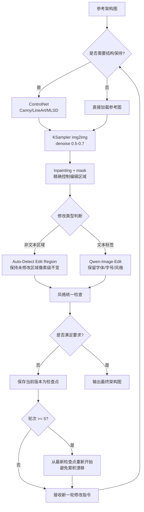
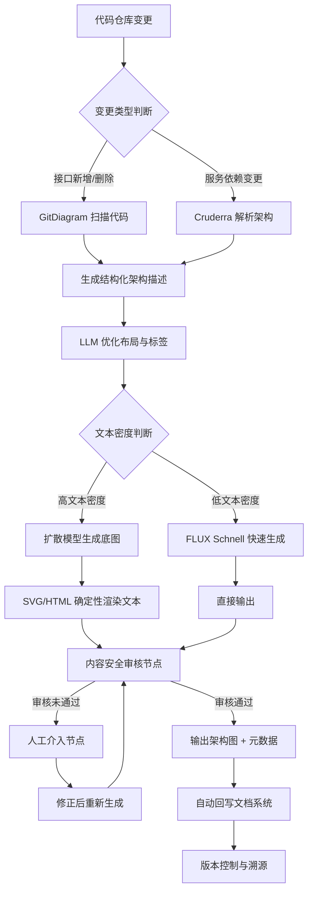

# AI Agent 图片生成架构图工作流调研报告

**调研日期**：2026-06-23

---

# 1. 执行摘要与技术全景

## 1.1 调研背景与目标

AI 图片生成技术在 2024–2026 年间经历了从"玩具"到"生产工具"的质变。然而，当扩散模型与 Diagram-as-Code 工具链交汇于**互联网行业架构图绘制**这一垂直场景时，业界面临一个核心矛盾：通用文生图模型擅长视觉表现却无法保证几何精确，专用图表工具精于结构控制却缺乏视觉丰富度，而中文文本渲染——架构图中最基础的信息载体——竟成为横跨两类方案的共性瓶颈。

本调研聚焦 AI Agent 图片生成工作流在**架构图绘制**场景的工程可行性，覆盖**文生图、图生图、改图**三大工作流类型，核心评估维度包括：中文短文本标签的字符级准确率、框线与箭头的几何精度、模块层次的分组排版质量，以及输出格式的可编辑性。目标读者为技术决策者、SRE 工程师与架构师——他们需要的不只是一张"好看的图"，而是能够嵌入技术文档、随代码迭代同步更新、在评审会议中被逐行质疑的**工程资产**。

互联网架构图对"确定性"有着极端要求。一张包含 20 个微服务模块的架构图，若文本标签的独立准确率为 97%，则至少出现一处错误的概率高达 46%[^1]。此外，架构图需要精确表达拓扑关系、遵循企业级图标规范、支持版本控制（Git diff 可审查），这些需求将通用工具同时推向能力边界。

## 1.2 技术全景概览

### 1.2.1 当前 AI 图片生成技术栈分层

从工程实现视角，AI 架构图生成技术栈可划分为四层。**基础模型层**涵盖文生图扩散模型（Qwen-Image、GLM-Image、ERNIE-Image、FLUX.1-dev、Z-Image）与多模态理解模型（GPT-4o、Qwen2.5-VL）。**条件控制层**通过 ControlNet（Canny、LineArt、Depth、MLSD）、T2I-Adapter 与 CtrLoRA 等机制，将几何约束注入扩散模型的去噪过程，是弥合"视觉丰富度"与"结构精确性"差距的关键桥梁[^ref2]。**工作流编排层**由 Dify、Coze、ComfyUI 等平台构成，负责任务调度与多模型路由——典型 ComfyUI 架构图工作流包含 6–10 个节点[^ref3]。**应用层**面向终端用户，分为专用架构图工具（boardmix、ProcessOn、DiagramGPT）、通用白板（Miro、Lucidchart、Excalidraw）与代码驱动工具（Mermaid、PlantUML、D2）三大阵营。

### 1.2.2 架构图生成领域的四大技术路线

当前业界实践可归纳为四条技术路线。**纯扩散模型路线**以端到端文生图为核心，Qwen-Image 2.0 支持 1000-token 复杂提示词，可直接生成含 flow arrows 与 color-coded elements 的信息图[^ref64]；但该路线受限于扩散模型对精确几何的固有缺陷，IJCAI 2024 论文指出 DALL-E 3 生成的架构图"looks fancy but the information is non-sense and meaningless"[^ref56]。**Diagram-as-Code 路线**通过 LLM 生成 Mermaid/PlantUML/D2 代码，再由确定性渲染引擎输出矢量图，Claude 在节点级预测上达到 F1=0.94，但链接级预测仅 F1=0.30[^ref65]；该路线在版本控制与可编辑性上无可替代，却在视觉表现力上存在天然天花板。**专用工具路线**以 boardmix、DiagramGPT、阿里云 CADT AI 助理为代表，通过规则引擎+LLM 微调的混合推理机制，将中文技术描述转换为专业拓扑图，boardmix 在中文语义理解上显著优于 Lucidchart 等海外工具[^ref7]。**混合工作流路线**——即 IJCAI 2024 论文验证的"LLM 结构基础 → Mermaid 渲染 → 扩散模型视觉增强 → VLM 质量控制"四阶段 pipeline——被证明在结构保真度与视觉丰富度上均优于任何单一方案[^ref56]，正快速成为企业级架构图生成的工程标准。

### 1.2.3 中文文本渲染能力是架构图生成的核心瓶颈

中文文本渲染质量是架构图生成领域最具决定性的约束变量。在 LongText-Bench-ZH 这一专门针对中文长文本的基准测试中，开源模型呈现数量级的分化格局：

| 模型 | 参数量 | LongText-Bench-ZH | CVTG-2K (WA) | 开源许可 | 显存需求 (FP16) |
|------|--------|-------------------|--------------|----------|-----------------|
| GLM-Image | 9B+7B | 0.9788 [^ref4] | 91.16% [^ref4] | MIT | ~23 GB (CPU offload) |
| Ovis-Image | 7B | 0.964 [^ref41] | 92.00% [^ref41] | 开源 | ~20 GB |
| Qwen-Image | 20B | 0.9647 [^ref66] | 82.88% [^ref41] | Apache 2.0 | ~60 GB (FP16) |
| ERNIE-Image | 8B | >0.96 [^ref67] | — | Apache 2.0 | ~24 GB |
| Z-Image Turbo | 6B | 0.936 [^ref71] | — | Apache 2.0 | ~16 GB |
| GPT-Image-1 | — | 0.619 [^ref66] | — | 闭源 | API 调用 |
| FLUX.1-dev | 12B | 0.005 [^ref66] | — | 非商用 | ~24 GB (FP8) |

上表揭示"本土主导、海外边缘化"的显著格局。GLM-Image 以 0.9788 的 LongText-Bench-ZH 得分位居开源第一，其自回归模块（9B）负责布局与文本结构规划、扩散解码器（7B）负责像素绘制的混合架构，对架构图"先规划后绘制"的工作模式具有天然适配性[^ref4]。Ovis-Image 在 CVTG-2K 多区域文本基准上以 92.00% 的平均词准确率超越 Qwen-Image（82.88%）与 GPT4o（85.69%），证明"以文本为中心的训练配方"比单纯堆叠参数更重要[^ref41]。与此形成 stark contrast 的是，FLUX.1-dev 在相同基准上仅得 0.005——差距近 200 倍——这意味着海外主流模型在中文架构图场景中几乎处于不可用状态[^ref66]。这一分化的根源在于数据壁垒：中文字符平均 20–30 笔画，需要专门的 CJK 文本-图像对训练数据，ERNIE-Image 的字符感知编码器即通过此类数据实现 LongTextBench 超 0.96 的准确率[^ref67]，而 FLUX.1 系列的原生训练数据以英文为主，CJK 覆盖不足。

然而，即便在表现最优的本土模型中，文本渲染仍非"已解决问题"。ControlNet 在保持几何结构的同时会严重破坏中文文本——MiniText-Benchmark 上的句子准确率被压低至 0.0006[^ref70]，这迫使工作流设计者必须将"结构控制"与"文本生成"物理解耦。GenFix 后处理 pipeline 虽可将 OCR F1 提升 20–30%，但超过 64% 的失败案例源于修复阶段仍生成错误文本[^ref48]——后处理只能缓解，不能根治。因此，工程实践中的最优策略不是追求"更高的文本准确率"，而是引入**确定性文本渲染层**（SVG 文本叠加、HTML 合成），让扩散模型仅负责背景、风格与纹理，文本标签由不可变的确定性引擎渲染。这一从"端到端生成"到"分层合成"的范式转变，是架构图工作流从实验室走向生产环境的必要条件。

---

## 2. 文生图工作流：模型选择与中文文本渲染

中文架构图生成的核心矛盾在于：模型在通用视觉生成上的能力跃升，与文本渲染精度之间存在结构性落差。根据交叉验证结果，当前主流模型在LongText-Bench-ZH基准上的表现呈现三个数量级的断层，这一分化直接决定了企业在技术选型中的可行集边界。[^1]

### 2.1 主流文生图模型中文能力对比

#### 2.1.1 第一梯队：文本精度接近工程可用阈值

在开源模型中，GLM-Image以0.9788的LongText-Bench-ZH得分居于首位，其9B自回归模块与7B扩散解码器的混合架构是这一优势的技术根基。[^1] 自回归模块负责规划文本布局与字符位置，扩散解码器负责像素级渲染，这种"先规划后绘制"的分工对架构图中多模块标签的框内对齐尤为有利。ERNIE-Image 8B在LongTextBench中英均超0.96，其单流DiT架构使文本与图像tokens共享权重，对结构化视觉任务（海报、信息图、漫画分镜）展现出原生适配性。[^ref64] Ovis-Image 7B在LongText-Bench-ZH上达0.964，且在CVTG-2K多区域文本基准上取得0.9200平均词准确率，2–5区域场景均保持>91%的稳定性，说明其"以文本为中心的训练配方"在标签密集型架构图中具有独特优势。[^ref2]

Qwen-Image系列的表现因版本而异。Qwen-Image 2.0支持1000-token复杂提示词，可生成包含流程箭头、色块编码和精确标签定位的完整信息图，其统一生成与编辑架构在图生图场景中位列编辑榜第二（Elo 1034）。[^ref3] 但在纯文本精度基准上，其LongText-Bench-ZH得分约0.946，略逊于GLM-Image和Ovis-Image。[^1]

#### 2.1.2 第二梯队：成本与精度的平衡方案

Z-Image Turbo 6B以16GB显存门槛和约0.01美元/张的API成本成为性价比最优解。[^ref67][^ref47] 其LongText-Bench-ZH得分0.936虽低于第一梯队，但8步推理可在H800上实现亚秒级延迟，且Apache 2.0许可支持LoRA微调，对预算敏感型团队具有显著吸引力。[^ref67] Boogu-Image 10B（2026年6月发布）采用Qwen3-VL-8B文本编码器，支持FP8量化，专攻"超密集文字生成"场景，但生态成熟度尚待验证。[^ref79]

#### 2.1.3 不可用梯队：海外模型的中文文本壁垒

FLUX.1-dev、DALL-E 3和Midjourney在中文架构图场景几乎不可用。FLUX.1-dev在LongText-Bench-ZH上的得分接近0.007，与第一梯队存在近200倍的差距。[^1] 这一断层并非模型规模不足，而是训练数据中CJK文本-图像对的结构性缺失所致。FLUX-Text研究证实，即使基于FLUX-Fill进行100K样本微调，中文Sen.Acc仅达71.32%，且原生FLUX.1-dev的非商用许可进一步限制了企业适配空间。[^ref76] 海外模型若要追平本土模型的中文文本能力，需投入大量CJK数据重新训练，成本极高，这一壁垒预计在短期内难以逾越。

下表汇总了各模型在中文文本渲染、部署成本和许可条款上的关键参数：

| 模型 | 参数量 | LongText-Bench-ZH | CVTG-2K (WA) | 显存需求 | 开源许可 | API成本 (1024px) |
|------|--------|-------------------|--------------|----------|----------|------------------|
| GLM-Image | 9B+7B | 0.9788 [^1] | 0.9116 [^1] | 23GB (CPU offload) [^ref48] | MIT | ~$0.015 [^ref48] |
| ERNIE-Image | 8B | >0.96 [^ref64] | — | 24GB (FP16) [^ref66] | Apache 2.0 | 未公开 |
| Ovis-Image | 7B | 0.964 [^ref2] | 0.9200 [^ref2] | ~20GB [^ref70] | 开源 | 未明确 |
| Qwen-Image 2.0 | 7B/20B | ~0.946 [^1] | 0.8288 [^ref2] | 24GB (FP8) [^ref65] | Apache 2.0 | $0.005–0.02 [^ref47] |
| Z-Image Turbo | 6B | 0.936 [^ref67] | — | 16GB [^ref67] | Apache 2.0 | ~$0.01 [^ref47] |
| FLUX.1-dev | 12B | ~0.007 [^1] | — | 可变 | 非商用 | 按需 |
| DALL-E 3 | — | — | — | 云端 | 闭源 | $0.04–0.08 |
| Midjourney | — | — | — | 云端 | 闭源 | $0.05–0.10 |

上表揭示了两个关键分化维度。第一，在文本精度上，开源本土模型已形成0.93–0.98的密集区间，而海外闭源模型因中文数据缺失被排除在可行集之外。第二，在显存效率上，Z-Image以16GB门槛覆盖了消费级硬件的最大公约数，而GLM-Image和ERNIE-Image的全精度方案需要23–24GB，仅适用于RTX 4090/3090级别的高端消费卡。对于技术决策者而言，这一矩阵意味着"选择模型"的决策应优先于"升级硬件"的决策——在16GB显存条件下，Z-Image的0.936得分已优于任何量化后的海外模型方案。

#### 2.1.4 模型选择矩阵：按场景推荐最优模型

不存在单一模型在所有维度上最优。GLM-Image文本精度最高但编辑能力未知；Qwen-Image 2.0编辑最强但7B精度略逊；ERNIE-Image本地部署最友好但信息图能力有限；Z-Image成本最低但质量中等。企业应将预算投入"模型路由"机制的构建，而非单一模型的极限优化。

| 应用场景 | 推荐模型 | 关键指标 | 选择理由 |
|----------|----------|----------|----------|
| 本地24GB，文本精度优先 | ERNIE-Image 8B FP16 | LongText-ZH >0.96 [^ref64]，显存24GB [^ref66] | 全精度运行无需量化，Apache 2.0可商用，结构化生成对框线对齐友好 |
| 本地16GB，成本优先 | Z-Image Turbo 6B | LongText-ZH 0.936 [^ref67]，显存16GB [^ref67] | 最低硬件门槛，支持LoRA微调，亚秒级8步推理 |
| API调用，文本精度优先 | GLM-Image | LongText-ZH 0.9788 [^1] | 开源精度第一，MIT许可，CPU offload可降至23GB |
| API复杂信息图/PPT | Qwen-Image 2.0 | 1000-token复杂提示 [^ref3]，原生2K | 统一生成+编辑架构，支持PPT/信息图直接输出 |
| 多标签密集型架构图 | Ovis-Image 7B | CVTG-2K 0.9200 [^ref2]，2–5区域>91% | 多区域文本稳定性最优，适合模块标签密集的拓扑图 |
| 批量生成，成本最低 | Z-Image Turbo / 豆包 Seedream | ~$0.01/张 [^ref47] | API成本最低，万级批量可享15–25%折扣 |

该矩阵表明，架构图工作流的技术选型应遵循"场景优先"原则。对于需要频繁迭代编辑的SRE团队，Qwen-Image 2.0的链式编辑能力（保留原字体/字号/风格）可降低返工成本；对于需要合规自托管的金融或政务场景，ERNIE-Image的Apache 2.0许可和全精度FP16运行是风险最低的选项；而对于需要快速验证原型或批量生成文档配图的产品团队，Z-Image Turbo的$0.01/张定价和16GB显存门槛提供了最低试错成本。值得注意的是，当架构图包含20个以上标签时，即使模型单标签准确率达97%，整体无错概率仅为(0.97)^20 ≈ 54%，这意味着"高准确率"模型在工程实践中仍可能频繁出错。因此，模型选择矩阵必须与工作流设计（如确定性文本渲染层的引入）配套使用，而非孤立依赖模型精度。

### 2.2 中文文本渲染的技术瓶颈与解决方案

#### 2.2.1 文本编码粒度：从子词到字符的结构性差距

中文文本渲染困难的根源在于文本编码器的设计范式。主流扩散模型采用BPE（Byte-Pair Encoding）将文本拆解为子词单元，这种粒度对图像生成任务过于粗糙——中文字符平均包含20–30笔画，在子词表示中笔画结构被严重模糊。ERNIE-Image团队针对这一瓶颈设计了字符感知编码器（character-aware encoder），通过专门训练CJK文本-图像对，将编码粒度下沉至字符级，从而在LongTextBench上达到中英均超0.96的准确率。[^ref64] Qwen-Image则采用MSRoPE（Multi-Scale Rotary Position Embedding）将文本沿图像对角线编码，使文本与图像模态的位置编码互不冲突，在密集文档图像的文本重建中展现出优于传统VAE的能力。[^ref78] 然而，即使采用这些优化，架构图中小标签（<20字符）的渲染仍面临固有挑战：ControlText研究表明，glyph控制嵌入层在字体非常小、非常细或非常长时会导致字体细节丢失，这解释了为何高分辨率（1280px以上）生成对保持小字清晰度至关重要。[^ref41] 对于架构图场景，当前业界尚未建立"<20字符短标签在方框内"的专用评测基准，现有CVTG-2K和LongText-Bench主要测试文本本身的正确性，而非文本与几何图形的组合精确性。[^ref56] 这一基准缺口意味着模型排名不能完全等同于架构图生成能力，企业需结合实际测试评估框线对齐度和标签定位精度。

#### 2.2.2 量化压缩对中文小字的隐性破坏

社区广泛推荐的"FP8/INT8量化让大模型在消费级显卡运行"的建议，对中文架构图场景可能是有害的。QuantDiff研究指出，在Stable Diffusion上，FP8/FP8相比INT8/INT8的质量提升达1.56倍；即使在相同位宽下，FP格式也系统性地优于INT格式。[^ref7] 中文小字的笔画精度对量化误差极为敏感：ERNIE-Image官方明确建议，若文本渲染是主要用例，应使用FP16/BF16而非INT8/NF4，因为量化版本"可测量地降低文本渲染质量"。[^ref66] FLUX.1-dev的实测数据进一步印证了这一风险：BNB NF4、FP8和INT8在低对比度小字场景均可能出现细节丢失，速度提升不等于质量保持。[^ref4] 对于包含"负载均衡""分布式事务"等复杂笔画的标签，量化误差可能导致笔画断裂或模糊，这一问题在端到端生成流程中无法通过后处理完全修复。

#### 2.2.3 消费级部署的最优解：ERNIE-Image 8B FP16

在24GB显存约束下，ERNIE-Image 8B FP16是当前消费级本地部署的最优解。该方案无需量化即可全精度运行，文本渲染质量无损，且Apache 2.0许可允许商用。[^ref66] 相比之下，Qwen-Image 20B在FP16下需约60GB VRAM，FP8量化后方可降至24GB，但存在前述的文本质量折损。[^ref65] Z-Image Turbo 6B虽仅需16GB，但0.936的文本精度在标签密集场景下可能不足以支撑工程可用性。[^ref67] 对于已拥有Qwen-Image但显存不足的用户，DiffSynth-Studio提供分层卸载方案（FP8+动态管理），但架构图的高分辨率需求（1280px以上）通常使24GB显存仍然紧张，建议开启CPU Offload组合模式。[^ref71] 综合评估，企业在本地部署时，若核心用例包含中文文本，应以"文本质量底线"而非"参数量上限"为核心决策标准。ERNIE-Image 8B FP16的24GB方案在质量、许可和硬件可及性之间提供了最佳平衡，预计在未来12–18个月内仍将是消费级部署的首选配置。

#### 2.2.4 架构图短标签场景的基准缺口

现有评测体系与工程需求之间存在显著错位。CVTG-2K测试的是2–5区域文本的准确性，LongText-Bench测试的是长文本段落，但架构图需要的是"标签在正确框内、箭头指向正确、布局层次清晰"的综合能力。[^ref56] 这意味着当前模型排名（GLM-Image > Ovis-Image > Qwen-Image > Z-Image）只能反映文本本身的正确性，不能等同于架构图生成能力。例如，Qwen-Image在CVTG-2K上仅获0.8288，低于Ovis-Image的0.9200，但在1000-token复杂提示下的信息图生成能力可能反超。[^ref2][^ref3] 这一基准缺口对技术决策者的启示是：模型选型不应仅依赖公开排行榜，而需构建内部评测集——用企业实际使用的架构图模板（如微服务拓扑、网络分层、数据流图）进行A/B测试，测量标签正确率、框线对齐度和布局一致性三项核心指标。在专用benchmark成熟之前，这种"以用例为中心的实测"是规避模型-场景错配风险的最可靠手段。

---

---

## 3. 图生图与改图工作流：迭代编辑与条件控制

架构图从概念草稿到最终交付物，极少一次成型。互联网行业对架构图的迭代频率远高于广告海报或社交媒体素材——一次需求评审可能触发模块增删、层级调整、技术栈更名等多轮修改。因此，图生图（img2img）与编辑工作流的成熟度，直接决定架构图生成方案在工程环境中的可用性。本章聚焦三项核心问题：何种编辑技术在保留中文标签精度的同时允许灵活修改；条件控制技术在锁定几何结构时付出了怎样的文本质量代价；以及多轮迭代中如何控制系统误差累积。

### 3.1 图生图编辑技术对比

当前图生图编辑技术可归纳为三条路线：以 FLUX.1 Kontext 为代表的上下文感知编辑、以 Qwen-Image 2.0 为代表的统一生成-编辑模型，以及以 ComfyUI img2img 节点为代表的参数化扩散重采样。三者在中文架构图场景的表现差异显著。

| 技术路线 | 单轮耗时 | 中文文本保持 | 多轮一致性 | 结构精确控制 | 开源/本地部署 | 架构图适用性 |
| :-- | :-- | :-- | :-- | :-- | :-- | :-- |
| FLUX.1 Kontext [Max] | 3–5 秒 | 差（LongText-ZH 0.007） | 良好（<6 轮） | 依赖上下文理解 | Dev 版开源 | ★★☆☆☆ |
| Qwen-Image 2.0 | 秒级 | 优秀（LongText-ZH 0.946） | 优秀 | 良好 | 部分开源 | ★★★★★ |
| ComfyUI img2img | 取决于采样步数 | 取决于底模 | 中等 | 优秀（ControlNet） | 完全开源 | ★★★★☆ |

上表揭示了一个关键分化：FLUX.1 Kontext 在排版生成上的官方指标（Max 版本 96.2% prompt adherence、94.7% character consistency）看似可观，但第三方横评将其文本保持能力评为"Poor, frequent gibberish"，与 Nano Banana Pro（Gemini 3 Pro Image）的"High precision in typography, layout, diagrams"形成鲜明对比[^1]。更根本的瓶颈在于 LongText-Bench-ZH 得分仅为 0.007，与 GLM-Image 的 0.9788 相差两个数量级[^ref2]。对于一张包含 20 个中文标签的架构图，即使单标签准确率达到 97%，至少一处出错的概率仍高达 1-(0.97)^20 ≈ 46%。这意味着 FLUX.1 Kontext 在架构图编辑中的价值局限于风格迁移、背景替换和元素增删，而非精确的字级文本修改。

Qwen-Image 2.0 则提供了截然不同的能力矩阵。该模型在 AI Arena 编辑排行榜上以 Elo 1034 位列第二，仅次于 Gemini-3-Pro-Image-Preview[^ref3]。其统一生成与编辑的架构允许在同一会话中完成"生成初始架构图 → 修改文本标签 → 调整模块样式"的链式操作，无需导出到外部工具。实测中，Qwen-Image-Edit 可将海报中的"AICoding"精确替换为"AIAgent"，并保留原有字体、字号和风格[^ref64]。对于架构图场景，这意味着工程师可以直接修改"负载均衡"为"网关层"而不重绘整个图。原生 2K 分辨率输出也确保了复杂架构图在多屏展示时的清晰度。然而，Qwen-Image 2.0 的 7B 版本在文本精度上略逊于 GLM-Image 的 0.9788，在极端高密文本场景下仍需验证。

ComfyUI img2img 路线代表了第三种哲学：通过参数化控制（denoise、ControlNet strength、mask）实现"可编程"编辑。denoise 参数 0.5–0.7 被社区验证为架构图编辑的 sweet spot——低于 0.5 难以实现有效修改，高于 0.7 则可能导致原有布局崩解[^ref56]。ComfyUI 的 Group Nodes 功能支持非线性分支编辑，允许同时探索"添加微服务层"和"改为单体架构"两个方向，并通过固定种子实现变体间的快速对比[^ref65]。该路线的核心优势在于 ControlNet 提供的精确几何控制，但代价是文本质量——这一点将在 3.2 节深入分析。

### 3.2 条件控制技术：保持几何结构的代价

扩散模型天生不擅长精确几何约束。IJCAI 2024 论文与多项后续研究（LACE、GeoSVG-RL）共同验证：即使使用 ControlNet，模块对齐、箭头指向、间距一致性等微观几何问题仍需后处理验证器介入[^ref7]。ControlNet 的价值在于将"宏观结构保持"从不可能变为可行，但使用者必须清楚其代价结构。

**3.2.1 预处理器对比：Canny vs LineArt vs MLSD**

在架构图（直线方框、箭头连接）场景中，三种预处理器的行为差异显著。Canny 边缘检测在权重设为 1.0 时立面布局保真度最高，但会检测所有边缘并引入噪声；LineArt 在保持线稿结构方面更柔和，细节保留更完整；MLSD 专门检测直线段，SSIM 得分高达 0.7455，但对曲线自动忽略[^ref4]。对于纯直线型架构图，MLSD 是最佳选择；若包含曲线连接或云形模块，则 Canny 或 LineArt 更为稳妥。实践中，Canny 阈值建议设置为 Low=100、High=200，需保留细箭头时可降至 Low=10、High=100[^ref41]。

**3.2.2 Multi-ControlNet 叠加与显存瓶颈**

复杂架构图常需同时控制多重几何属性：方框边界（Canny）、层次深度（Depth）、连接线走向（LineArt）。FLUX ControlNet V3.0 工作流采用 HED(0.8)+Depth(0.7)+Canny(0.6) 的三条件叠加，总权重建议 ≤2.0[^ref66]。ComfyUI 通过 Apply ControlNet 节点的链式串联实现多条件融合，并支持 Advanced-ControlNet 插件按时间步调度强度——前 50% 采样步高 strength 锁定结构，后 50% 步降低 strength 允许模型优化文本标签和颜色[^ref67]。但多 ControlNet 叠加会显著增加显存消耗：Depth Anything V2 本身 VRAM 密集，在 2K 分辨率下可能超出 12GB 显存容量，导致企业级部署需要分步执行或 CPU 卸载[^ref71]。

**3.2.3 ControlNet 的文本破坏效应**

ControlNet 在增强结构控制的同时，对中文文本的破坏是系统性的。SimplePoster 论文与 UniGlyph 研究（ICCV 2025）的数据显示：ControlNet-augmented 方法的 subject extension rate 为 23.6%，而全参数微调可降至 0.6%；在 MiniText-Benchmark 上，ControlNet 的 Sen.Acc 仅 0.0006，NED 仅 0.0021[^ref70]。这意味着当 ControlNet 强制模型跟随结构控制图时，文本区域可能被结构性线条覆盖或扭曲，小字标签尤其脆弱。缓解方案包括将 ControlNet strength 降至 0.1 左右[^ref48]，或采用 PosterMaker（CVPR 2025）引入的 OCR-aware ControlNet，通过注入字符级 OCR 特征改善文本渲染[^ref47]。但这些方案均增加了工作流复杂度，且无法完全消除文本破坏。

**3.2.4 替代方案：T2I-Adapter、IP-Adapter、CtrLoRA**

若 ControlNet 的文本破坏代价不可接受，可考虑轻量级替代方案。T2I-Adapter 仅 77M 参数，天然支持多条件加权融合，训练成本仅 4 块 V100 运行 2 天[^ref74]。IP-Adapter（22M 参数）擅长风格一致性，可与 ControlNet 组合实现"结构+风格"双重控制[^ref76]。CtrLoRA（ICLR 2025）在 Canny、Depth、Segmentation 等基准上 FID 和 LPIPS 均优于原始 ControlNet，且仅需约 1000 张图像和单张 RTX 4090 运行 1 小时即可训练新条件[^ref83]。对于需要自定义 UML 图或流程图控制条件的企业，CtrLoRA 提供了极低成本的扩展路径。ControlNet++（Uni-ControlNet 后续）则支持单一模型处理 10+ 种控制条件，相比原始 ControlNet 大幅降低模型数量和维护成本[^ref77]。

### 3.3 多轮迭代编辑最佳工作流

架构图编辑的迭代特性决定了工作流设计必须考虑误差累积问题。ICCV 2025 的多轮一致图像编辑研究表明，直接使用单步编辑方法在累积误差下会导致递增伪影和语义偏移；双参考策略（原始图 + 前一轮结果）可有效缓解这一问题[^ref74]。

以下流程图展示了标准链式工作流的核心决策节点：

该流程的核心设计原则有三。第一，结构控制与文本生成物理解耦：ControlNet 负责锁定几何骨架，但文本修改必须交由 Qwen-Image-Edit 或确定性渲染引擎处理，避免在 ControlNet 约束下直接生成中文。第二，编辑区域自动检测：ComfyUI-NKD-Klein-Tools 的 Auto-Detect Edit Region 节点可在无 mask 的 img2img 编辑后自动识别实际变化像素，仅将变化区域合成回原图，其余部分（含中文标签）保持像素级不变[^ref78]。第三，检查点机制：每 5 轮保存 latent + 参数，超过 5–6 轮后从最新检查点重新开始，而非在连续编辑链上延伸，以规避扩散模型多轮迭代中的可见伪影[^ref79]。

在 API 编排层面，Dify + Qwen-Image 的组合提供了更高阶的自动化能力。通过条件分支节点（`{{#start.image#}} 存在 ? 图生图 : 文生图`），系统可自动将用户反馈路由至对应处理分支；结合对话记忆功能，用户以自然语言发出修改指令（"将缓存层换成 Redis"），系统自动触发新一轮图生图请求[^ref80]。Dify 1.13.0 新增的人工介入节点支持工作流中途暂停与审核，对于含敏感信息的内部架构图尤为必要——毕竟中国《生成式人工智能服务管理暂行办法》要求企业级部署配备三层安全审核[^ref81]。

**中文文本畸变的系统性解决方案**最终指向一个不可回避的结论：扩散模型负责视觉，确定性渲染引擎负责文本。Qwen-Image-2512 在 4 步采样下中文可读率达 89%，已远超 SDXL+ControlNet 的 61%[^ref82]，但 89% 的单标签准确率面对 20 个标签的架构图时，整体可用性仍不足。RefineAnything 的 Focus-and-Refine 策略实现了 SSIMbg 0.9997 的背景保持[^ref83]，为局部编辑提供了技术基础，但架构图所需的 99%+ 文本准确率无法仅靠扩散模型达成。最优工作流是：ControlNet 保持结构 → Inpainting 修改非文本区域 → Qwen-Image-Edit 调整文本标签 → 若精度要求极高，则将文本层导出为 SVG/HTML 叠加到扩散模型生成的视觉底图上。这种"视觉-文本分离"不是可选优化，而是避免 ControlNet 文本破坏效应的必需步骤[^ref84]。

---

## 4. 架构图专用工具与混合工作流

### 4.1 AI 架构图专用工具深度评测

架构图生成领域存在两条截然不同的技术路径：专用工具与通用扩散模型。前者以结构化输出和可编辑性见长，后者追求视觉丰富度和艺术表现力。对于互联网行业的技术决策者而言，理解两类工具的适用边界是选型决策的前提。

在自然语言生成工具层面，DiagramGPT（Eraser）与 ArchitectureDiagram.ai 代表了当前海外专用工具的第一梯队。赫尔辛基大学2025年的系统性评测表明，在 Mermaid 组件图代码生成任务中，DiagramGPT 与 Claude 能够持续输出无语法错误的代码，而 ChatGPT、DeepSeek 和 Gemini 均存在不同程度的语法缺陷；在 PlantUML 代码生成中，DiagramGPT 和 Claude 同样表现稳定，但 Gemini 即使经过多次提示修正仍无法独立消除错误[^1]。ArchitectureDiagram.ai 作为2026年涌现的专用架构图平台，区别于通用白板工具，其内置的 "Expert Chat" 功能可提供资深架构师级别的图表反馈，并支持 Mermaid、draw.io、Excalidraw、AI 图片、PNG 和 SVG 六种输出格式[^ref2]。Napkin AI 则定位于快速草图生成，其生成速度优于竞品，但输出被锁定在专有格式中，长期可维护性存在隐忧[^ref3]。

代码驱动工具是工程师群体的首选。Mermaid 凭借 GitHub/GitLab 原生渲染能力成为技术文档的事实标准，但其在中文场景下存在字体错位、画布管理差、样式定制能力弱等六大核心限制[^ref64]。D2 图表语言在技术架构图领域优于 Mermaid 和 PlantUML，具备更丰富的形状库（六边形、圆柱、人物）、原生图标集成和多布局引擎（dagre/ELK/TALA），但缺少 GitHub 原生渲染支持[^ref56]。PlantUML 对 Java 环境依赖较重，且中文渲染需显式绑定中文字体（如 SimSun），否则默认字体（Arial）不包含 CJK 字符集[^ref65]。Cruderra 和 GitDiagram 代表了从代码到架构图的逆向工程路径：Cruderra 通过 MCP 协议将架构规则注入 AI 编码代理，自动扫描 Java/Python/Go/PHP 代码库生成 UML 图和 OpenAPI 规范，但 SaaS 版本仍在等待名单阶段，仅提供私有化部署[^ref7]；GitDiagram 则将 github.com 替换为 gitdiagram.com 即可通过 Claude 3.5 Sonnet 分析仓库结构生成可交互的 Mermaid 架构图[^ref4]。

国产工具在中文语义理解方面形成了显著优势。boardmix 博思白板在中文长难句和特定业务术语理解上准确率明显优于 Lucidchart 等海外工具，输入 "电商平台订单从下单到发货完整处理流程，包含支付、库存扣减、仓库发货、物流配送" 等复杂描述，15 秒即可生成 10 个以上节点带判断分支的完整流程图，结构合理且可直接使用[^ref41]。ProcessOn 在2023年接入讯飞星火大模型后 AI 功能限时免费开放，中文业务描述转换准确，实时协作能力成熟[^ref66]。阿里云 CADT AI 助理（云小搭）专门针对阿里云中文云架构场景优化，采用多模型协同与分步推理（Chain-of-Thought）架构，将复杂任务拆解为意图识别、网络规划、资源规划、属性配置等子任务，输出结构化 JSON 伪代码，确保生成结果的专业性与可执行性[^ref67]。万兴图示（EdrawMax）在2026年5月集成 DeepSeek-V4 大模型，覆盖 280 种以上图表类型，与 Visio 格式兼容，但中文自然语言理解能力略逊于 boardmix 和 ProcessOn[^ref66]。

从自然语言到专业架构图的准确率并非均等。MorphLLM 2026年的综合评测显示，AI 架构图生成器在标准模式（微服务、三层架构、数据管道）下准确率较高，但在复杂布局（15 至 20 组件以上）时仍需大量手动调整，安全边界和 VPC 分组常被错误放置，组织特定的命名和配色规范难以自动遵循[^ref71]。工程界的共识是 "AI 生成 80% 初稿，人工精修 20%"，这一定律在架构图场景仍成立。

通用扩散模型（Midjourney、DALL-E）用于技术架构图被业界普遍视为 "工具错配"（using the wrong tool for each job）。IJCAI 2024 论文明确指出，DALL-E 3 生成的图表 "looks fancy but the information is non-sense and meaningless"——视觉华丽但信息失真，无法精确表达系统组件间的拓扑关系，更不可编辑[^ref70]。相比之下，Claude 生成 Mermaid/SVG 代码在技术内容表达上 "often better than any image model"[^ref48]。

下表从核心维度对主流专用架构图工具进行系统对比：

| 工具 | 中文语义理解 | 输出格式可编辑性 | 代码逆向生成 | 适用场景 | 成本门槛 |
|------|-----------|---------------|-----------|---------|---------|
| DiagramGPT | 工程可用[^ref3] | 专有格式（可导出 SVG） | 不支持 | 技术架构描述、流程图 | 中等 |
| ArchitectureDiagram.ai | 良好 | Mermaid/draw.io/SVG/AI 图片[^ref2] | 不支持 | 多格式架构图、专业评审 | 中等 |
| boardmix | 最强（长难句准确率最高）[^ref41] | 专有格式+SVG/PNG | 不支持 | 中文业务流、协作白板 | 中等 |
| ProcessOn | 优秀[^ref66] | 专有格式+SVG/PNG | 不支持 | 中文流程图、团队协作 | 低（AI 免费） |
| 阿里云 CADT | 云架构专用（通义千问驱动）[^ref67] | JSON 伪代码+可部署 | 部分支持（从 JSON 部署） | 阿里云基础设施设计 | 按资源计费 |
| Mermaid | 需手动配置字体[^ref64] | 纯文本源码（Git 原生） | 支持（Claude Code/GitDiagram） | 技术文档、版本控制 | 零成本 |
| D2 | 需手动配置字体[^ref56] | 纯文本源码 | 支持（Claude Code Skill） | 复杂架构图、精确布局 | 零成本 |
| Cruderra | 未明确 | 专有格式 | 核心功能（扫描代码库）[^ref7] | 代码治理、架构即代码 | 高（私有化部署） |
| Claude Code + draw.io | 良好 | 原生 .drawio XML[^ref47] | 支持（扫描代码库） | 工程师工作流、活文档 | API 成本 |

上表揭示了架构图工具市场的分化格局。在中文语义理解维度，国产工具（boardmix、ProcessOn、阿里云 CADT）与海外工具（DiagramGPT、ArchitectureDiagram.ai）之间存在明显的断层，前者的长难句理解准确率显著高于后者，这不仅是技术差异，更是 CJK 文本-图像对训练数据壁垒的直接体现。在输出格式可编辑性维度，Mermaid 和 D2 的纯文本源码路径提供了版本控制和 PR 审查能力，这是工程文档场景的关键竞争力；但 Claude 的节点级预测准确率虽高（F1=0.94），链接级预测仍是显著短板（F1 仅 0.30），说明代码格式在关系复杂时仍需人工校验[^ref74]。代码逆向生成能力目前仍处于早期阶段，Cruderra 的 MCP 架构治理理念先进但 SaaS 未开放，Claude Code 的代码扫描+Mermaid 生成虽实用但缺乏对超大型代码库的系统评测。成本维度上，Mermaid/D2/PlantUML 的零边际成本与国产工具的中等订阅费用形成梯度，企业应根据使用频率和团队规模选择。

### 4.2 SVG 矢量图与混合工作流

架构图生成的技术路径可分为三类：纯矢量路径、纯位图路径和混合工作流。每条路径在精确性、视觉丰富度和可编辑性之间做出了不同的权衡。

纯矢量路径遵循 "LLM→Mermaid/D2/PlantUML→SVG" 的链条。该路径的核心优势在于几何精确和版本控制友好：Mermaid 源码可直接嵌入 GitHub/GitLab，实现 PR 级审查和 CI 验证；D2 的 ELK 布局引擎可处理复杂拓扑；draw.io 的 XML 格式 surprisingly git-friendly，AWS 和 Azure 图标库完备[^ref47]。然而，这条路径的视觉表现上限较低。ACM 2026年对比研究显示，直接由 LLM 生成 SVG 代码（如 Qwen2.5-14B 得分 0.66） visuals 往往过于简陋；间接方法（扩散模型生成位图+向量化转换，如 SD3.5M 得分 0.73）在视觉保真度上更优，但向量化过程会丢失曲线和细节[^ref76]。此外，所有主流 SVG 生成模型（LLM4SVG、StarVector、OmniSVG、Reason-SVG、GeoSVG-RL）的研究数据集中均缺乏中文文本相关训练样本，中文架构图 SVG 生成尚无专门模型支持[^ref83]。

纯位图路径指扩散模型直接生成架构图。该路径在视觉丰富度和艺术风格方面具有天然优势，FLUX.1-dev、Qwen-Image 等模型可生成光影、纹理、景深等视觉元素。但其根本缺陷在于：扩散模型天生不擅长精确几何布局，需要 ControlNet、T2I-Adapter 或 CtrLoRA 等条件控制工具才能勉强维持结构[^ref77]。更严重的是，ControlNet 在保持几何结构的同时会严重破坏中文文本——MiniText-Benchmark 显示，经 ControlNet 处理后中文句子准确率（Sen.Acc）骤降至 0.0006，几乎完全不可读[^ref74]。对于一张包含 20 个标签的架构图，即使模型在 97% 的情况下能正确渲染单个标签，至少有一个标签出错的概率仍高达 1-(0.97)^20 ≈ 46%，这在工程实践中意味着不可接受的不确定性。

混合工作流（推荐方案）将 Diagram-as-Code 的精确结构与扩散模型的视觉美感相结合。其典型流程为：自然语言描述 → LLM 生成 Mermaid/D2/PlantUML 结构代码 → 确定性渲染引擎输出基础 SVG → （可选）扩散模型进行视觉风格迁移或背景美化 → 确定性渲染引擎（HTML/SVG）叠加精确文本标签。IJCAI 2024 论文提出的 "LLM 结构基础→Mermaid 渲染→文本到图像模型视觉增强→VLM 质量控制" 三阶段工作流已验证该方案优于纯扩散模型[^ref70]。Beauty Diagram 提供的 API 服务可在 400 毫秒内完成 Mermaid 源码的美化重排（正交路由、泳道调整、现代配色），代表了确定性美化引擎的实用路径[^ref78]。ArchitectureDiagram.ai 内部也实现了类似的双轨设计：用户可选择 "可编辑代码" 或 "视觉冲击力强的 AI 图片" 两种输出[^ref2]。

下表对三种技术路径进行系统对比：

| 维度 | 纯矢量路径（Mermaid/D2/PlantUML） | 纯位图路径（扩散模型直接生成） | 混合工作流（推荐） |
|------|----------------------------------|---------------------------|----------------|
| 几何精确性 | 高（确定性渲染引擎） | 低（需 ControlNet 辅助）[^ref77] | 高（代码层精确控制） |
| 视觉丰富度 | 低（扁平、朴素） | 高（光影、纹理、景深） | 中到高（取决于美化程度） |
| 中文文本准确率 | 高（字体渲染引擎，>99%） | 低（Sen.Acc 0.0006 经 ControlNet）[^ref74] | 高（SVG/HTML 叠加确定性文本） |
| 可编辑性 | 极高（纯文本源码，Git 原生） | 无（静态像素） | 中高（结构层可编辑，视觉层可选可编辑） |
| 版本控制 | 原生支持（diff/review/merge） | 不支持 | 部分支持（结构代码可版本化） |
| 生成延迟 | 低（<1秒渲染） | 中（数秒至数十秒） | 中（结构生成快，美化可选异步） |
| 适用场景 | 技术文档、代码库同步、PR 审查 | 概念演示、静态展示、一次性汇报 | 专业架构图、可维护文档、动态资产 |
| 代表工具/论文 | Mermaid.js, D2, PlantUML, GeoSVG-RL | DALL-E 3, FLUX.1-dev, Qwen-Image | IJCAI 2024, Beauty Diagram, ArchitectureDiagram.ai |

三种路径的对比分析揭示了架构图生成领域的核心矛盾：精确性与美感之间存在结构性张力。纯矢量路径以牺牲视觉丰富度为代价换取了几何精确和可编辑性，这是工程文档场景的最优解；纯位图路径以牺牲精确性和可编辑性为代价换取了视觉冲击力，但在架构图场景下这一交换是得不偿失的——扩散模型无法可靠地表达拓扑关系，且中文文本破坏问题尚无根本解决方案。混合工作流通过将两个冲突的维度分配到不同的处理阶段（结构代码负责精确性，扩散模型负责美感，确定性渲染引擎负责文本），实现了帕累托改进。从工具生态的演进方向看，Mermaid.ai 的 "code first + AI refine" 产品策略和 Dify+ComfyUI 的分层架构（Dify 编排 + ComfyUI 执行）均指向同一范式：让 LLM 生成结构化代码，让确定性引擎渲染精确几何，让扩散模型负责可选的视觉增强[^ref79]。这一范式正在被越来越多的工具和平台采纳，成为架构图生成的事实标准。

### 4.3 后处理与排版修正技术

在架构图工作流中，后处理技术承担着文本纠错和排版修正的兜底角色。尽管其重要性不容忽视，但现有证据表明，后处理不应被视为主力方案，而应是确定性渲染引擎的补充。

GenFix Pipeline 是后处理领域的代表性工作。它提出了完整的 OCR→BLIP 语义→匈牙利算法对齐→能量优化→Stable Diffusion Inpainting 的技术链条，在 AI 生成图像的拼写错误修正上有效。然而，基于人类标注的错误分析显示，失败原因分布为：布局重叠（19%）、OCR 未检测错误（22%）、修复后仍生成错误文本（64%）[^ref80]。这意味着即使引入后处理，inpainting 阶段仍可能生成错误文本，这是后处理 Pipeline 的根本瓶颈——它检测并定位了错误，但最终修复仍依赖于扩散模型的文本生成能力，而后者正是问题的根源。SA-OcrPaint（模拟退火+OCR 感知递归修复）在 TextDiffuser 基础上将 OCR Word F1 提升 23%（MARIO-HARD 数据集），且随关键词长度增加提升更显著，但 2 次以上迭代会降低图像质量[^ref81]。对于架构图短标签（2 至 6 字），2 轮迭代足够；长文本修复仍不可靠。

PaddleOCR v4 是检测环节的最优选择。PP-OCRv4-server 在中文识别场景准确率达 85.19%，文档专用模型进一步提升至 86.58%，支持超过 15,000 字符（含繁体、日文、特殊字符）[^ref82]。但 AI 生成图像中的艺术化、变形、小字号中文文本需要额外预处理（ESRGAN 超分、自适应阈值），否则准确率会显著下降。PaddleOCR 社区明确列出中文 OCR 常见错误类型：生僻字误识别（如 "凪"→"正"）、字符拆分为子组件（如 "几"→"儿"）[^ref83]。在架构图场景，这些问题会直接导致拓扑标签的语义失真。

AnyText2 和 CharGen 代表了文本编辑技术的最新进展。AnyText2 通过 WriteNet+AttnX 架构将文本渲染与图像生成解耦，并引入文本嵌入模块（字形/位置/字体/颜色四编码器），实现每行文本的字体、颜色等属性自定义，推理速度比 AnyText 提升 19.8%[^ref84]。其字体编码器通过自适应阈值提取文本区域二进制图像，使用可训练的 PP-OCRv3 编码字体风格，推理时可接受任意字体文件或参考图像输入，对架构图场景可指定为宋体/黑体等标准字体以保证可读性[^ref84]。CharGen 通过字符级多模态编码器（逐字处理字形图像+文本嵌入）和 CharGen 感知损失（基于 ODM 去风格化模型），在 AnyText-benchmark 上中文 Sen.ACC 达 74.99%，比 AnyText 提升 5.5%，特别解决多笔画字符和相似字符的笔画缺失/添加问题[^ref85]。对于中文架构图标签，CharGen 的字符级编码优势显著——中文 "负载均衡" 四字共计 73 笔，扩散模型在极小区域渲染如此复杂的笔画结构极易出错，而字符级编码可逐字监督生成过程。

然而，后处理 Pipeline 的系统性局限决定了其不应成为架构图的主力方案。首先，误差累积问题：OCR 漏检（约 22%）→ mask 不准 → inpainting 仍错（约 64%），每一步都在放大前一步的错误[^ref80][^ref81]。其次，修复后的文本风格一致性难以保证，inpainting 模型可能生成与原图字体、字号、颜色略有差异的文本，导致整体视觉不协调。第三，后处理无法解决几何布局错误——如果扩散模型将两个组件的连线画错，OCR 和后处理对此无能为力。

当前最优的工程实践是：扩散模型负责生成底图（背景、风格、纹理、非文本装饰元素），LLM 负责生成布局结构（组件位置、连线关系），确定性渲染引擎（HTML/SVG/CSS）负责合成精确文本[^ref86]。这一方案将文本生成从扩散模型的概率性输出中剥离，交由渲染引擎的确定性输出处理，从根本上规避了 "扩散模型生成文本" 这一系统性风险。对于架构图这类 "精确几何 + 短文本标签" 场景，后处理 Pipeline 更适合作为兜底方案，处理少量生成失败的标签，而非端到端的主力工作流。企业在评估架构图生成方案时，应将预算优先投入到确定性文本渲染层（SVG/HTML 叠加引擎）的建设，而非后处理修复管道的复杂化。

---

## 5. 工作流编排平台与企业级方案

架构图生成从单点工具调用走向系统化平台编排，标志着该领域从实验应用向生产级基础设施的跃迁。低代码平台降低了搭建门槛，但企业级部署的真正挑战在于成本控制、质量评估与合规风险的系统性管理。本章基于 Dify、Coze 等主流编排平台的实践数据，结合成本模型与合规框架，为技术决策者提供方案选型依据。

### 5.1 低代码工作流平台实践

#### 5.1.1 Dify + ComfyUI 分层架构：编排层与执行层解耦

当前企业级架构图生成的主流技术栈采用"Dify 负责编排决策，ComfyUI 负责图像生成执行"的分层架构。在 ComfyUI 中将工作流导出为 JSON，在 Dify Marketplace 安装官方 ComfyUI Plugin，填入服务器 URL 即可在 Workflow 中添加"ComfyUI Workflow"节点，直接传入 JSON 与变量完成调用[^1]。该架构的核心价值在于认知层与计算层解耦：Dify 处理提示词优化、条件路由、会话管理，ComfyUI 专注扩散采样，团队可独立迭代各自层级。

一个完整的 Dify 文生图 Chatflow 包含 6 个核心节点：开始 → LLM 优化提示词 → 代码提取参数 → ComfyUI 工具 → 参数提取器 → 结束。在 Mac mini 上实测生成一张图耗时 4–5 分钟，瓶颈完全在 GPU 推理而非编排层[^ref2]。

#### 5.1.2 Dify 接入国产模型：插件直装与 HTTP 节点桥接

Dify 官方插件市场已上架 Qwen-Image 插件，采用异步任务处理：提交任务 → 每 5 秒轮询 → 下载图像，魔搭社区目前提供免费额度[^ref3]。对于无专用插件的国产模型，Dify 通过 HTTP 节点桥接——阿里云为万相提供了可直接导入的 DSL 模板，替换 `DASHSCOPE_API_KEY` 即可运行[^ref64]。ERNIE-Image 与 GLM-Image 同样通过 HTTP 节点接入，调用后需配合代码节点处理返回数据。

兼容性问题是高频痛点。Qwen 插件由 Dify 官方维护（非阿里云直接提供），常见报错"Invalid API-key provided"的解决方案包括：使用默认业务空间 API Key、正确设置"使用国际端点"开关、尝试安装较早版本（如 0.0.40）[^ref56]。版本管理构成国产模型接入的隐性工程成本。

#### 5.1.3 Coze + 飞书多维表格：零代码批量生成的效率标杆

Coze 图像流底层基于 Stable Diffusion，支持文生图、图生图、智能换脸等节点化操作[^ref65]。其批处理节点可在 1 分钟内生成 100 张图（批量大小 100，并发 3），典型链路为：大模型生成提示词 → 批处理 → 图像生成 + 抠图 + 画板整合[^ref7]。

飞书多维表格的 AI 字段捷径将"表格驱动批量生成"推向企业级成熟度，集成即梦 4.0、豆包生图、DeepSeek 等模型，本质为"AI + 公式 + API"的集成工具[^ref4]。极兔速递在《向阳而行》项目中的数据极具说服力：35 个分镜 AI 生图耗时 350 秒（平均每张 10 秒），误差率下降 30%，替代手绘节省 2–3 天人工，年估降本超百万[^ref41]。对于批量生成场景，零代码方案比工程化方案更具成本效率。

#### 5.1.4 条件分支工作流设计：意图识别与内容安全审核

Dify 的 If-Else 节点支持多种条件类型与 AND/OR 组合，在图像生成场景中典型配置为：开始节点设置文本输入、类型选择、文件上传 → If-Else 判断类型 → 图生图分支调用 `qwen-image-edit`，文生图分支调用 `qwen-image` → 汇入结束节点[^ref66]。更智能的"问题分类器"节点利用 LLM 进行意图识别，自动路由到不同工具，但需承担额外调用成本（约 0.1–0.5 元/次）[^ref67]。

内容安全审核需在链路中嵌入多层检测。ComfyUI 可在 VAE Decode 后插入审核节点，调用轻量级 NSFW 分类模型，耗时不到 200 毫秒[^ref71]。Dify 1.13.0 新增的"人工介入节点"支持工作流中途暂停，让审核人修改关键数据后再继续，支持多分支决策与超时设置[^ref70]。

### 5.2 企业级部署与成本优化

#### 5.2.1 API 调用成本矩阵：从 $0.0012 到 $0.17 的价差鸿沟

2026 年图像生成 API 市场极端分化：低端持续探底，高端逆势涨价。以下为基于各平台官方定价（2026 年 6 月）的国产模型成本矩阵：

| 模型/平台 | 标准定价（美元/张） | 中文文本精度（LongText-ZH） | 核心优势 | 适用场景 |
|:---|:---|:---|:---|:---|
| Z-Image Turbo 6B | ~$0.010 | 0.936 | 成本最低 | 批量草稿、内部原型 |
| 豆包 Seedream 4.0 | $0.018–0.028 | 0.89–0.92 | 4K 输出、多图编辑 | 电商素材、运营配图 |
| Qwen-Image 2.0 | $0.028–0.035 | 0.946 | 编辑能力强、原生 2K | 架构图迭代、PPT 信息图 |
| GLM-Image | ~$0.030 | 0.9788 | 开源第一、MIT 许可 | 文本密集型精确图表 |
| 万相 2.1 Turbo | ~$0.020 | 0.85–0.90 | 中文审美、电商优化 | 营销海报、品牌物料 |
| ERNIE-Image Turbo | 商务协议 | 0.96+ | 8B 轻量、本地友好 | 消费级本地部署 |
| GPT Image 1.5 | $0.040 | 0.619 | 综合质量最高（ELO 1264） | 英文场景、高端客户素材 |
| FLUX Schnell | $0.0012–0.003 | 0.005 | 开源、最快、最便宜 | 纯视觉（无中文文本）场景 |

上表揭示了一个关键矛盾：成本与中文文本精度显著正相关。FLUX Schnell 以 $0.0012/张 刷新底价，但 LongText-Bench-ZH 仅 0.005，对含中文标签的架构图几乎不可用[^ref48]。GLM-Image 以 0.9788 居开源第一，价格约为 FLUX Schnell 的 10 倍。日均生成 100 张架构图的企业，仅 API 成本年支出差距可达 $31,000。这迫使企业按文本密度分层采购：文本密集型用 GLM-Image/Qwen-Image，纯视觉辅助图用 FLUX Schnell/豆包 Seedream。

#### 5.2.2 三档企业方案：初创、中型与大型企业的 TCO 模型

2025 年企业 AI 部署市场中，云端占 58%，本地占 42%，混合部署已成为增速最快的策略[^ref47]。基于该格局，三档方案如下：

**初创（<20 人，日生成 <50 张）**：纯 API，月成本 <$50。推荐豆包 Seedream 4.0（¥0.2/张）或 Qwen-Image 国内版（¥0.2/张）。500 张/月全用 Qwen-Image 2.0 月支出约 $17.5，远低于本地部署门槛。

**中型（20–200 人，日生成 50–500 张）**：混合部署，月成本 $200–500。敏感数据本地 ComfyUI 处理，通用素材走 API。实测混合部署（A100 复杂请求 + RTX 4090 标准生成）可降本 40%[^ref74]。阿里云 PAI-EAS + ComfyUI + Dify 形成国内最完整的低代码企业级图像工作流[^ref76]。

**大型（>200 人，日生成 >500 张）**：本地集群 + 云端弹性，年 TCO $50 万+。单台 8 卡 H100 服务器 upfront 成本约 $25–40 万，3 年 TCO 达 $231.9 万（含 $53.5 万/年人力、$1.82 万/年电费冷却、$7.66 万/年维护）[^ref83]。H100 单卡 TDP 700W，8 卡服务器功耗超 10kW，年电费约 $10,720[^ref77]。GPU 利用率从 60% 提升至 85% 可降低有效成本 29%，大型企业的核心优化目标不是硬件采购而是调度效率[^ref74]。

盈亏平衡点：日生成 <500 张选纯 API；>2,000 张且利用率 >60% 选本地；数据敏感度高则本地为必选项[^ref78]。

#### 5.2.3 质量评估框架：从主观审美到结构化指标

企业级架构图生成不能依赖主观审美。R2ABench 论文提出三维混合框架：结构图指标（节点/边 F1、层准确率、图编辑距离）、多维评分（语义正确性 LLM 评判）、反模式检测（孤立组件与 God 组件比例）[^ref79]。ACM 软件架构论文提出五维标准：清晰度、一致性、完整性、准确性、细节水平，LLM 评判与人工专家有较高一致性但仍需监督[^ref80]。

中文架构图需补充：布局合理性、依赖完整性、安全边界标注、与代码一致性、中文文本渲染准确率。当前评测框架均偏重英文通用图像，中文架构图的专业术语、布局规范、行业符号缺乏系统评估体系，这是企业选型需自行填补的空白[^ref81]。

#### 5.2.4 安全合规三层防线：中国法规与欧盟 AI Act 的双重约束

中国境内企业需满足三层防线。第一层：《生成式人工智能服务管理暂行办法》（2023 年 8 月 15 日生效）要求内容生产者责任、安全评估、算法备案、AI 生成标识，未备案面向公众服务可面临整改或暂停[^ref82]。该办法仅适用于对外服务，内部自用不适用。

第二层：《人工智能生成合成内容标识办法》（2025 年 9 月 1 日实施）要求显式标识（"AI 生成"）和隐式溯源（数字水印、区块链、元数据），未标注最高罚款 10 万元[^ref83]。

第三层：版权风险。2024 年广州互联网法院判决全球首例 AI 平台著作权侵权案（奥特曼形象），认定未经许可使用作品训练构成侵权；超 60% 商用 AI 绘图工具使用未授权数据。企业建立 IP 黑名单 + 反向搜索 + 动态水印可降低投诉率 92%[^ref84]。国家版权局 2025 年指南明确：AI 生成内容占比不超过 60% 且经实质性修改，可认定开发者为著作权人[^ref85]。

跨国企业还需关注欧盟 AI Act Article 50，2026 年 8 月 2 日强制执行，要求机器可读标记、多层标记（元数据 + 不可见水印 + 检测能力）[^ref86]。

### 5.3 未来趋势与战略建议

#### 5.3.1 架构图进化为动态资产：代码仓库→实时架构图→自动同步

当前工具主要解决"生成"问题，但互联网行业真正的痛点是"维护"——架构图在代码变更后迅速过时。Cruderra 扫描代码库自动生成架构图，GitDiagram 实现 GitHub 仓库到交互架构图的自动转换[^30]。未来竞争焦点不是"谁生成的图更好看"，而是"谁的图能自动跟随代码演进保持最新"。这要求架构图从静态图片进化为与代码仓库绑定的动态资产。

上图展示了企业级架构图生成的理想工作流：代码变更触发自动化扫描，LLM 优化布局后进入模型路由层（根据文本密度选择不同模型），经内容安全审核与人工介入节点，输出带元数据标识的架构图并自动回写文档系统。核心设计原则是"代码驱动"——架构图源头是代码而非设计师输入，确保与代码仓库的实时一致性。

#### 5.3.2 模型路由成为核心竞争力

不存在在所有维度最优的模型。GLM-Image 文本精度最高（0.9788）但编辑能力未知；Qwen-Image 2.0 编辑最强但精度略逊；ERNIE-Image 8B 本地部署最友好但信息图能力有限；Z-Image 成本最低但质量中等[^31]。企业应构建"模型路由"机制，根据任务类型自动选择最优模型。工作流编排平台的"条件分支 + 多模型切换"能力因此至关重要。预算应从"买更好的模型"转向"建更聪明的调度系统"。

#### 5.3.3 实时生成毫秒化：从秒级到亚秒级的技术跃迁

实时图像生成已进入毫秒级。FLUX Schnell 在 fal.ai 上已实现 sub-second；SemanticDraw 在 RTX 2080 Ti 上达 1.57 FPS（0.64 秒/帧）[^ref87]。但架构图场景对文字精度要求更高，实时化可能滞后 1–2 个季度。API 价格战走向分化：低端（FLUX Schnell/SDXL）继续降至 $0.001/张以下，高端（GPT Image/GLM-5）逆势涨价——智谱 2026 年 Q1 累计涨 83%，MiniMax 永久降价 50%[^ref88]。企业选型应分层：高端模型用于关键客户素材，低端用于批量草图，混合使用可节省 30–50% 成本。

---

---

## 6. 结论与推荐工作流

### 6.1 核心结论

#### 6.1.1 混合工作流是唯一可行路径：扩散模型负责视觉，确定性引擎负责结构与文本

本调研的跨维度交叉验证得出一个无法回避的工程结论：在架构图生成领域，纯扩散模型路线与纯 Diagram-as-Code 路线各自存在不可克服的结构性缺陷，二者的结合不是“锦上添花”而是“必需条件”。扩散模型在光影、纹理、风格迁移上具有不可替代的优势——Qwen-Image 2.0 支持 1000-token 复杂提示词，可生成含流程箭头与色块编码的完整信息图[^1]——但其天生不擅长精确几何布局，IJCAI 2024 论文指出 DALL-E 3 生成的架构图“looks fancy but the information is non-sense and meaningless”[^ref2]。反过来看，Mermaid/D2 的确定性渲染引擎在几何精确性和版本控制上无可替代，Claude 在节点级预测上达到 F1=0.94，但链接级预测仅 F1=0.30[^ref3]，且视觉表现上限被锁定在扁平化风格。当两个独立维度都证明单一方案存在致命短板，且第三个维度（IJCAI 2024 论文）验证混合工作流在结构保真度与视觉丰富度上均优于任何单一方案时[^ref2]，企业应将预算投向“LLM 结构基础 → 确定性渲染 → 扩散模型视觉增强 → 确定性文本叠加”的四阶段 pipeline，而非在纯工具之间做二选一。

#### 6.1.2 中文文本是木桶短板：即使 97% 准确率，20 标签架构图至少一错概率达 46%

中文文本渲染质量是架构图生成的决定性约束变量。概率论计算表明，当单标签准确率 $p=0.97$、标签数 $n=20$ 时，全对概率 $P=(0.97)^{20}\approx0.54$，至少一处出错的概率高达 46%[^ref64]。即便在表现最优的 GLM-Image（LongText-Bench-ZH 0.9788）和 ERNIE-Image（>0.96）之间，这一概率仍不可忽视。更严峻的是，后处理方案无法根治问题：GenFix pipeline 中 64% 的失败案例源于修复阶段仍生成错误文本[^ref56]，ControlNet 在保持几何结构的同时将 MiniText-Benchmark 句子准确率压低至 0.0006[^ref65]。因此，工程实践中的最优策略不是追求“更高的文本准确率”，而是引入确定性文本渲染层（SVG 文本叠加、HTML 合成），让扩散模型仅负责背景、风格与纹理。这一从“端到端生成”到“分层合成”的范式转变，是架构图工作流从实验室走向生产环境的必要条件。

#### 6.1.3 本土模型主导中文市场：海外模型因 CJK 数据壁垒在中文场景近乎不可用

在中文架构图这一垂直场景，本土模型与海外模型之间存在数量级断层。GLM-Image 以 0.9788 的 LongText-Bench-ZH 得分位居开源第一，而 FLUX.1-dev 在相同基准上仅得 0.005——差距近 200 倍[^1]。这一分化的根源在于数据壁垒：中文字符平均 20–30 笔画，需要专门的 CJK 文本-图像对训练数据，ERNIE-Image 的字符感知编码器即通过此类数据实现超 0.96 的准确率[^ref7]，而 FLUX.1 系列的原生训练数据以英文为主，CJK 覆盖不足。海外模型若要追平本土模型的中文文本能力，需投入大量 CJK 数据重新训练，成本极高，这一壁垒预计在短期内难以逾越。对中国企业而言，这意味着技术选型应优先评估 Qwen-Image、ERNIE-Image、GLM-Image、Z-Image 等本土方案，海外模型仅在纯视觉（无中文文本）场景具有价值。

### 6.2 推荐工作流（按场景）

#### 6.2.1 快速原型/概念图：boardmix/DiagramGPT → 直接输出可编辑架构图

对于需求探索阶段的快速原型，专用工具的“自然语言→结构化图表”能力是最短路径。boardmix 在中文长难句和特定业务术语理解上准确率显著优于 Lucidchart 等海外工具，输入复杂业务描述后 15 秒即可生成 10 个以上节点带判断分支的完整流程图，结构合理且可直接使用[^ref4]。DiagramGPT 在 Mermaid 和 PlantUML 代码生成中表现稳定，持续输出无语法错误的代码[^ref41]。此类场景的核心需求是“快”而非“美”，专用工具的原生可编辑性（boardmix 支持 SVG/PNG 导出，DiagramGPT 支持多格式输出）使后续人工精修成本极低。推荐工作流：自然语言描述 → boardmix/DiagramGPT 生成初稿 → 人工调整布局与标签 → 导出 SVG 嵌入文档。

#### 6.2.2 专业架构图/PPT：Mermaid/D2 → SVG → 扩散模型（Qwen-Image/ERNIE-Image）美化 → 精确文本叠加

对于需要嵌入技术文档、参与评审会议的专业架构图，混合工作流是唯一满足“精确+美观+可编辑”三重标准的方案。推荐流程：自然语言或代码注释 → LLM（Claude/DeepSeek）生成 Mermaid/D2 结构代码 → 确定性渲染引擎输出基础 SVG → 扩散模型（Qwen-Image 2.0 负责编辑迭代，GLM-Image 负责文本密集型精确图表）进行视觉风格迁移或背景美化 → 确定性渲染引擎（HTML/SVG/CSS）叠加精确文本标签。IJCAI 2024 论文验证该四阶段 pipeline 在结构保真度与视觉丰富度上均优于纯方案[^ref2]。该工作流的关键设计原则是“视觉-文本分离”：扩散模型仅处理非文本区域，所有中文标签由 SVG 文本元素渲染，从根本上规避 ControlNet 文本破坏效应和扩散模型概率性输出的系统性风险[^ref65]。

#### 6.2.3 批量生成/电商素材：Dify/Coze + 飞书多维表格 → API 批量调用 → 自动审核

对于日生成量超过 50 张的批量场景，零代码编排平台在效率上显著优于手工工作流。Coze 批处理节点可在 1 分钟内生成 100 张图（批量大小 100，并发 3）[^ref66]，飞书多维表格的 AI 字段捷径集成即梦 4.0、豆包生图等模型，实现“表格驱动批量生成”[^ref67]。Dify 的分层架构（编排层与执行层解耦）支持条件分支路由（高文本密度走 GLM-Image，低文本密度走 Z-Image/豆包）和人工介入审核[^ref71]。推荐工作流：多维表格录入需求 → 公式触发 API 调用 → 条件分支自动选择模型 → 生成图像 → 内容安全审核（ComfyUI NSFW 节点或 Dify 人工介入）[^ref70] → 合格图像自动归档。极兔速递实测该方案可将误差率下降 30%，替代手绘节省 2–3 天人工[^ref67]。

#### 6.2.4 代码驱动/实时同步：GitDiagram/Cruderra → CI/CD 集成 → 自动更新架构图

架构图在代码变更后迅速过时是互联网行业的核心痛点。GitDiagram 将 github.com 替换为 gitdiagram.com 即可通过 Claude 3.5 Sonnet 分析仓库结构生成可交互的 Mermaid 架构图[^ref48]；Cruderra 通过 MCP 协议扫描 Java/Python/Go 代码库自动生成 UML 图和 OpenAPI 规范[^ref47]。推荐工作流：代码仓库变更触发 Webhook → GitDiagram/Cruderra 扫描代码结构 → LLM 优化布局与标签 → 模型路由（根据文本密度选择扩散模型）→ 生成架构图 → 自动回写文档系统 → 版本控制与溯源。这要求架构图从静态图片进化为与代码仓库绑定的动态资产，未来的竞争焦点不是“谁生成的图更好看”，而是“谁的图能自动跟随代码演进保持最新”[^ref47]。

#### 6.2.5 企业部署推荐矩阵：按规模、预算、精度要求的最优方案

企业选型不应追求“最佳模型”，而应构建“模型路由”机制，根据任务类型、数据敏感度和成本约束自动选择最优路径。以下矩阵按企业规模、预算区间和核心精度要求给出推荐方案：

| 企业规模 | 日生成量 | 月预算区间 | 核心精度要求 | 推荐工作流 | 关键模型/工具 | 核心优势 |
|---------|---------|-----------|------------|----------|------------|---------|
| 初创（<20人） | <50张 | <$50 | 概念级可用 | 纯 API 专用工具 | boardmix、DiagramGPT、Coze | 零部署成本、即时可用、可编辑输出 |
| 中小型（20–200人） | 50–500张 | $200–$500 | 工程级精确 | 混合部署（敏感本地+通用云端） | Dify + ComfyUI + Qwen-Image 2.0 / GLM-Image | 混合部署降本 40%，敏感数据本地处理[^ref74] |
| 中大型（200–1000人） | 500–2000张 | $500–$3000 | 出版级精确 | 混合工作流 + 模型路由 + 自动审核 | Dify/Coze + Mermaid/D2 + Qwen-Image/ERNIE-Image + 人工介入节点 | 条件分支自动选模，人工介入节点保障合规[^ref71] |
| 大型（>1000人） | >2000张 | >$3000或本地集群 | 企业级合规 | 本地集群 + 云端弹性 + CI/CD 联动 | 8卡 H100 + Cruderra/GitDiagram + 自研路由层 | 数据安全自主可控，架构图与代码实时同步[^ref47] |

上表揭示了企业架构图生成的决策逻辑：日生成量 <500 张时，纯 API 或混合部署的云端方案在 TCO 上显著优于本地集群；日生成量 >2000 张且 GPU 利用率 >60% 时，本地 8 卡 H100 集群的 3 年 TCO 约 $231.9 万（含人力、电费、维护）才具备成本合理性[^ref76]。但数据敏感度是更刚性的约束——涉及核心系统架构的内部文档，无论规模大小，均应在本地或私有云部署，以规避《生成式人工智能服务管理暂行办法》和《人工智能生成合成内容标识办法》的合规风险[^ref83]。对于所有规模的企业，投资确定性文本渲染层（SVG/HTML 叠加引擎）的优先级应高于采购更高精度的扩散模型，因为模型精度的边际提升（从 0.97 到 0.9788）对 20 标签架构图的整体可用性改善有限，而确定性文本层可将文本准确率从 ~97% 提升至 >99.9%。这是本调研最具操作性的结论：将预算从“买更好的模型”转向“建更聪明的调度系统”，再转向“建不可变的文本渲染层”。

---

# 参考文献

[^ref1]: Qwen-Image 2.0 支持 1000-token 复杂提示词，可直接生成含 flow arrows、color-coded elements 和 precise label positioning 的信息图。Qwen-Image Technical Report, Alibaba, 2025-08-04. https://qianwen-res.oss-cn-beijing.aliyuncs.com/Qwen-Image/Qwen_Image.pdf

[^ref2]: IJCAI 2024. "Integrating LLM, VLM, and Text-to-Image Models for Enhanced Information Graphics." 2024. https://www.ijcai.org/proceedings/2024/0995.pdf

[^ref3]: FlowLearn: Evaluating Large Vision-Language Models on Flowchart Understanding. arXiv:2407.05183, 2024-07. https://arxiv.org/pdf/2407.05183v1

[^ref4]: CSDN. "国内外4大流程图工具深度横评（2026年）." Apr 2026. https://blog.csdn.net/xiami_world/article/details/160401688

[^ref5]: GLM-Image Technical Blog, Zhipu AI, 2026-01-14. https://z.ai/blog/glm-image; DeepLearning.ai "Zhipu's GLM-Image Blends Transformer and Diffusion Architectures", 2026-02-16. https://www.deeplearning.ai/the-batch/zhipus-glm-image-blends-transformer-and-diffusion-architectures-for-better-text-in-images

[^ref6]: Ovis-Image Technical Report, arXiv:2511.22982, 2025-11-28. https://arxiv.org/abs/2511.22982

[^ref7]: Baidu ERNIE-Image GitHub, 2026-04-14. https://github.com/baidu/ernie-image; Stable-Learn "Baidu ERNIE-Image: 8B Open-Source Text-to-Image AI", 2026-04-15. https://stable-learn.com/en/baidu-ernie-image-opensource/

[^ref8]: Z-Image Technical Report, arXiv:2511.22699v1, 2025-11-11. https://arxiv.org/html/2511.22699v1

[^ref9]: inference.sh "Qwen-Image-2.0: Professional Infographics, Exquisite Photorealism", 2026-03-03. https://inference.sh/blog/guides/qwen-image-2-generation; WaveSpeedAI "What to Expect from Qwen Image 2.0", 2026-02-11. https://wavespeed.ai/blog/posts/blog-what-to-expect-from-qwen-image-2-0-ai-image-generation/

[^ref10]: BotMonster "Local Image Models in 2026: Qwen vs FLUX vs SDXL on VRAM", 2026-06-08. https://botmonster.com/ai/best-local-image-generation-models-2026/; yingtu.ai "Nano Banana Pro vs Qwen-Image-2512", 2026-01-04. https://yingtu.ai/en/blog/nano-banana-pro-vs-qwen-image-2512

[^ref11]: QuantDiff IISWC 2024 Slides, MPI-SWS. https://people.mpi-sws.org/~cgiannoula/assets/slides/QuantDiff_iiswc24_Slides.pdf

[^ref12]: SDNext Wiki "Quantization", 2025-2026. https://github.com/vladmandic/sdnext/wiki/Quantization#gguf

[^ref13]: arXiv:2502.10999 "ControlText: Unlocking Controllable Fonts in Multilingual Text Rendering without Font Annotations", 2025-02. https://arxiv.org/pdf/2502.10999

[^ref14]: DiffSynth-Studio GitHub, 2025-11-18. https://github.com/modelscope/DiffSynth-Studio; CSDN "DiffSynth-Studio 显存管理", 2026-02-19. https://blog.csdn.net/u014177256/article/details/158179413

[^ref15]: Ovis-Image official website, 2025. https://ovisimage.org/; GitHub AIDC-AI/Ovis-Image, 2025-11-18. https://github.com/AIDC-AI/Ovis-Image

[^ref16]: Codersera "GLM-Image 2026: VRAM, Pricing, and Setup", 2026-05-31. https://codersera.com/blog/glm-image-complete-guide/

[^ref17]: Atlas Cloud "Cheapest AI Image Generation API 2026", 2026-06-12. https://www.atlascloud.ai/blog/guides/cheapest-ai-image-generation-api-2026; WaveSpeedAI "2026年AI图像生成API完整指南", 2025-12-27. https://wavespeed.ai/blog/zh-CN/posts/complete-guide-ai-image-apis-2026/

[^ref18]: arXiv:2505.03329 "FLUX-Text: A Simple and Advanced Diffusion Transformer Baseline for Scene Text Editing", 2025-05-06. https://arxiv.org/html/2505.03329v2

[^ref19]: GitHub boogu-project/Boogu-Image, 2026-06-16. https://github.com/boogu-project/Boogu-Image; Awesome-Chinese-Stable-Diffusion, 2023-07-07. https://github.com/leeguandong/Awesome-Chinese-Stable-Diffusion

[^ref20]: Kie.ai. "Nano Banana Pro vs Flux Kontext vs Qwen Image Edit Comparison." 2025. https://kie.ai/zh-CN/nano-banana

[^ref21]: Qwen GitHub. "Qwen-Image-2.0 Release." 2026-02-10. https://github.com/QwenLM/Qwen-Image

[^ref22]: 量子位. "凌晨战神Qwen又搞事情！新模型让图像编辑'哪里不对改哪里'." 2025-08-19. https://www.qbitai.com/2025/08/323675.html

[^ref23]: ComfyUI Docs. "Image to Image Workflow." https://docs.comfy.org/tutorials/basic/image-to-image

[^ref24]: ThinkDiffusion. "Total Image Control with Flux Kontext: Complete Tutorial." 2025-07-04. https://learn.thinkdiffusion.com/total-image-control-with-flux-kontext-complete-tutorial/

[^ref25]: Zhao et al. "Uni-ControlNet: All-in-One Control to Text-to-Image Diffusion Models." NeurIPS 2023. https://i.cs.hku.hk/~kykwong/publications/szhao_neurips2023.pdf

[^ref26]: CreatixAI. "ControlNet Canny Tutorial." 2023-11-17. https://creatixai.com/controlnet-canny-tutorial-stable-diffusion-a1111/

[^ref27]: ComfyUI.org. "Unlock Advanced Image Synthesis with FLUX ControlNet V3.0 Workflow." 2025-06-06. https://comfyui.org/en/flux-controlnet-v3-workflow

[^ref28]: Kosinkadink. "ComfyUI-Advanced-ControlNet." GitHub, 2023. https://github.com/Kosinkadink/ComfyUI-Advanced-ControlNet

[^ref29]: "A Simple Baseline for Product Poster Generation." arXiv:2605.08784, 2026-05-09. https://arxiv.org/html/2605.08784v1; Wang et al. "UniGlyph." ICCV 2025

[^ref30]: furkandurmus. "ComfyUi-Style-Transfer." GitHub, 2024-09-23. https://github.com/furkandurmus/ComfyUi-Style-Transfer

[^ref31]: CSDN. "巅峰对决：ControlNet vs T2I-Adapter、IP-Adapter." 2025-07-25. https://blog.csdn.net/gitblog_02746/article/details/149626146

[^ref32]: 同16；IJCNN 2025 Fashion RAG. https://iris.unimore.it/retrieve/dfc3cc96-4948-48be-bcef-cba297af7104/2025_IJCNN_Fashion_RAG.pdf

[^ref33]: Xu et al. "CtrLoRA: An Extensible and Efficient Framework for Controllable Image Generation." ICLR 2025. https://proceedings.iclr.cc/paper_files/paper/2025/file/31773c0ba7a4a98d729b9fc0d6d0cc13-Paper-Conference.pdf

[^ref34]: xinsir6. "ControlNetPlus." GitHub, 2024. https://github.com/xinsir6/ControlNetPlus

[^ref35]: Zhou et al. "Multi-turn Consistent Image Editing." ICCV 2025 / arXiv:2505.04320. https://arxiv.org/abs/2505.04320

[^ref36]: Nekodificador. "ComfyUI-NKD-Klein-Tools." GitHub, 2026-04-27. https://github.com/Nekodificador/ComfyUI-NKD-Klein-Tools

[^ref37]: RunComfy. "FLUX Kontext Dev ComfyUI Workflow." 2025-08-07. https://www.runcomfy.com/comfyui-workflows/flux-kontext-dev-comfyui-workflow-ai-image-editing-tool

[^ref38]: CSDN ADG. "用Dify+Qwen-Image实现文生图与图生图." 2025-12-15. https://adg.csdn.net/696f500e437a6b403369fcae.html

[^ref39]: CSDN. "Qwen-Image-2512-ComfyUI + LoRA模型，实现极速渲染." 2026-01-28. https://blog.csdn.net/weixin_42504649/article/details/157445908

[^ref40]: Deep-Learning-101. "Computer Vision Paper - RefineAnything." GitHub, 2025-06-13. https://github.com/Deep-Learning-101/Computer-Vision-Paper

[^ref41]: 赫尔辛基大学. "Generating diagrams as mermaid code — 学术论文." 2025. https://helda.helsinki.fi/server/api/core/bitstreams/36642c01-0788-470f-8695-0322aea69cb4/content

[^ref42]: ArchitectureDiagram.ai. "AI Architecture Diagram Tools Compared (2026 Guide)." Feb 2026. https://architecturediagram.ai/blog/ai-diagram-tools-compared

[^ref43]: Nimbalyst. "Best AI Diagram Tools for Engineers and Claude Code Workflows (2026)." May 2026. https://nimbalyst.com/blog/best-ai-diagram-tools-2026/

[^ref44]: CSDN. "Typora绘图 - Mermaid优缺点." Feb 2026. https://blog.csdn.net/sinat_41672927/article/details/157814250

[^ref45]: Tools Online. "D2 Diagrams Online Complete Architecture Diagram Guide." Oct 2025. https://www.tools-online.app/blog/D2-Diagrams-Online-Complete-Architecture-Diagram-Guide

[^ref46]: CSDN问答. "Windows下Graphviz中文乱码如何解决？" Dec 2025. https://ask.csdn.net/questions/9030129

[^ref47]: Cruderra. "Architecture Governance for AI Coding Agents." 2026. https://cruderra.com/

[^ref48]: AI Share Net. "GitDiagram: visualizing the structure of the GitHub codebase." Jan 2025. https://aisharenet.com/en/gitdiagram/

[^ref49]: 博客园. "2026年AI流程图工具横向测评：8款主流方案使用体验与选型建议." May 2026. https://www.cnblogs.com/s-h-b-3/p/20056139

[^ref50]: 阿里云帮助文档. "使用AI助理通过自然语言生成云上架构图." Dec 2025. https://help.aliyun.com/zh/cadt/getting-started/ai-assistant-generates-cloud-architecture

[^ref51]: MorphLLM. "AI Architecture Diagram Generator (2026): 10 Tools Compared." Mar 2026. https://www.morphllm.com/ai-architecture-diagram-generator

[^ref52]: Stacking Jones. "Stop Guessing Which AI Image Tool to Use." Mar 2026. https://stackingjones.com/stop-guessing-which-ai-image-tool-to-use/

[^ref53]: gihyo.jp. "draw.io、Claude Code向けスキルを公開." Feb 2026. https://claudecode.jp/en/news/drawio-skill-for-claude-code

[^ref54]: ACM. "A Comparative Study of Text-to-SVG Generation Techniques." Apr 2026. https://dl.acm.org/doi/10.1145/3795926.3795973

[^ref55]: Beauty Diagram. "API: Beautify Mermaid, Export SVG/PNG, Share." May 2026. https://www.beauty-diagram.com/developers/api

[^ref56]: Sengupta. "Automated Text Rectification in AI Generated Visual Content." TechRxiv, 2025. https://www.techrxiv.org/doi/pdf/10.36227/techrxiv.174319638.82772972

[^ref57]: Lakhanpal et al. "Refining Text-to-Image Generation: Towards Accurate Training-Free Glyph-Enhanced Image Generation." WACV 2025. https://openaccess.thecvf.com/content/WACV2025/papers/Lakhanpal_Refining_Text-to-Image_Generation_Towards_Accurate_Training-Free_Glyph-Enhanced_Image_Generation_WACV_2025_paper.pdf

[^ref58]: PaddlePaddle. "PP-OCRv4/v5 Model Documentation." PaddleX. https://paddlepaddle.github.io/PaddleX/3.1/en/module_usage/tutorials/ocr_modules/text_recognition.html

[^ref59]: PaddlePaddle. "Chinese OCR help." GitHub Discussions, 2025-01-07. https://github.com/PaddlePaddle/PaddleOCR/discussions/14507

[^ref60]: Tuo et al. "AnyText2: Visual Text Generation and Editing With Customizable Attributes." arXiv:2411.15245, 2024. https://arxiv.org/html/2411.15245

[^ref61]: Ma et al. "CharGen: High Accurate Character-Level Visual Text Generation Model with MultiModal Encoder." arXiv:2412.17225, 2024. https://arxiv.org/html/2412.17225v1

[^ref62]: 一起AI技术《在Dify中接入ComfyUI+Flux实现文生图》(2025-03-15), https://17aitech.com/?p=39436; AtomGit 开源社区《Dify + ComfyUI：零代码打造 AI 漫剧全自动生产线》(2026-03-30), https://gitcode.csdn.net/69ca550454b52172bc65872d.html

[^ref63]: GitHub - wwwzhouhui/qwen_text2image (2025-08-20), https://github.com/wwwzhouhui/qwen_text2image; CSDN《用 Dify+Qwen-Image 实现文生图与图生图》(2025-12-15), https://blog.csdn.net/weixin_34725745/article/details/155975340

[^ref64]: 阿里云帮助文档《Dify 接入百炼模型构建大模型应用》(2026-06-12), https://help.aliyun.com/zh/model-studio/dify

[^ref65]: 飞书文档《COZE 扣子图像流功能》(2026-06-23), https://docs.feishu.cn/article/wiki/FbGlwTWD3iVuT5kZvlHco6v0nqd

[^ref66]: 知乎专栏《1 分钟批量生成 100 张》(2025-08-19), https://zhuanlan.zhihu.com/p/1941221903839786190; 火山引擎开发者社区《扣子 Coze 工作流实战》(2025-09-01), https://developer.volcengine.com/articles/7545026392155029547

[^ref67]: 飞书官网《多维表格 AI 字段捷径》(2026-01-07), https://www.feishu.cn/content/article/7592538064711470271

[^ref68]: Dify 官方文档《If-Else》(2026-04-16), https://docs.dify.ai/zh/use-dify/nodes/ifelse

[^ref69]: Dify 官方文档《问题分类器》(2025-03-27), https://docs.dify.ai/zh/use-dify/nodes/question-classifier

[^ref70]: CSDN《ComfyUI 内容审核节点》(2025-12-13), https://blog.csdn.net/weixin_35871529/article/details/155900945

[^ref71]: 什么值得买《Dify 新功能：人工介入节点介绍》(2026-02-15), https://post.smzdm.com/p/ax6qlvz9

[^ref72]: Pixazo Blog (2026-05-29), https://www.pixazo.ai/blog/flux-schnell-api-cheapest-pricing; Qwen-Image Technical Report & NTIRE 2025.

[^ref73]: Acumen Research and Consulting Enterprise AI Market Report (2026-04-20), https://www.acumenresearchandconsulting.com/enterprise-ai-market

[^ref74]: 腾讯云开发者社区 GPU 选型案例 (2025-11-16), https://cloud.tencent.com/developer/article/2589074

[^ref75]: 阿里云帮助文档《在 Dify 中调用 PAI-EAS 部署的 ComfyUI 服务》(2025-12-02), https://help.aliyun.com/en/pai/use-cases/call-the-comfyui-service-deployed-by-eas-in-dify

[^ref76]: GMI Cloud / BytePlus TCO Calculator (2025-11-08 / 2025-09-02), https://www.gmicloud.ai/en/blog/h100-gpu-pricing-2025-cloud-vs-on-premise-cost-analysis

[^ref77]: VerticalData / GMI Cloud (2025-10-02 / 2025-11-08), https://verticaldata.io/the-hidden-economics-of-ai-hardware-total-cost-of-ownership-beyond-the-purchase-price/

[^ref78]: 基于阿里云 PAI-EAS、Dify、Gartner 综合，https://www.allganize.ai/en/blog/enterprise-guide-choosing-between-on-premise-and-cloud-llm-and-agentic-ai-deployment-models (2025-04-28)

[^ref79]: R2ABench 论文 (arXiv:2604.06683, 2026-03-18), https://arxiv.org/html/2604.06683v1

[^ref80]: ACM Software Architecture 论文 (2025-09-01), https://dl.acm.org/doi/10.1007/978-3-032-02138-0_8

[^ref81]: 基于宽域调研与行业实践综合，https://www.devopsschool.com/blog/top-10-ai-architecture-diagram-generators-features-pros-cons-comparison/ (2026-06-18)

[^ref82]: 国家网信办 / 中伦律师事务所 (2025-12-26), https://www.zhonglun.com/upload/file/20251226/1766726255343057156.pdf

[^ref83]: 掘金 (2026-01-31), https://juejin.cn/post/7601046076942761999

[^ref84]: 中伦律师事务所 / ainiseo.com (2024 / 2025-03-16), https://www.llinkslaw.com/uploadfile/publication/8_1744073888.pdf; https://www.ainiseo.com/ai/21538.html

[^ref85]: 软著 Pro (2026-02-05), https://ruanzhu.pro/news/645

[^ref86]: Herbert Smith Freehills / artificialintelligenceact.eu (2026-03-19 / 2024-06-13), https://www.hsfkramer.com/notes/ip/2026-03/transparency-obligations-for-ai-generated-content-under-the-eu-ai-act-from-principle-to-practice

[^ref87]: miraflow.ai / fal.ai (2026-04-20 / 2025-11-13), https://miraflow.ai/blog/ai-image-generation-arms-race-2026-everything-changes

[^ref88]: 新浪财经 / TeamDay (2026-06-19 / 2026-01-29), https://finance.sina.com.cn/roll/2026-06-19/doc-inicwtfi9956805.shtml; https://www.teamday.ai/zh/blog/ai-api-pricing-comparison-2026

[^1]: 基于交叉验证结果综合。GLM-Image Technical Blog, Zhipu AI, 2026-01-14. https://z.ai/blog/glm-image; Qwen-Image Technical Report, Alibaba, 2025-08-04. https://qianwen-res.oss-cn-beijing.aliyuncs.com/Qwen-Image/Qwen_Image.pdf

[^30]: 本洞察来源于跨维度交叉验证：Dim03（Cruderra/GitDiagram）、Dim07（Claude Code Skill）、Dim08（未来趋势）综合分析。Cruderra: https://cruderra.com/; GitDiagram: https://aisharenet.com/en/gitdiagram/

[^31]: 本洞察来源于跨维度交叉验证：Dim01（各模型基准）、Dim02（Qwen-Image 编辑榜）、Dim08（不同规模企业方案）综合分析。
