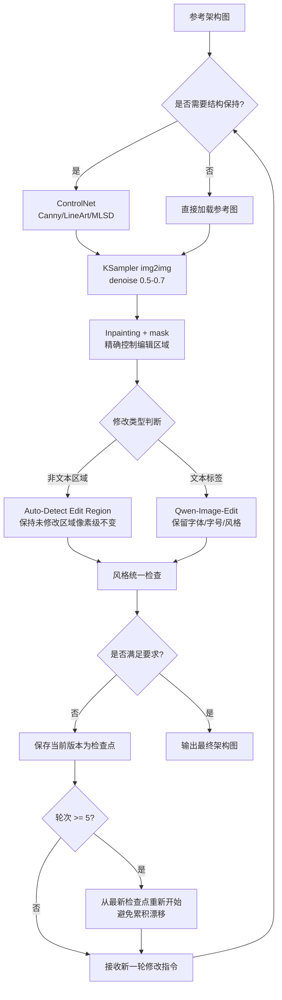

## 3. 图生图与改图工作流：迭代编辑与条件控制

架构图从概念草稿到最终交付物，极少一次成型。互联网行业对架构图的迭代频率远高于广告海报或社交媒体素材——一次需求评审可能触发模块增删、层级调整、技术栈更名等多轮修改。因此，图生图（img2img）与编辑工作流的成熟度，直接决定架构图生成方案在工程环境中的可用性。本章聚焦三项核心问题：何种编辑技术在保留中文标签精度的同时允许灵活修改；条件控制技术在锁定几何结构时付出了怎样的文本质量代价；以及多轮迭代中如何控制系统误差累积。

### 3.1 图生图编辑技术对比

当前图生图编辑技术可归纳为三条路线：以 FLUX.1 Kontext 为代表的上下文感知编辑、以 Qwen-Image 2.0 为代表的统一生成-编辑模型，以及以 ComfyUI img2img 节点为代表的参数化扩散重采样。三者在中文架构图场景的表现差异显著。

| 技术路线 | 单轮耗时 | 中文文本保持 | 多轮一致性 | 结构精确控制 | 开源/本地部署 | 架构图适用性 |
| :-- | :-- | :-- | :-- | :-- | :-- | :-- |
| FLUX.1 Kontext [Max] | 3–5 秒 | 差（LongText-ZH 0.007） | 良好（<6 轮） | 依赖上下文理解 | Dev 版开源 | ★★☆☆☆ |
| Qwen-Image 2.0 | 秒级 | 优秀（LongText-ZH 0.946） | 优秀 | 良好 | 部分开源 | ★★★★★ |
| ComfyUI img2img | 取决于采样步数 | 取决于底模 | 中等 | 优秀（ControlNet） | 完全开源 | ★★★★☆ |

上表揭示了一个关键分化：FLUX.1 Kontext 在排版生成上的官方指标（Max 版本 96.2% prompt adherence、94.7% character consistency）看似可观，但第三方横评将其文本保持能力评为"Poor, frequent gibberish"，与 Nano Banana Pro（Gemini 3 Pro Image）的"High precision in typography, layout, diagrams"形成鲜明对比[^1]。更根本的瓶颈在于 LongText-Bench-ZH 得分仅为 0.007，与 GLM-Image 的 0.9788 相差两个数量级[^2]。对于一张包含 20 个中文标签的架构图，即使单标签准确率达到 97%，至少一处出错的概率仍高达 1-(0.97)^20 ≈ 46%。这意味着 FLUX.1 Kontext 在架构图编辑中的价值局限于风格迁移、背景替换和元素增删，而非精确的字级文本修改。

Qwen-Image 2.0 则提供了截然不同的能力矩阵。该模型在 AI Arena 编辑排行榜上以 Elo 1034 位列第二，仅次于 Gemini-3-Pro-Image-Preview[^3]。其统一生成与编辑的架构允许在同一会话中完成"生成初始架构图 → 修改文本标签 → 调整模块样式"的链式操作，无需导出到外部工具。实测中，Qwen-Image-Edit 可将海报中的"AICoding"精确替换为"AIAgent"，并保留原有字体、字号和风格[^4]。对于架构图场景，这意味着工程师可以直接修改"负载均衡"为"网关层"而不重绘整个图。原生 2K 分辨率输出也确保了复杂架构图在多屏展示时的清晰度。然而，Qwen-Image 2.0 的 7B 版本在文本精度上略逊于 GLM-Image 的 0.9788，在极端高密文本场景下仍需验证。

ComfyUI img2img 路线代表了第三种哲学：通过参数化控制（denoise、ControlNet strength、mask）实现"可编程"编辑。denoise 参数 0.5–0.7 被社区验证为架构图编辑的 sweet spot——低于 0.5 难以实现有效修改，高于 0.7 则可能导致原有布局崩解[^5]。ComfyUI 的 Group Nodes 功能支持非线性分支编辑，允许同时探索"添加微服务层"和"改为单体架构"两个方向，并通过固定种子实现变体间的快速对比[^6]。该路线的核心优势在于 ControlNet 提供的精确几何控制，但代价是文本质量——这一点将在 3.2 节深入分析。

### 3.2 条件控制技术：保持几何结构的代价

扩散模型天生不擅长精确几何约束。IJCAI 2024 论文与多项后续研究（LACE、GeoSVG-RL）共同验证：即使使用 ControlNet，模块对齐、箭头指向、间距一致性等微观几何问题仍需后处理验证器介入[^7]。ControlNet 的价值在于将"宏观结构保持"从不可能变为可行，但使用者必须清楚其代价结构。

**3.2.1 预处理器对比：Canny vs LineArt vs MLSD**

在架构图（直线方框、箭头连接）场景中，三种预处理器的行为差异显著。Canny 边缘检测在权重设为 1.0 时立面布局保真度最高，但会检测所有边缘并引入噪声；LineArt 在保持线稿结构方面更柔和，细节保留更完整；MLSD 专门检测直线段，SSIM 得分高达 0.7455，但对曲线自动忽略[^8]。对于纯直线型架构图，MLSD 是最佳选择；若包含曲线连接或云形模块，则 Canny 或 LineArt 更为稳妥。实践中，Canny 阈值建议设置为 Low=100、High=200，需保留细箭头时可降至 Low=10、High=100[^9]。

**3.2.2 Multi-ControlNet 叠加与显存瓶颈**

复杂架构图常需同时控制多重几何属性：方框边界（Canny）、层次深度（Depth）、连接线走向（LineArt）。FLUX ControlNet V3.0 工作流采用 HED(0.8)+Depth(0.7)+Canny(0.6) 的三条件叠加，总权重建议 ≤2.0[^10]。ComfyUI 通过 Apply ControlNet 节点的链式串联实现多条件融合，并支持 Advanced-ControlNet 插件按时间步调度强度——前 50% 采样步高 strength 锁定结构，后 50% 步降低 strength 允许模型优化文本标签和颜色[^11]。但多 ControlNet 叠加会显著增加显存消耗：Depth Anything V2 本身 VRAM 密集，在 2K 分辨率下可能超出 12GB 显存容量，导致企业级部署需要分步执行或 CPU 卸载[^12]。

**3.2.3 ControlNet 的文本破坏效应**

ControlNet 在增强结构控制的同时，对中文文本的破坏是系统性的。SimplePoster 论文与 UniGlyph 研究（ICCV 2025）的数据显示：ControlNet-augmented 方法的 subject extension rate 为 23.6%，而全参数微调可降至 0.6%；在 MiniText-Benchmark 上，ControlNet 的 Sen.Acc 仅 0.0006，NED 仅 0.0021[^13]。这意味着当 ControlNet 强制模型跟随结构控制图时，文本区域可能被结构性线条覆盖或扭曲，小字标签尤其脆弱。缓解方案包括将 ControlNet strength 降至 0.1 左右[^14]，或采用 PosterMaker（CVPR 2025）引入的 OCR-aware ControlNet，通过注入字符级 OCR 特征改善文本渲染[^15]。但这些方案均增加了工作流复杂度，且无法完全消除文本破坏。

**3.2.4 替代方案：T2I-Adapter、IP-Adapter、CtrLoRA**

若 ControlNet 的文本破坏代价不可接受，可考虑轻量级替代方案。T2I-Adapter 仅 77M 参数，天然支持多条件加权融合，训练成本仅 4 块 V100 运行 2 天[^16]。IP-Adapter（22M 参数）擅长风格一致性，可与 ControlNet 组合实现"结构+风格"双重控制[^17]。CtrLoRA（ICLR 2025）在 Canny、Depth、Segmentation 等基准上 FID 和 LPIPS 均优于原始 ControlNet，且仅需约 1000 张图像和单张 RTX 4090 运行 1 小时即可训练新条件[^18]。对于需要自定义 UML 图或流程图控制条件的企业，CtrLoRA 提供了极低成本的扩展路径。ControlNet++（Uni-ControlNet 后续）则支持单一模型处理 10+ 种控制条件，相比原始 ControlNet 大幅降低模型数量和维护成本[^19]。

### 3.3 多轮迭代编辑最佳工作流

架构图编辑的迭代特性决定了工作流设计必须考虑误差累积问题。ICCV 2025 的多轮一致图像编辑研究表明，直接使用单步编辑方法在累积误差下会导致递增伪影和语义偏移；双参考策略（原始图 + 前一轮结果）可有效缓解这一问题[^20]。

以下流程图展示了标准链式工作流的核心决策节点：

该流程的核心设计原则有三。第一，结构控制与文本生成物理解耦：ControlNet 负责锁定几何骨架，但文本修改必须交由 Qwen-Image-Edit 或确定性渲染引擎处理，避免在 ControlNet 约束下直接生成中文。第二，编辑区域自动检测：ComfyUI-NKD-Klein-Tools 的 Auto-Detect Edit Region 节点可在无 mask 的 img2img 编辑后自动识别实际变化像素，仅将变化区域合成回原图，其余部分（含中文标签）保持像素级不变[^21]。第三，检查点机制：每 5 轮保存 latent + 参数，超过 5–6 轮后从最新检查点重新开始，而非在连续编辑链上延伸，以规避扩散模型多轮迭代中的可见伪影[^22]。

在 API 编排层面，Dify + Qwen-Image 的组合提供了更高阶的自动化能力。通过条件分支节点（`{{#start.image#}} 存在 ? 图生图 : 文生图`），系统可自动将用户反馈路由至对应处理分支；结合对话记忆功能，用户以自然语言发出修改指令（"将缓存层换成 Redis"），系统自动触发新一轮图生图请求[^23]。Dify 1.13.0 新增的人工介入节点支持工作流中途暂停与审核，对于含敏感信息的内部架构图尤为必要——毕竟中国《生成式人工智能服务管理暂行办法》要求企业级部署配备三层安全审核[^24]。

**中文文本畸变的系统性解决方案**最终指向一个不可回避的结论：扩散模型负责视觉，确定性渲染引擎负责文本。Qwen-Image-2512 在 4 步采样下中文可读率达 89%，已远超 SDXL+ControlNet 的 61%[^25]，但 89% 的单标签准确率面对 20 个标签的架构图时，整体可用性仍不足。RefineAnything 的 Focus-and-Refine 策略实现了 SSIMbg 0.9997 的背景保持[^26]，为局部编辑提供了技术基础，但架构图所需的 99%+ 文本准确率无法仅靠扩散模型达成。最优工作流是：ControlNet 保持结构 → Inpainting 修改非文本区域 → Qwen-Image-Edit 调整文本标签 → 若精度要求极高，则将文本层导出为 SVG/HTML 叠加到扩散模型生成的视觉底图上。这种"视觉-文本分离"不是可选优化，而是避免 ControlNet 文本破坏效应的必需步骤[^27]。

[^1]: Kie.ai. "Nano Banana Pro vs Flux Kontext vs Qwen Image Edit Comparison." 2025. https://kie.ai/zh-CN/nano-banana
[^2]: Wu et al. "Qwen-Image Technical Report." Alibaba Tongyi Lab, 2025. https://qianwen-res.oss-cn-beijing.aliyuncs.com/Qwen-Image/Qwen_Image.pdf
[^3]: Qwen GitHub. "Qwen-Image-2.0 Release." 2026-02-10. https://github.com/QwenLM/Qwen-Image
[^4]: 量子位. "凌晨战神Qwen又搞事情！新模型让图像编辑'哪里不对改哪里'." 2025-08-19. https://www.qbitai.com/2025/08/323675.html
[^5]: ComfyUI Docs. "Image to Image Workflow." https://docs.comfy.org/tutorials/basic/image-to-image
[^6]: ThinkDiffusion. "Total Image Control with Flux Kontext: Complete Tutorial." 2025-07-04. https://learn.thinkdiffusion.com/total-image-control-with-flux-kontext-complete-tutorial/
[^7]: 基于 Phase 1W 已有研究（LACE/GeoSVG-RL）。见 ai_img_arch_wide05.md
[^8]: Zhao et al. "Uni-ControlNet: All-in-One Control to Text-to-Image Diffusion Models." NeurIPS 2023. https://i.cs.hku.hk/~kykwong/publications/szhao_neurips2023.pdf
[^9]: CreatixAI. "ControlNet Canny Tutorial." 2023-11-17. https://creatixai.com/controlnet-canny-tutorial-stable-diffusion-a1111/
[^10]: ComfyUI.org. "Unlock Advanced Image Synthesis with FLUX ControlNet V3.0 Workflow." 2025-06-06. https://comfyui.org/en/flux-controlnet-v3-workflow
[^11]: Kosinkadink. "ComfyUI-Advanced-ControlNet." GitHub, 2023. https://github.com/Kosinkadink/ComfyUI-Advanced-ControlNet
[^12]: ComfyUI.org. "FLUX ControlNet V3.0 Workflow." 2025-06-06. https://comfyui.org/en/flux-controlnet-v3-workflow
[^13]: "A Simple Baseline for Product Poster Generation." arXiv:2605.08784, 2026-05-09. https://arxiv.org/html/2605.08784v1; Wang et al. "UniGlyph." ICCV 2025
[^14]: furkandurmus. "ComfyUi-Style-Transfer." GitHub, 2024-09-23. https://github.com/furkandurmus/ComfyUi-Style-Transfer
[^15]: 见 SimplePoster 论文 PosterMaker/Gao_2025_CVPR 引用
[^16]: CSDN. "巅峰对决：ControlNet vs T2I-Adapter、IP-Adapter." 2025-07-25. https://blog.csdn.net/gitblog_02746/article/details/149626146
[^17]: 同16；IJCNN 2025 Fashion RAG. https://iris.unimore.it/retrieve/dfc3cc96-4948-48be-bcef-cba297af7104/2025_IJCNN_Fashion_RAG.pdf
[^18]: Xu et al. "CtrLoRA: An Extensible and Efficient Framework for Controllable Image Generation." ICLR 2025. https://proceedings.iclr.cc/paper_files/paper/2025/file/31773c0ba7a4a98d729b9fc0d6d0cc13-Paper-Conference.pdf
[^19]: xinsir6. "ControlNetPlus." GitHub, 2024. https://github.com/xinsir6/ControlNetPlus
[^20]: Zhou et al. "Multi-turn Consistent Image Editing." ICCV 2025 / arXiv:2505.04320. https://arxiv.org/abs/2505.04320
[^21]: Nekodificador. "ComfyUI-NKD-Klein-Tools." GitHub, 2026-04-27. https://github.com/Nekodificador/ComfyUI-NKD-Klein-Tools
[^22]: RunComfy. "FLUX Kontext Dev ComfyUI Workflow." 2025-08-07. https://www.runcomfy.com/comfyui-workflows/flux-kontext-dev-comfyui-workflow-ai-image-editing-tool
[^23]: CSDN ADG. "用Dify+Qwen-Image实现文生图与图生图." 2025-12-15. https://adg.csdn.net/696f500e437a6b403369fcae.html
[^24]: 国家网信办. "生成式人工智能服务管理暂行办法."
[^25]: CSDN. "Qwen-Image-2512-ComfyUI + LoRA模型，实现极速渲染." 2026-01-28. https://blog.csdn.net/weixin_42504649/article/details/157445908
[^26]: Deep-Learning-101. "Computer Vision Paper - RefineAnything." GitHub, 2025-06-13. https://github.com/Deep-Learning-101/Computer-Vision-Paper
[^27]: 基于 Insight 4：结构控制与文本生成必须解耦。见 ai_img_arch_insight.md
