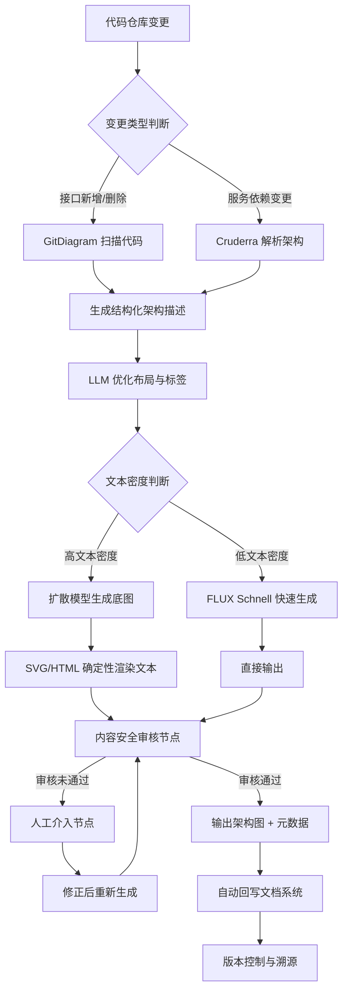

## 5. 工作流编排平台与企业级方案

架构图生成从单点工具调用走向系统化平台编排，标志着该领域从实验应用向生产级基础设施的跃迁。低代码平台降低了搭建门槛，但企业级部署的真正挑战在于成本控制、质量评估与合规风险的系统性管理。本章基于 Dify、Coze 等主流编排平台的实践数据，结合成本模型与合规框架，为技术决策者提供方案选型依据。

### 5.1 低代码工作流平台实践

#### 5.1.1 Dify + ComfyUI 分层架构：编排层与执行层解耦

当前企业级架构图生成的主流技术栈采用"Dify 负责编排决策，ComfyUI 负责图像生成执行"的分层架构。在 ComfyUI 中将工作流导出为 JSON，在 Dify Marketplace 安装官方 ComfyUI Plugin，填入服务器 URL 即可在 Workflow 中添加"ComfyUI Workflow"节点，直接传入 JSON 与变量完成调用[^1]。该架构的核心价值在于认知层与计算层解耦：Dify 处理提示词优化、条件路由、会话管理，ComfyUI 专注扩散采样，团队可独立迭代各自层级。

一个完整的 Dify 文生图 Chatflow 包含 6 个核心节点：开始 → LLM 优化提示词 → 代码提取参数 → ComfyUI 工具 → 参数提取器 → 结束。在 Mac mini 上实测生成一张图耗时 4–5 分钟，瓶颈完全在 GPU 推理而非编排层[^2]。

#### 5.1.2 Dify 接入国产模型：插件直装与 HTTP 节点桥接

Dify 官方插件市场已上架 Qwen-Image 插件，采用异步任务处理：提交任务 → 每 5 秒轮询 → 下载图像，魔搭社区目前提供免费额度[^3]。对于无专用插件的国产模型，Dify 通过 HTTP 节点桥接——阿里云为万相提供了可直接导入的 DSL 模板，替换 `DASHSCOPE_API_KEY` 即可运行[^4]。ERNIE-Image 与 GLM-Image 同样通过 HTTP 节点接入，调用后需配合代码节点处理返回数据。

兼容性问题是高频痛点。Qwen 插件由 Dify 官方维护（非阿里云直接提供），常见报错"Invalid API-key provided"的解决方案包括：使用默认业务空间 API Key、正确设置"使用国际端点"开关、尝试安装较早版本（如 0.0.40）[^5]。版本管理构成国产模型接入的隐性工程成本。

#### 5.1.3 Coze + 飞书多维表格：零代码批量生成的效率标杆

Coze 图像流底层基于 Stable Diffusion，支持文生图、图生图、智能换脸等节点化操作[^6]。其批处理节点可在 1 分钟内生成 100 张图（批量大小 100，并发 3），典型链路为：大模型生成提示词 → 批处理 → 图像生成 + 抠图 + 画板整合[^7]。

飞书多维表格的 AI 字段捷径将"表格驱动批量生成"推向企业级成熟度，集成即梦 4.0、豆包生图、DeepSeek 等模型，本质为"AI + 公式 + API"的集成工具[^8]。极兔速递在《向阳而行》项目中的数据极具说服力：35 个分镜 AI 生图耗时 350 秒（平均每张 10 秒），误差率下降 30%，替代手绘节省 2–3 天人工，年估降本超百万[^9]。对于批量生成场景，零代码方案比工程化方案更具成本效率。

#### 5.1.4 条件分支工作流设计：意图识别与内容安全审核

Dify 的 If-Else 节点支持多种条件类型与 AND/OR 组合，在图像生成场景中典型配置为：开始节点设置文本输入、类型选择、文件上传 → If-Else 判断类型 → 图生图分支调用 `qwen-image-edit`，文生图分支调用 `qwen-image` → 汇入结束节点[^10]。更智能的"问题分类器"节点利用 LLM 进行意图识别，自动路由到不同工具，但需承担额外调用成本（约 0.1–0.5 元/次）[^11]。

内容安全审核需在链路中嵌入多层检测。ComfyUI 可在 VAE Decode 后插入审核节点，调用轻量级 NSFW 分类模型，耗时不到 200 毫秒[^12]。Dify 1.13.0 新增的"人工介入节点"支持工作流中途暂停，让审核人修改关键数据后再继续，支持多分支决策与超时设置[^13]。

### 5.2 企业级部署与成本优化

#### 5.2.1 API 调用成本矩阵：从 $0.0012 到 $0.17 的价差鸿沟

2026 年图像生成 API 市场极端分化：低端持续探底，高端逆势涨价。以下为基于各平台官方定价（2026 年 6 月）的国产模型成本矩阵：

| 模型/平台 | 标准定价（美元/张） | 中文文本精度（LongText-ZH） | 核心优势 | 适用场景 |
|:---|:---|:---|:---|:---|
| Z-Image Turbo 6B | ~$0.010 | 0.936 | 成本最低 | 批量草稿、内部原型 |
| 豆包 Seedream 4.0 | $0.018–0.028 | 0.89–0.92 | 4K 输出、多图编辑 | 电商素材、运营配图 |
| Qwen-Image 2.0 | $0.028–0.035 | 0.946 | 编辑能力强、原生 2K | 架构图迭代、PPT 信息图 |
| GLM-Image | ~$0.030 | 0.9788 | 开源第一、MIT 许可 | 文本密集型精确图表 |
| 万相 2.1 Turbo | ~$0.020 | 0.85–0.90 | 中文审美、电商优化 | 营销海报、品牌物料 |
| ERNIE-Image Turbo | 商务协议 | 0.96+ | 8B 轻量、本地友好 | 消费级本地部署 |
| GPT Image 1.5 | $0.040 | 0.619 | 综合质量最高（ELO 1264） | 英文场景、高端客户素材 |
| FLUX Schnell | $0.0012–0.003 | 0.005 | 开源、最快、最便宜 | 纯视觉（无中文文本）场景 |

上表揭示了一个关键矛盾：成本与中文文本精度显著正相关。FLUX Schnell 以 $0.0012/张 刷新底价，但 LongText-Bench-ZH 仅 0.005，对含中文标签的架构图几乎不可用[^14]。GLM-Image 以 0.9788 居开源第一，价格约为 FLUX Schnell 的 10 倍。日均生成 100 张架构图的企业，仅 API 成本年支出差距可达 $31,000。这迫使企业按文本密度分层采购：文本密集型用 GLM-Image/Qwen-Image，纯视觉辅助图用 FLUX Schnell/豆包 Seedream。

#### 5.2.2 三档企业方案：初创、中型与大型企业的 TCO 模型

2025 年企业 AI 部署市场中，云端占 58%，本地占 42%，混合部署已成为增速最快的策略[^15]。基于该格局，三档方案如下：

**初创（<20 人，日生成 <50 张）**：纯 API，月成本 <$50。推荐豆包 Seedream 4.0（¥0.2/张）或 Qwen-Image 国内版（¥0.2/张）。500 张/月全用 Qwen-Image 2.0 月支出约 $17.5，远低于本地部署门槛。

**中型（20–200 人，日生成 50–500 张）**：混合部署，月成本 $200–500。敏感数据本地 ComfyUI 处理，通用素材走 API。实测混合部署（A100 复杂请求 + RTX 4090 标准生成）可降本 40%[^16]。阿里云 PAI-EAS + ComfyUI + Dify 形成国内最完整的低代码企业级图像工作流[^17]。

**大型（>200 人，日生成 >500 张）**：本地集群 + 云端弹性，年 TCO $50 万+。单台 8 卡 H100 服务器 upfront 成本约 $25–40 万，3 年 TCO 达 $231.9 万（含 $53.5 万/年人力、$1.82 万/年电费冷却、$7.66 万/年维护）[^18]。H100 单卡 TDP 700W，8 卡服务器功耗超 10kW，年电费约 $10,720[^19]。GPU 利用率从 60% 提升至 85% 可降低有效成本 29%，大型企业的核心优化目标不是硬件采购而是调度效率[^20]。

盈亏平衡点：日生成 <500 张选纯 API；>2,000 张且利用率 >60% 选本地；数据敏感度高则本地为必选项[^21]。

#### 5.2.3 质量评估框架：从主观审美到结构化指标

企业级架构图生成不能依赖主观审美。R2ABench 论文提出三维混合框架：结构图指标（节点/边 F1、层准确率、图编辑距离）、多维评分（语义正确性 LLM 评判）、反模式检测（孤立组件与 God 组件比例）[^22]。ACM 软件架构论文提出五维标准：清晰度、一致性、完整性、准确性、细节水平，LLM 评判与人工专家有较高一致性但仍需监督[^23]。

中文架构图需补充：布局合理性、依赖完整性、安全边界标注、与代码一致性、中文文本渲染准确率。当前评测框架均偏重英文通用图像，中文架构图的专业术语、布局规范、行业符号缺乏系统评估体系，这是企业选型需自行填补的空白[^24]。

#### 5.2.4 安全合规三层防线：中国法规与欧盟 AI Act 的双重约束

中国境内企业需满足三层防线。第一层：《生成式人工智能服务管理暂行办法》（2023 年 8 月 15 日生效）要求内容生产者责任、安全评估、算法备案、AI 生成标识，未备案面向公众服务可面临整改或暂停[^25]。该办法仅适用于对外服务，内部自用不适用。

第二层：《人工智能生成合成内容标识办法》（2025 年 9 月 1 日实施）要求显式标识（"AI 生成"）和隐式溯源（数字水印、区块链、元数据），未标注最高罚款 10 万元[^26]。

第三层：版权风险。2024 年广州互联网法院判决全球首例 AI 平台著作权侵权案（奥特曼形象），认定未经许可使用作品训练构成侵权；超 60% 商用 AI 绘图工具使用未授权数据。企业建立 IP 黑名单 + 反向搜索 + 动态水印可降低投诉率 92%[^27]。国家版权局 2025 年指南明确：AI 生成内容占比不超过 60% 且经实质性修改，可认定开发者为著作权人[^28]。

跨国企业还需关注欧盟 AI Act Article 50，2026 年 8 月 2 日强制执行，要求机器可读标记、多层标记（元数据 + 不可见水印 + 检测能力）[^29]。

### 5.3 未来趋势与战略建议

#### 5.3.1 架构图进化为动态资产：代码仓库→实时架构图→自动同步

当前工具主要解决"生成"问题，但互联网行业真正的痛点是"维护"——架构图在代码变更后迅速过时。Cruderra 扫描代码库自动生成架构图，GitDiagram 实现 GitHub 仓库到交互架构图的自动转换[^30]。未来竞争焦点不是"谁生成的图更好看"，而是"谁的图能自动跟随代码演进保持最新"。这要求架构图从静态图片进化为与代码仓库绑定的动态资产。

上图展示了企业级架构图生成的理想工作流：代码变更触发自动化扫描，LLM 优化布局后进入模型路由层（根据文本密度选择不同模型），经内容安全审核与人工介入节点，输出带元数据标识的架构图并自动回写文档系统。核心设计原则是"代码驱动"——架构图源头是代码而非设计师输入，确保与代码仓库的实时一致性。

#### 5.3.2 模型路由成为核心竞争力

不存在在所有维度最优的模型。GLM-Image 文本精度最高（0.9788）但编辑能力未知；Qwen-Image 2.0 编辑最强但精度略逊；ERNIE-Image 8B 本地部署最友好但信息图能力有限；Z-Image 成本最低但质量中等[^31]。企业应构建"模型路由"机制，根据任务类型自动选择最优模型。工作流编排平台的"条件分支 + 多模型切换"能力因此至关重要。预算应从"买更好的模型"转向"建更聪明的调度系统"。

#### 5.3.3 实时生成毫秒化：从秒级到亚秒级的技术跃迁

实时图像生成已进入毫秒级。FLUX Schnell 在 fal.ai 上已实现 sub-second；SemanticDraw 在 RTX 2080 Ti 上达 1.57 FPS（0.64 秒/帧）[^32]。但架构图场景对文字精度要求更高，实时化可能滞后 1–2 个季度。API 价格战走向分化：低端（FLUX Schnell/SDXL）继续降至 $0.001/张以下，高端（GPT Image/GLM-5）逆势涨价——智谱 2026 年 Q1 累计涨 83%，MiniMax 永久降价 50%[^33]。企业选型应分层：高端模型用于关键客户素材，低端用于批量草图，混合使用可节省 30–50% 成本。

---

[^1]: 一起AI技术《在Dify中接入ComfyUI+Flux实现文生图》(2025-03-15), https://17aitech.com/?p=39436; AtomGit 开源社区《Dify + ComfyUI：零代码打造 AI 漫剧全自动生产线》(2026-03-30), https://gitcode.csdn.net/69ca550454b52172bc65872d.html

[^2]: 一起AI技术《在Dify中接入ComfyUI+Flux实现文生图》(2025-03-15), https://17aitech.com/?p=39436

[^3]: GitHub - wwwzhouhui/qwen_text2image (2025-08-20), https://github.com/wwwzhouhui/qwen_text2image; CSDN《用 Dify+Qwen-Image 实现文生图与图生图》(2025-12-15), https://blog.csdn.net/weixin_34725745/article/details/155975340

[^4]: 阿里云帮助文档《Dify 接入百炼模型构建大模型应用》(2026-06-12), https://help.aliyun.com/zh/model-studio/dify

[^5]: 阿里云帮助文档《Dify 接入百炼模型构建大模型应用》(2026-06-12), https://help.aliyun.com/zh/model-studio/dify; CSDN《Dify 模型接入避坑指南》(2026-03-19), https://blog.csdn.net/weixin_30566063/article/details/159235769

[^6]: 飞书文档《COZE 扣子图像流功能》(2026-06-23), https://docs.feishu.cn/article/wiki/FbGlwTWD3iVuT5kZvlHco6v0nqd

[^7]: 知乎专栏《1 分钟批量生成 100 张》(2025-08-19), https://zhuanlan.zhihu.com/p/1941221903839786190; 火山引擎开发者社区《扣子 Coze 工作流实战》(2025-09-01), https://developer.volcengine.com/articles/7545026392155029547

[^8]: 飞书官网《多维表格 AI 字段捷径》(2026-01-07), https://www.feishu.cn/content/article/7592538064711470271

[^9]: 飞书官网《多维表格 AI 字段捷径》(2026-01-07), https://www.feishu.cn/content/article/7592538064711470271

[^10]: Dify 官方文档《If-Else》(2026-04-16), https://docs.dify.ai/zh/use-dify/nodes/ifelse

[^11]: Dify 官方文档《问题分类器》(2025-03-27), https://docs.dify.ai/zh/use-dify/nodes/question-classifier

[^12]: CSDN《ComfyUI 内容审核节点》(2025-12-13), https://blog.csdn.net/weixin_35871529/article/details/155900945

[^13]: 什么值得买《Dify 新功能：人工介入节点介绍》(2026-02-15), https://post.smzdm.com/p/ax6qlvz9

[^14]: Pixazo Blog (2026-05-29), https://www.pixazo.ai/blog/flux-schnell-api-cheapest-pricing; Qwen-Image Technical Report & NTIRE 2025.

[^15]: Acumen Research and Consulting Enterprise AI Market Report (2026-04-20), https://www.acumenresearchandconsulting.com/enterprise-ai-market

[^16]: 腾讯云开发者社区 GPU 选型案例 (2025-11-16), https://cloud.tencent.com/developer/article/2589074

[^17]: 阿里云帮助文档《在 Dify 中调用 PAI-EAS 部署的 ComfyUI 服务》(2025-12-02), https://help.aliyun.com/en/pai/use-cases/call-the-comfyui-service-deployed-by-eas-in-dify

[^18]: GMI Cloud / BytePlus TCO Calculator (2025-11-08 / 2025-09-02), https://www.gmicloud.ai/en/blog/h100-gpu-pricing-2025-cloud-vs-on-premise-cost-analysis

[^19]: VerticalData / GMI Cloud (2025-10-02 / 2025-11-08), https://verticaldata.io/the-hidden-economics-of-ai-hardware-total-cost-of-ownership-beyond-the-purchase-price/

[^20]: 腾讯云开发者社区 GPU 选型案例 (2025-11-16), https://cloud.tencent.com/developer/article/2589074

[^21]: 基于阿里云 PAI-EAS、Dify、Gartner 综合，https://www.allganize.ai/en/blog/enterprise-guide-choosing-between-on-premise-and-cloud-llm-and-agentic-ai-deployment-models (2025-04-28)

[^22]: R2ABench 论文 (arXiv:2604.06683, 2026-03-18), https://arxiv.org/html/2604.06683v1

[^23]: ACM Software Architecture 论文 (2025-09-01), https://dl.acm.org/doi/10.1007/978-3-032-02138-0_8

[^24]: 基于宽域调研与行业实践综合，https://www.devopsschool.com/blog/top-10-ai-architecture-diagram-generators-features-pros-cons-comparison/ (2026-06-18)

[^25]: 国家网信办 / 中伦律师事务所 (2025-12-26), https://www.zhonglun.com/upload/file/20251226/1766726255343057156.pdf

[^26]: 掘金 (2026-01-31), https://juejin.cn/post/7601046076942761999

[^27]: 中伦律师事务所 / ainiseo.com (2024 / 2025-03-16), https://www.llinkslaw.com/uploadfile/publication/8_1744073888.pdf; https://www.ainiseo.com/ai/21538.html

[^28]: 软著 Pro (2026-02-05), https://ruanzhu.pro/news/645

[^29]: Herbert Smith Freehills / artificialintelligenceact.eu (2026-03-19 / 2024-06-13), https://www.hsfkramer.com/notes/ip/2026-03/transparency-obligations-for-ai-generated-content-under-the-eu-ai-act-from-principle-to-practice

[^30]: 本洞察来源于跨维度交叉验证：Dim03（Cruderra/GitDiagram）、Dim07（Claude Code Skill）、Dim08（未来趋势）综合分析。

[^31]: 本洞察来源于跨维度交叉验证：Dim01（各模型基准）、Dim02（Qwen-Image 编辑榜）、Dim08（不同规模企业方案）综合分析。

[^32]: miraflow.ai / fal.ai (2026-04-20 / 2025-11-13), https://miraflow.ai/blog/ai-image-generation-arms-race-2026-everything-changes

[^33]: 新浪财经 / TeamDay (2026-06-19 / 2026-01-29), https://finance.sina.com.cn/roll/2026-06-19/doc-inicwtfi9956805.shtml; https://www.teamday.ai/zh/blog/ai-api-pricing-comparison-2026
