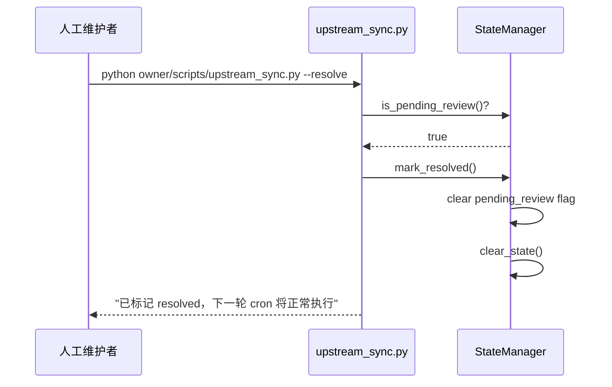
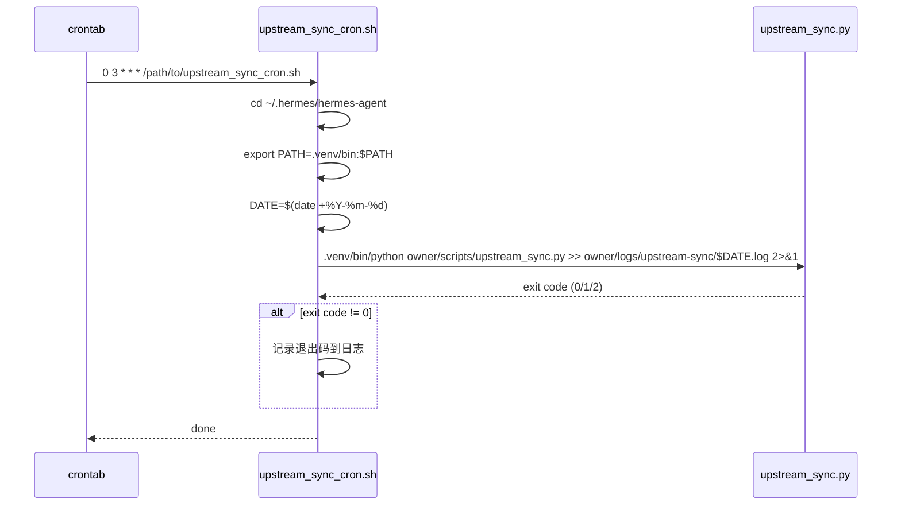
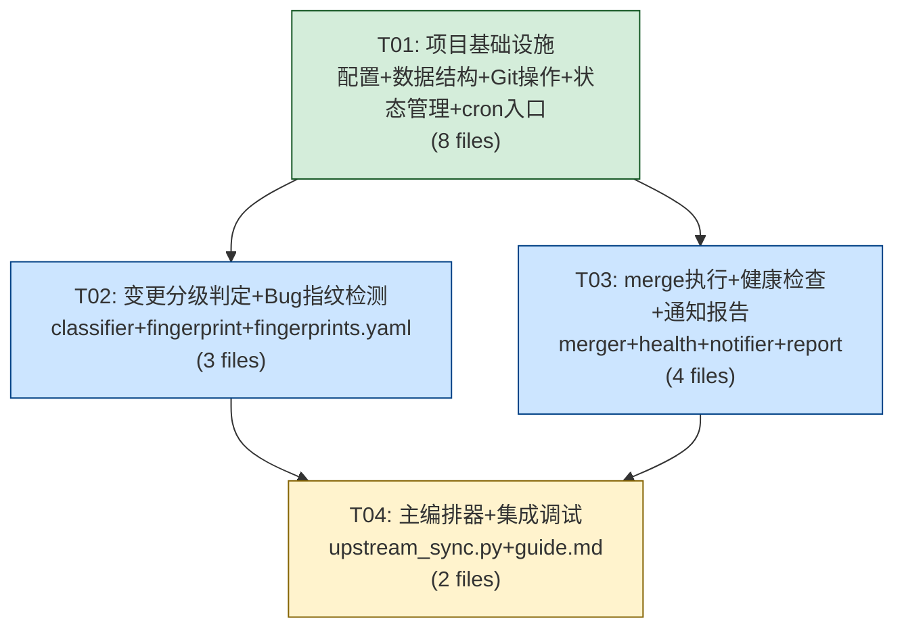

# 架构设计：hermes-agent 上游自动追赶机制

> **项目名称**：`hermes_upstream_sync`
> **仓库路径**：`~/.hermes/hermes-agent`（`/Users/yangtb/.hermes/hermes-agent`）
> **架构师**：高见远（Bob）
> **日期**：2026-07-16

---

## 目录

- [Part A：系统设计](#part-a系统设计)
  - [1. 实现方案 + 框架选型](#1-实现方案--框架选型)
  - [2. 文件列表及相对路径](#2-文件列表及相对路径)
  - [3. 数据结构和接口](#3-数据结构和接口)
  - [4. 程序调用流程](#4-程序调用流程)
  - [5. 待明确事项](#5-待明确事项)
- [Part B：任务分解](#part-b任务分解)
  - [6. 依赖包列表](#6-依赖包列表)
  - [7. 任务列表](#7-任务列表)
  - [8. 共享知识](#8-共享知识)
  - [9. 任务依赖图](#9-任务依赖图)

---

# Part A：系统设计

## 1. 实现方案 + 框架选型

### 1.1 整体架构概述

**一句话核心**：一个 Python 编排脚本驱动的流水线，按 `fetch → 分级判定(D1-D5) → 试合并 → 健康检查(D6) → 测试(D7) → 提交/回滚 → 通知` 七段式执行，任一阶段触发红线即回滚并转人工。

**模块划分**：

```
┌─────────────────────────────────────────────────────────┐
│                   upstream_sync_cron.sh                  │
│                   (cron shell wrapper)                   │
└──────────────────────┬──────────────────────────────────┘
                       │
              ┌────────▼────────┐
              │  upstream_sync   │  ← 主编排器 (CLI entry)
              │  .py (Orchestrator)│     --dry-run / --resolve
              └────────┬────────┘
                       │
    ┌──────────┬───────┼───────┬──────────┬──────────┐
    ▼          ▼       ▼       ▼          ▼          ▼
┌───────┐ ┌────────┐ ┌─────┐ ┌──────┐ ┌────────┐ ┌────────┐
│GitOps │ │Classi- │ │Finger│ │Merger│ │Health  │ │Notifier│
│       │ │fier    │ │print │ │      │ │Checker │ │        │
│D4预检 │ │D1-D5   │ │检测  │ │merge │ │D6+D7   │ │策略模式 │
└───┬───┘ └───┬────┘ └──┬──┘ └──┬───┘ └───┬────┘ └───┬────┘
    │         │         │       │         │          │
    ▼         ▼         ▼       ▼         ▼          ▼
┌───────┐ ┌──────────────────────────────────────┐ ┌──────┐
│State  │ │        models.py (dataclass)          │ │Report│
│Manager│ │  ChangeClassification / SyncReport ...│ │Builder│
└───────┘ └──────────────────────────────────────┘ └──────┘
    │
    ▼
┌───────────────────┐
│  config.py        │  ← upstream_sync.yaml
│  (SyncConfig)     │
└───────────────────┘
```

### 1.2 技术栈选型

| 决策项 | 选型 | 理由 |
|--------|------|------|
| **语言** | Python 3.11+（项目 `requires-python = ">=3.11,<3.14"`） | 与 hermes-agent 主项目一致，直接复用 `.venv` |
| **运行时** | `~/.hermes/hermes-agent/.venv/bin/python` | 项目已有 venv，PyYAML 6.0.3 + pytest 已安装，无需额外安装 |
| **新依赖** | **无**（零新增第三方包） | 仅用 stdlib（`subprocess`/`json`/`dataclasses`/`pathlib`/`argparse`/`logging`）+ PyYAML（已在 pyproject.toml dependencies 中） |
| **cron 编排** | 系统 `crontab` + shell wrapper 脚本 | macOS 原生支持，无需 launchd 复杂配置；shell wrapper 负责 cd 到仓库根、激活 venv、重定向日志 |
| **通知实现** | 策略模式：`LogNotifier`（P0，写文件）+ `FeishuNotifier`（P2，飞书 webhook） | 初期仅写日志文件，后续可无缝扩展飞书 |
| **配置格式** | YAML（`upstream_sync.yaml`） | 与项目现有 `anchors.yaml`/`inventory.yaml` 风格一致 |
| **状态持久化** | JSON 文件（`.sync_state.json`） | 轻量、可读、无需数据库 |
| **架构模式** | Pipeline + Strategy | 流水线按阶段顺序执行；通知渠道用策略模式可扩展 |
| **日志格式** | 结构化 JSON Lines（`.jsonl`）+ 人类可读 Markdown 报告 | JSON Lines 便于后续周报统计（P2-03）；Markdown 报告供人工阅读 |

### 1.3 核心技术挑战与解法

| 挑战 | 解法 |
|------|------|
| **D4 试合并不污染工作区** | `git merge --no-commit --no-ff upstream/main`：成功时 merge 结果暂存于 index 但不提交，HEAD 不变；失败时 `git merge --abort` 恢复。D6/D7 在暂存态运行，通过后 `git commit --no-edit` 完成；失败时 `git merge --abort` |
| **回滚可靠性** | 执行前将 pre-merge HEAD 写入 `.sync_state.json`；任一阶段失败先尝试 `git merge --abort`，再兜底 `git reset --hard <pre_merge_head>` |
| **幂等安全** | 每次运行前检查 state 文件是否有 pending review；有则跳过本轮（等待人工 `--resolve`）；无则正常执行 |
| **工作区干净检查** | 执行前 `git status --porcelain`，非空则跳过本轮并写日志 |
| **merge_health_check.py 集成** | 通过 `subprocess.run()` 调用 `.venv/bin/python owner/validation/merge_health_check.py`，捕获退出码（0=通过/1=失败）和 stdout |
| **与现有 check_hermes_upstream.py 的关系** | 新系统是它的超集（增加了分级、自动 merge、健康检查、回滚、通知）。`check_hermes_upstream.py` 保留不动，新系统独立实现 |

---

## 2. 文件列表及相对路径

所有路径相对于仓库根目录 `~/.hermes/hermes-agent`。

### 2.1 新建文件（16 个）

| # | 文件路径 | 职责 | 所属任务 |
|---|---------|------|---------|
| 1 | `owner/sync/__init__.py` | sync 包初始化，导出公开 API | T01 |
| 2 | `owner/sync/models.py` | 核心数据结构（dataclass） | T01 |
| 3 | `owner/sync/config.py` | 配置加载器（SyncConfig） | T01 |
| 4 | `owner/sync/gitops.py` | Git 操作封装（fetch/merge/reset/diff/log） | T01 |
| 5 | `owner/sync/state.py` | 状态管理（pre-merge HEAD、pending review） | T01 |
| 6 | `owner/config/upstream_sync.yaml` | 同步配置文件（阈值、cron、remote、通知） | T01 |
| 7 | `owner/scripts/upstream_sync_cron.sh` | cron shell wrapper（cd + venv + 日志重定向） | T01 |
| 8 | `owner/logs/upstream-sync/.gitkeep` | 日志目录占位 | T01 |
| 9 | `owner/sync/classifier.py` | 变更分级判定 D1-D5（预合并阶段） | T02 |
| 10 | `owner/sync/fingerprint.py` | Bug 重复修复检测（指纹库匹配） | T02 |
| 11 | `owner/validation/fix_fingerprints.yaml` | Bug 修复指纹库初始数据（5-8 项） | T02 |
| 12 | `owner/sync/merger.py` | merge 执行 + D4 冲突预检 + 回滚 | T03 |
| 13 | `owner/sync/health.py` | D6 健康检查 + D7 测试集成 | T03 |
| 14 | `owner/sync/notifier.py` | 通知模块（策略模式：LogNotifier + FeishuNotifier） | T03 |
| 15 | `owner/sync/report.py` | 报告生成（Markdown 格式，自动通过 + 人工确认） | T03 |
| 16 | `owner/scripts/upstream_sync.py` | 主编排脚本（CLI entry：`--dry-run` / `--resolve`） | T04 |

### 2.2 修改文件（0 个）

本设计**不修改任何现有文件**。所有新代码放在 `owner/sync/` 新包中，通过 `subprocess` 调用已有的 `merge_health_check.py`，通过文件读取使用 `anchors.yaml`/`inventory.yaml`/`fix_fingerprints.yaml`。

### 2.3 复用的现有文件（只读）

| 文件 | 复用方式 |
|------|---------|
| `owner/validation/merge_health_check.py` | `subprocess.run()` 调用，解析退出码 + stdout |
| `owner/validation/anchors.yaml` | 读取 `file` 字段，用于 D2 锚点文件触及检测 |
| `owner/validation/inventory.yaml` | 不直接读取（由 merge_health_check.py 内部使用） |
| `owner/docs/owner改动清单.md` | 读取附录 B.1 重度侵入文件列表（硬编码到配置中，避免每次解析 Markdown） |

---

## 3. 数据结构和接口

### 3.1 配置文件 Schema（`owner/config/upstream_sync.yaml`）

```yaml
# ─── 仓库配置 ───
repo:
  root: "~/.hermes/hermes-agent"     # 仓库根目录（~ 自动展开）
  owner_branch: "owner"               # 二次开发分支
  upstream_remote: "upstream"          # 上游 remote 名
  upstream_branch: "main"             # 上游分支名
  venv_python: ".venv/bin/python"     # venv Python 路径（相对 repo.root）

# ─── cron 配置 ───
cron:
  schedule: "0 3 * * *"               # crontab 表达式（每日凌晨 3:00）
  max_commits_threshold: 100          # 积累超过此数 → 自动转 MANUAL_REVIEW

# ─── 变更分级配置 ───
classification:
  d1_max_files: 20                    # D1: 总改动文件数阈值
  # D2: 锚点文件列表（从 anchors.yaml 读取，此处仅指定路径）
  d2_anchors_file: "owner/validation/anchors.yaml"
  # D3: 重度侵入文件列表（来自改动清单附录 B.1）
  d3_heavily_intruded_files:
    - "gateway/run.py"
    - "plugins/platforms/feishu/adapter.py"
    - "agent/conversation_loop.py"
    - "tools/approval.py"
    - "gateway/platforms/base.py"
    - "tools/cronjob_tools.py"
    - "cron/jobs.py"
    - "cron/scheduler.py"
  # D5: 危险关键词列表
  d5_dangerous_keywords:
    - "refactor"
    - "rewrite"
    - "architecture"
    - "remove"
    - "deprecate"
    - "rename"
    - "split"
    - "restructure"

# ─── 健康检查配置 ───
health_check:
  script: "owner/validation/merge_health_check.py"
  # 使用 repo.venv_python 执行

# ─── 测试配置 ───
testing:
  command: ".venv/bin/python -m pytest tests/owner/ -x -q"
  timeout_seconds: 600                # 测试超时（10 分钟）

# ─── Bug 指纹检测配置 ───
fingerprint:
  file: "owner/validation/fix_fingerprints.yaml"
  high_confidence_threshold: 0.8      # > 0.8 → 高置信度 MANUAL_REVIEW
  medium_confidence_threshold: 0.5    # 0.5-0.8 → 中置信度 MANUAL_REVIEW
  file_weight: 0.6                    # 文件交集率权重
  keyword_weight: 0.4                 # 关键词命中率权重

# ─── 通知配置 ───
notification:
  log_dir: "owner/logs/upstream-sync" # 日志目录
  feishu_webhook: ""                  # 飞书 webhook URL（空=禁用，P2）

# ─── 状态文件配置 ───
state:
  file: "owner/logs/upstream-sync/.sync_state.json"

# ─── 回滚配置 ───
rollback:
  strategy: "reset_hard"              # 回滚策略：git reset --hard
```

### 3.2 Bug 修复指纹库 Schema（`owner/validation/fix_fingerprints.yaml`）

```yaml
fixes:
  - id: <唯一标识符>                    # 如 "credential-pool-env-seed-asymmetry"
    title: "<修复标题>"                 # 人类可读描述
    owner_commit: "<改动清单章节号>"     # 如 "2.2.1"
    owner_commit_hash: "<可选>"         # owner 分支 commit hash
    fixed_files:                        # 本地修复涉及的文件列表
      - <相对仓库根的文件路径>
    fix_keywords:                       # 修复意图关键词列表
      - <关键词>
    fix_category: <bugfix|security|enhancement>
    status: <active|superseded|merged_upstream>
```

**初始数据**（从改动清单"已修复"小节提取 5 项）：

```yaml
fixes:
  - id: credential-pool-env-seed-asymmetry
    title: "credential pool env seeding 不校验 key 格式"
    owner_commit: "2.2.1"
    owner_commit_hash: "e0230f90a"
    fixed_files:
      - hermes_cli/auth.py
      - agent/credential_pool.py
      - hermes_cli/model_switch.py
    fix_keywords:
      - api_key_prefixes
      - _seed_from_env
      - copilot
      - ghp_
    fix_category: bugfix
    status: active

  - id: anthropic-unconditional-probe
    title: "anthropic 无条件探测拖慢 /providers"
    owner_commit: "2.2.2"
    fixed_files:
      - hermes_cli/model_switch.py
      - hermes_cli/providers.py
    fix_keywords:
      - _cred_signal_slugs
      - anthropic
      - should_probe
      - has_explicit_models
    fix_category: bugfix
    status: active

  - id: env-only-providers-display
    title: "env-only providers 不纳入显示列表"
    owner_commit: "2.2.3"
    owner_commit_hash: "83576b22c"
    fixed_files:
      - hermes_cli/model_switch.py
    fix_keywords:
      - env-only
      - provider
      - display
      - list
    fix_category: bugfix
    status: active

  - id: feishu-model-picker-stale-session
    title: "飞书 model_picker 卡片 stale session 卡 loading"
    owner_commit: "2.2.4"
    fixed_files:
      - plugins/platforms/feishu/adapter.py
    fix_keywords:
      - model_picker
      - stale
      - loading
      - action_value
    fix_category: bugfix
    status: active

  - id: damodel-env-var-template-crash
    title: "damodel /model 校验时 env-var 模板未展开导致 crash"
    owner_commit: "2.8.1"
    fixed_files:
      - hermes_cli/model_switch.py
    fix_keywords:
      - damodel
      - base_url
      - template
      - env
    fix_category: bugfix
    status: active
```

### 3.3 核心数据结构（`owner/sync/models.py`）

```python
class UpstreamCommit:
    hash: str                    # commit hash
    short_hash: str              # 短 hash
    message: str                 # 完整 commit message
    files: list[str]             # 修改的文件列表
    author: str
    date: str                    # ISO 8601

class DimensionResult:
    dimension: str               # "D1" ~ "D7"
    name: str                    # 如 "改动规模"
    passed: bool                 # True=AUTO, False=触发红线
    details: str                 # 人类可读详情
    triggered_red_line: bool     # 是否触发了 MANUAL_REVIEW 红线

class FingerprintMatch:
    fingerprint_id: str
    fingerprint_title: str
    owner_commit: str            # 改动清单章节号
    upstream_commit_hash: str
    upstream_commit_message: str
    file_intersection_rate: float
    keyword_hit_rate: float
    combined_similarity: float
    confidence: str              # "high" | "medium"

class ChangeClassification:
    decision: str                # "AUTO_MERGE" | "MANUAL_REVIEW"
    dimensions: list[DimensionResult]    # D1-D5 结果
    upstream_commits: list[UpstreamCommit]
    total_files_changed: int
    total_commits: int
    reasons: list[str]           # 触发 MANUAL_REVIEW 的原因列表
    fingerprint_matches: list[FingerprintMatch]

class MergeResult:
    success: bool
    output: str                  # git merge stdout+stderr
    conflict_files: list[str]    # 冲突文件列表（如有）

class HealthCheckResult:
    exit_code: int               # 0=通过, 1=失败
    passed: bool
    output: str                  # 完整 stdout
    summary: str                 # 最后一行摘要

class TestResult:
    exit_code: int
    passed: bool
    output: str
    summary: str

class SyncReport:
    timestamp: str               # ISO 8601
    pre_merge_head: str          # merge 前 HEAD hash
    upstream_head: str           # upstream/main HEAD hash
    merge_base: str              # merge-base hash
    total_commits: int           # 上游新增 commit 数
    classification: ChangeClassification | None
    merge_result: MergeResult | None       # None=未尝试 merge
    health_check: HealthCheckResult | None
    test_result: TestResult | None
    rolled_back: bool
    decision: str                # 最终决策：AUTO_MERGE / MANUAL_REVIEW / SKIPPED / ERROR
    log_file: str                # 日志文件路径
    error: str | None            # 错误信息（如有）
```

### 3.4 类图（classDiagram）

```mermaid
classDiagram
    direction TB

    %% ─── 数据结构 ───
    class UpstreamCommit {
        +str hash
        +str short_hash
        +str message
        +list~str~ files
        +str author
        +str date
    }

    class DimensionResult {
        +str dimension
        +str name
        +bool passed
        +str details
        +bool triggered_red_line
    }

    class FingerprintMatch {
        +str fingerprint_id
        +str fingerprint_title
        +str upstream_commit_hash
        +float combined_similarity
        +str confidence
    }

    class ChangeClassification {
        +str decision
        +list~DimensionResult~ dimensions
        +list~UpstreamCommit~ upstream_commits
        +int total_files_changed
        +list~str~ reasons
        +list~FingerprintMatch~ fingerprint_matches
    }

    class MergeResult {
        +bool success
        +str output
        +list~str~ conflict_files
    }

    class HealthCheckResult {
        +int exit_code
        +bool passed
        +str output
        +str summary
    }

    class TestResult {
        +int exit_code
        +bool passed
        +str output
        +str summary
    }

    class SyncReport {
        +str timestamp
        +str pre_merge_head
        +str upstream_head
        +int total_commits
        +ChangeClassification classification
        +MergeResult merge_result
        +HealthCheckResult health_check
        +TestResult test_result
        +bool rolled_back
        +str decision
        +str log_file
    }

    %% ─── 配置 ───
    class SyncConfig {
        -dict _raw
        +Path repo_root
        +str owner_branch
        +str upstream_remote
        +str upstream_branch
        +Path venv_python
        +int d1_max_files
        +list~str~ d3_heavily_intruded_files
        +list~str~ d5_dangerous_keywords
        +int max_commits_threshold
        +float high_confidence_threshold
        +float medium_confidence_threshold
        +float file_weight
        +float keyword_weight
        +str health_check_script
        +str test_command
        +Path log_dir
        +str feishu_webhook
        +Path state_file
        +load(path: Path) SyncConfig
    }

    %% ─── Git 操作 ───
    class GitOps {
        -Path repo_root
        -SyncConfig config
        +fetch_upstream() void
        +get_merge_base(branch: str) str
        +get_upstream_head() str
        +get_current_head() str
        +get_owner_branch() str
        +is_workdir_clean() bool
        +get_new_commits(since: str) list~UpstreamCommit~
        +get_changed_files(base: str, head: str) list~str~
        +try_merge_no_commit() tuple~bool, str~
        +complete_merge() void
        +abort_merge() void
        +reset_hard(target: str) void
        +get_commit_files(hash: str) list~str~
        +get_commit_message(hash: str) str
    }

    %% ─── 状态管理 ───
    class StateManager {
        -Path state_file
        +save_pre_merge(head: str, timestamp: str) void
        +load_state() dict | None
        +clear_state() void
        +is_pending_review() bool
        +mark_resolved() void
        +save_report_path(path: str) void
    }

    %% ─── 变更分级 ───
    class ChangeClassifier {
        -SyncConfig config
        -GitOps gitops
        +classify(commits: list~UpstreamCommit~) ChangeClassification
        -_check_d1(commits) DimensionResult
        -_check_d2(commits) DimensionResult
        -_check_d3(commits) DimensionResult
        -_check_d4() DimensionResult
        -_check_d5(commits) DimensionResult
        -_load_anchor_files() set~str~
    }

    %% ─── Bug 指纹检测 ───
    class FingerprintDetector {
        -SyncConfig config
        +load_fingerprints() list~dict~
        +detect(commits: list~UpstreamCommit~) list~FingerprintMatch~
        -_compute_similarity(commit, fingerprint) tuple
    }

    %% ─── Merge 执行 ───
    class Merger {
        -SyncConfig config
        -GitOps gitops
        -StateManager state
        +try_merge() MergeResult
        +complete() void
        +rollback() void
    }

    %% ─── 健康检查 ───
    class HealthChecker {
        -SyncConfig config
        +run_health_check() HealthCheckResult
        +run_tests() TestResult
        -_run_subprocess(cmd: list~str~, timeout: int) tuple~int, str~
    }

    %% ─── 通知（策略模式） ───
    class Notifier {
        <<abstract>>
        +notify_success(report: SyncReport) void*
        +notify_manual_review(report: SyncReport) void*
        +notify_error(report: SyncReport) void*
    }

    class LogNotifier {
        -Path log_dir
        +notify_success(report) void
        +notify_manual_review(report) void
        +notify_error(report) void
        -_write_log(filename: str, content: str) void
    }

    class FeishuNotifier {
        -str webhook_url
        +notify_success(report) void
        +notify_manual_review(report) void
        +notify_error(report) void
    }

    %% ─── 报告生成 ───
    class ReportBuilder {
        +build_success_report(report: SyncReport) str
        +build_manual_review_report(report: SyncReport) str
        +build_error_report(report: SyncReport) str
    }

    %% ─── 主编排器 ───
    class UpstreamSyncOrchestrator {
        -SyncConfig config
        -GitOps gitops
        -StateManager state
        -ChangeClassifier classifier
        -FingerprintDetector fingerprint
        -Merger merger
        -HealthChecker health
        -list~Notifier~ notifiers
        +run(dry_run: bool) SyncReport
        +resolve() void
        -_check_prerequisites() bool
        -_fetch_and_detect() SyncReport | None
        -_execute_pipeline(report: SyncReport) SyncReport
        -_send_notifications(report: SyncReport) void
    }

    %% ─── 关系 ───
    SyncConfig "1" --> "1" GitOps : configures
    SyncConfig "1" --> "1" ChangeClassifier : configures
    SyncConfig "1" --> "1" FingerprintDetector : configures
    SyncConfig "1" --> "1" HealthChecker : configures
    SyncConfig "1" --> "1" Merger : configures

    GitOps "1" --> "1" SyncConfig : uses
    ChangeClassifier "1" --> "1" GitOps : uses
    ChangeClassifier "1" --> "*" DimensionResult : produces
    ChangeClassification "1" --> "*" DimensionResult : contains
    ChangeClassification "1" --> "*" UpstreamCommit : contains
    ChangeClassification "1" --> "*" FingerprintMatch : contains

    FingerprintDetector "1" --> "*" FingerprintMatch : produces

    Merger "1" --> "1" GitOps : uses
    Merger "1" --> "1" StateManager : uses
    Merger "1" --> "1" MergeResult : produces

    HealthChecker "1" --> "1" HealthCheckResult : produces
    HealthChecker "1" --> "1" TestResult : produces

    Notifier <|-- LogNotifier : implements
    Notifier <|-- FeishuNotifier : implements

    UpstreamSyncOrchestrator "1" --> "1" SyncConfig : owns
    UpstreamSyncOrchestrator "1" --> "1" GitOps : owns
    UpstreamSyncOrchestrator "1" --> "1" StateManager : owns
    UpstreamSyncOrchestrator "1" --> "1" ChangeClassifier : owns
    UpstreamSyncOrchestrator "1" --> "1" FingerprintDetector : owns
    UpstreamSyncOrchestrator "1" --> "1" Merger : owns
    UpstreamSyncOrchestrator "1" --> "1" HealthChecker : owns
    UpstreamSyncOrchestrator "1" --> "*" Notifier : owns
    UpstreamSyncOrchestrator "1" --> "1" ReportBuilder : uses

    SyncReport "1" --> "1" ChangeClassification : contains
    SyncReport "1" --> "1" MergeResult : contains
    SyncReport "1" --> "1" HealthCheckResult : contains
    SyncReport "1" --> "1" TestResult : contains
```



### 3.5 模块间接口（函数签名摘要）

```python
# ─── config.py ───
class SyncConfig:
    @classmethod
    def load(cls, path: Path) -> "SyncConfig": ...
    # 所有配置项作为只读属性

# ─── gitops.py ───
class GitOps:
    def __init__(self, repo_root: Path, config: SyncConfig): ...
    def fetch_upstream(self) -> None: ...
    def get_merge_base(self, branch: str = None) -> str: ...
    def get_upstream_head(self) -> str: ...
    def get_current_head(self) -> str: ...
    def get_owner_branch(self) -> str: ...
    def is_workdir_clean(self) -> bool: ...
    def get_new_commits(self, since: str) -> list[UpstreamCommit]: ...
    def get_changed_files(self, base: str, head: str) -> list[str]: ...
    def try_merge_no_commit(self) -> tuple[bool, str, list[str]]: ...  # (success, output, conflict_files)
    def complete_merge(self) -> None: ...  # git commit --no-edit
    def abort_merge(self) -> None: ...     # git merge --abort
    def reset_hard(self, target: str) -> None: ...
    def get_commit_files(self, commit_hash: str) -> list[str]: ...
    def get_commit_message(self, commit_hash: str) -> str: ...

# ─── state.py ───
class StateManager:
    def __init__(self, state_file: Path): ...
    def save_pre_merge(self, head: str, timestamp: str) -> None: ...
    def load_state(self) -> dict | None: ...
    def clear_state(self) -> None: ...
    def is_pending_review(self) -> bool: ...
    def mark_resolved(self) -> None: ...
    def save_report_path(self, path: str) -> None: ...

# ─── classifier.py ───
class ChangeClassifier:
    def __init__(self, config: SyncConfig, gitops: GitOps): ...
    def classify(self, commits: list[UpstreamCommit]) -> ChangeClassification: ...

# ─── fingerprint.py ───
class FingerprintDetector:
    def __init__(self, config: SyncConfig): ...
    def load_fingerprints(self) -> list[dict]: ...
    def detect(self, commits: list[UpstreamCommit]) -> list[FingerprintMatch]: ...

# ─── merger.py ───
class Merger:
    def __init__(self, config: SyncConfig, gitops: GitOps, state: StateManager): ...
    def try_merge(self) -> MergeResult: ...     # D4: try_merge_no_commit
    def complete(self) -> None: ...              # commit the staged merge
    def rollback(self) -> None: ...              # abort + reset_hard fallback

# ─── health.py ───
class HealthChecker:
    def __init__(self, config: SyncConfig): ...
    def run_health_check(self) -> HealthCheckResult: ...  # D6
    def run_tests(self) -> TestResult: ...                 # D7

# ─── notifier.py ───
class Notifier(ABC):
    @abstractmethod
    def notify_success(self, report: SyncReport) -> None: ...
    @abstractmethod
    def notify_manual_review(self, report: SyncReport) -> None: ...
    @abstractmethod
    def notify_error(self, report: SyncReport) -> None: ...

class LogNotifier(Notifier): ...
class FeishuNotifier(Notifier): ...

# ─── report.py ───
class ReportBuilder:
    @staticmethod
    def build_success_report(report: SyncReport) -> str: ...
    @staticmethod
    def build_manual_review_report(report: SyncReport) -> str: ...
    @staticmethod
    def build_error_report(report: SyncReport) -> str: ...

# ─── upstream_sync.py (Orchestrator) ───
class UpstreamSyncOrchestrator:
    def __init__(self, config_path: Path | None = None): ...
    def run(self, dry_run: bool = False) -> SyncReport: ...
    def resolve(self) -> None: ...

# CLI entry point
def main(): ...
    # argparse: --dry-run, --resolve, --config <path>
```

---

## 4. 程序调用流程

### 4.1 完整时序图（正常 AUTO_MERGE 路径 + MANUAL_REVIEW 路径 + 回滚路径）

```mermaid
sequenceDiagram
    autonumber
    participant Cron as cron (crontab)
    participant Shell as upstream_sync_cron.sh
    participant Orch as UpstreamSyncOrchestrator
    participant Git as GitOps
    participant State as StateManager
    participant Classifier as ChangeClassifier
    participant FP as FingerprintDetector
    participant Merger as Merger
    participant Health as HealthChecker
    participant Notifier as LogNotifier
    participant Report as ReportBuilder
    participant HCS as merge_health_check.py

    %% ─── 触发阶段 ───
    Cron->>Shell: 0 3 * * * (每日凌晨)
    Shell->>Shell: cd ~/.hermes/hermes-agent && source .venv
    Shell->>Orch: .venv/bin/python owner/scripts/upstream_sync.py

    %% ─── 前置检查 ───
    Orch->>Orch: load SyncConfig(upstream_sync.yaml)
    Orch->>State: is_pending_review()?
    State-->>Orch: false (无 pending)
    Orch->>Git: is_workdir_clean()?
    alt 工作区不干净
        Git-->>Orch: false
        Orch->>Report: build_error_report(dirty workdir)
        Orch->>Notifier: notify_error(report)
        Orch-->>Shell: exit 2 (ERROR)
    end

    %% ─── Fetch + 变更检测 ───
    Orch->>Git: fetch_upstream()
    Git->>Git: git fetch upstream --quiet
    Orch->>Git: get_merge_base(owner)
    Git-->>Orch: <merge_base_hash>
    Orch->>Git: get_upstream_head()
    Git-->>Orch: <upstream_head_hash>

    alt merge_base == upstream_head (无新 commit)
        Orch->>Report: build_success_report(已是最新)
        Orch->>Notifier: notify_success(report)
        Orch-->>Shell: exit 0 (NO_UPDATES)
    end

    Orch->>Git: get_new_commits(merge_base)
    Git-->>Orch: [commit1, commit2, ... commitN]
    Orch->>State: save_pre_merge(current_head, timestamp)

    %% ─── dry-run 分支 ───
    opt --dry-run 模式
        Orch->>Classifier: classify(commits)
        Classifier-->>Orch: ChangeClassification
        Orch->>FP: detect(commits)
        FP-->>Orch: [FingerprintMatch...]
        Orch->>Report: build_manual_review_report(classification)
        Note over Orch: 输出分级报告，不执行 merge
        Orch-->>Shell: exit 0 (DRY_RUN)
    end

    %% ─── 分级判定 D1-D5 ───
    Orch->>Classifier: classify(commits)

    Note over Classifier: D1: 总改动文件数 ≤ 20?
    Classifier->>Git: get_changed_files(merge_base, upstream_head)
    Git-->>Classifier: [file1, file2, ...]

    Note over Classifier: D2: 是否触及 anchors.yaml 锚点文件?
    Classifier->>Classifier: load anchors.yaml → 提取 file 字段
    Classifier->>Classifier: 交集检测

    Note over Classifier: D3: 是否触及附录 B.1 重度侵入文件?
    Classifier->>Classifier: 交集检测 (config.d3_heavily_intruded_files)

    Note over Classifier: D5: commit message 含危险关键词?
    Classifier->>Classifier: 关键词扫描 (config.d5_dangerous_keywords)

    Note over Classifier: D4: 试合并冲突预检
    Classifier->>Git: try_merge_no_commit()
    Git->>Git: git merge --no-commit --no-ff upstream/main

    alt D4 有冲突
        Git-->>Classifier: (False, output, conflict_files)
        Classifier->>Git: abort_merge()
        Git->>Git: git merge --abort
    else D4 无冲突
        Git-->>Classifier: (True, output, [])
        Note over Classifier: D4 通过，merge 已暂存（未提交）
    end

    Classifier-->>Orch: ChangeClassification(decision, dimensions[])

    %% ─── Bug 指纹检测 ───
    Orch->>FP: detect(commits)
    FP->>FP: load fix_fingerprints.yaml (status=active)
    FP->>FP: 对每个 commit × 每个 fingerprint 计算相似度
    FP-->>Orch: [FingerprintMatch...]

    %% ─── 分级决策 ───
    alt decision == MANUAL_REVIEW (D1-D5 任一红线 或 指纹高/中置信度)
        Note over Orch: D4 试合并可能已暂存 merge → 需回滚
        opt D4 已暂存 merge
            Orch->>Merger: rollback()
            Merger->>Git: abort_merge() / reset_hard(pre_merge_head)
        end
        Orch->>Report: build_manual_review_report(classification + fingerprints)
        Orch->>Notifier: notify_manual_review(report)
        Orch->>State: save pending_review = true
        Orch-->>Shell: exit 1 (MANUAL_REVIEW)
    end

    %% ─── AUTO_MERGE 路径：merge 已暂存，执行 D6 ───
    Note over Orch: D1-D5 全通过，D4 merge 已暂存（未提交）

    %% ─── D6: 健康检查 ───
    Orch->>Health: run_health_check()
    Health->>HCS: .venv/bin/python owner/validation/merge_health_check.py
    HCS->>HCS: 7 项检查 (import/patch/marker/anchor/inventory)
    HCS-->>Health: exit_code=0 (全通过) / exit_code=1 (有 FAIL)

    alt D6 失败 (exit_code=1)
        Health-->>Orch: HealthCheckResult(passed=False)
        Orch->>Merger: rollback()
        Merger->>Git: abort_merge()
        opt abort 失败
            Merger->>Git: reset_hard(pre_merge_head)
        end
        Orch->>State: save pending_review = true
        Orch->>Report: build_manual_review_report(健康检查失败)
        Orch->>Notifier: notify_manual_review(report)
        Orch-->>Shell: exit 1 (MANUAL_REVIEW)
    end

    %% ─── D7: 测试 ───
    Health-->>Orch: HealthCheckResult(passed=True)
    Orch->>Health: run_tests()
    Health->>Health: .venv/bin/python -m pytest tests/owner/ -x -q

    alt D7 失败
        Health-->>Orch: TestResult(passed=False)
        Orch->>Merger: rollback()
        Merger->>Git: abort_merge() / reset_hard(pre_merge_head)
        Orch->>State: save pending_review = true
        Orch->>Report: build_manual_review_report(测试失败)
        Orch->>Notifier: notify_manual_review(report)
        Orch-->>Shell: exit 1 (MANUAL_REVIEW)
    end

    %% ─── 全部通过：完成 merge ───
    Health-->>Orch: TestResult(passed=True)
    Orch->>Merger: complete()
    Merger->>Git: complete_merge()
    Git->>Git: git commit --no-edit (完成 merge commit)

    %% ─── 通知 + 清理 ───
    Orch->>Report: build_success_report(report)
    Orch->>Notifier: notify_success(report)
    Orch->>State: clear_state()
    Orch-->>Shell: exit 0 (AUTO_MERGE_SUCCESS)
    Shell-->>Cron: done
```



### 4.2 --resolve 流程



### 4.3 cron shell wrapper 调用流程



---

## 5. 产品策略对齐（S′ → T，2026-07-16 拍板）

与 PRD §1 / §5 对齐，架构实现须遵守：

| 项 | v1（S′） | v2（T，门闩见 PRD §1.3） |
|----|---------|-------------------------|
| 定位 | 分诊 + 受控自动合；主怕清单无声缺失 | 无害 commit 吞吐；每小批仍 D6/D7 |
| 合并模型 | 整批 `merge-base..upstream` | 序贯/小窗或路径安全；`AUTO_PARTIAL` |
| 硬红线 | D0/D2/D3/D4/D6/D7；指纹 high（可配） | 同左，不得削弱 D6/D7 |
| 软信号 | D1/D5；指纹 medium（默认不阻断） | 同左 |
| 配置 | `classification.d*_mode`、`fingerprint.*_blocks_auto` | 另增 partial 状态字段 |

**Classifier 决策**：仅 `triggered_red_line=True`（hard）影响 `decision`；soft 写入 `soft_warnings`，`passed` 仍为 True。  
**Orchestrator**：`medium` 指纹默认不触发 MANUAL；`high` 由 `high_blocks_auto` 控制。  
**分支守卫**：`run()` 前置校验 `HEAD == owner_branch`。

权威需求文档：`owner/docs/hermes-upstream-sync-prd.md`（与 WorkBuddy 交付物同步）。

---

## 5. 待明确事项

| # | 待明确事项 | 当前假设 | 影响范围 |
|---|-----------|---------|---------|
| 1 | **cron 执行环境**：crontab 执行时的 `PATH` 和工作目录可能与交互式 shell 不同。venv 路径是否需要绝对路径？ | shell wrapper 中使用 `cd ~/.hermes/hermes-agent` + 相对路径 `.venv/bin/python`，并在脚本内用 `os.path.expanduser("~")` 解析仓库根 | `upstream_sync_cron.sh`、`config.py` |
| 2 | **D4 试合并后的 D6/D7 执行环境**：`git merge --no-commit` 后工作区是 merge 结果但 HEAD 未变，`merge_health_check.py` 和 `pytest` 在此状态下运行是否可靠？ | 可靠。`merge_health_check.py` 基于 AST 扫描文件内容（不依赖 HEAD），`pytest` 运行工作区实际代码。merge 已暂存到 index + working tree | `merger.py`、`health.py` |
| 3 | **>100 commits 自动转 MANUAL_REVIEW**：Q6 假设中提到此规则，应作为 D1 的补充还是独立检查？ | 作为独立的前置检查（在 D1 之前），若 `total_commits > max_commits_threshold` 直接判定 MANUAL_REVIEW，不再执行 D1-D5 | `classifier.py` |
| 4 | **飞书 webhook 格式**：P2 功能，webhook 消息格式是否需要卡片消息？ | 初期不实现 FeishuNotifier（webhook 为空时跳过），仅保留接口和占位类 | `notifier.py` |
| 5 | **并发锁**：如果 cron 执行时上一轮尚未完成（如测试耗时较长），如何防止并发执行？ | shell wrapper 中使用 `flock` 文件锁（`flock -n /tmp/hermes-upstream-sync.lock`），获取失败则跳过 | `upstream_sync_cron.sh` |

---

# Part B：任务分解

## 6. 依赖包列表

### 6.1 Python 第三方包

| 包名 | 版本 | 用途 | 是否需新增 |
|------|------|------|-----------|
| `pyyaml` | 6.0.3 | 解析 YAML 配置文件 | ❌ 已在 `pyproject.toml` dependencies |
| `pytest` | 已安装 | 测试执行（D7） | ❌ 已在 `.venv` 中 |

**结论：零新增第三方包。** 全部使用 Python stdlib + 已有依赖。

### 6.2 系统依赖

| 依赖 | 用途 | 是否已有 |
|------|------|---------|
| `git` | 所有 Git 操作 | ✅ |
| `cron` / `crontab` | 定时调度 | ✅ macOS 自带 |
| `flock` | 并发锁（shell wrapper） | ✅ macOS 自带 |
| `bash` | shell wrapper | ✅ |

---

## 7. 任务列表

### T01：项目基础设施（配置 + 数据结构 + Git操作 + 状态管理 + cron入口）

| 属性 | 值 |
|------|-----|
| **任务编号** | T01 |
| **任务名称** | 项目基础设施 |
| **优先级** | P0 |
| **依赖** | 无（基础任务） |

**涉及文件**（8 个）：

| # | 文件 | 类型 | 实现要点 |
|---|------|------|---------|
| 1 | `owner/sync/__init__.py` | 新建 | 包初始化，导出公开 API（`SyncConfig`, `GitOps`, `StateManager` 等） |
| 2 | `owner/sync/models.py` | 新建 | 全部 dataclass 定义：`UpstreamCommit`、`DimensionResult`、`ChangeClassification`、`FingerprintMatch`、`MergeResult`、`HealthCheckResult`、`TestResult`、`SyncReport`。使用 `@dataclass`，字段带类型注解 |
| 3 | `owner/sync/config.py` | 新建 | `SyncConfig.load(path)` 类方法，解析 `upstream_sync.yaml`，`~` 路径展开，所有配置项作为只读属性。验证必填字段存在 |
| 4 | `owner/sync/gitops.py` | 新建 | `GitOps` 类：封装所有 git 命令（`subprocess.run` + `GIT_TERMINAL_PROMPT=0`）。关键方法：`fetch_upstream`、`get_merge_base`、`get_upstream_head`、`is_workdir_clean`（`git status --porcelain`）、`get_new_commits`（`git log --format` 解析为 `UpstreamCommit` 列表）、`try_merge_no_commit`（`git merge --no-commit --no-ff`）、`complete_merge`（`git commit --no-edit`）、`abort_merge`（`git merge --abort`）、`reset_hard`。所有方法捕获 `subprocess.CalledProcessError` 并包装为自定义异常 |
| 5 | `owner/sync/state.py` | 新建 | `StateManager` 类：JSON 文件读写 `.sync_state.json`。方法：`save_pre_merge`、`load_state`、`clear_state`、`is_pending_review`、`mark_resolved`。文件操作用 `json.dump/load` + 原子写（先写临时文件再 rename） |
| 6 | `owner/config/upstream_sync.yaml` | 新建 | 完整配置文件（见 3.1 节 schema）。包含所有阈值、文件列表、关键词列表、路径配置 |
| 7 | `owner/scripts/upstream_sync_cron.sh` | 新建 | bash 脚本：`cd` 到仓库根 → `flock` 并发锁 → 激活 venv → 执行 `upstream_sync.py` → 日志重定向到 `owner/logs/upstream-sync/<date>.log`。chmod +x |
| 8 | `owner/logs/upstream-sync/.gitkeep` | 新建 | 空文件，确保日志目录存在 |

**实现要点**：
- `GitOps` 是整个系统的基石，所有 git 交互都经过它，确保命令统一、错误处理一致
- `StateManager` 的原子写：先写 `.sync_state.json.tmp`，再 `os.rename` 覆盖，防止写一半崩溃
- `upstream_sync_cron.sh` 中 `flock -n` 非阻塞获取锁，失败则 `echo "另一轮同步正在执行，跳过" && exit 0`
- `SyncConfig` 加载时验证 `d3_heavily_intruded_files` 和 `d5_dangerous_keywords` 非空

---

### T02：变更分级判定 + Bug指纹检测

| 属性 | 值 |
|------|-----|
| **任务编号** | T02 |
| **任务名称** | 变更分级判定 + Bug 指纹检测 |
| **优先级** | P0 |
| **依赖** | T01（依赖 `models.py`、`config.py`、`gitops.py`） |

**涉及文件**（3 个）：

| # | 文件 | 类型 | 实现要点 |
|---|------|------|---------|
| 1 | `owner/sync/classifier.py` | 新建 | `ChangeClassifier` 类，实现 D1-D5 五维分级。`classify()` 方法依次执行 D1→D2→D3→D5→D4（注意 D4 最后，因为它是试合并），任一触发红线立即记录原因。>100 commits 前置检查。返回 `ChangeClassification` |
| 2 | `owner/sync/fingerprint.py` | 新建 | `FingerprintDetector` 类：`load_fingerprints()` 读取 `fix_fingerprints.yaml` 中 `status=active` 条目；`detect()` 对每个上游 commit × 每个 fingerprint 计算文件交集率 + 关键词命中率 + 综合相似度。返回 `list[FingerprintMatch]` |
| 3 | `owner/validation/fix_fingerprints.yaml` | 新建 | 指纹库初始数据（5 项，从改动清单 §2.2.1-§2.2.4 + §2.8.1 提取，见 3.2 节） |

**实现要点**：

**classifier.py 关键逻辑**：
```
classify(commits):
  # 前置检查：commits 数量
  if len(commits) > config.max_commits_threshold:
      return MANUAL_REVIEW(reason="积累超过 100 commits")

  # D1: 总改动文件数
  changed_files = gitops.get_changed_files(merge_base, upstream_head)
  d1 = DimensionResult("D1", passed=len(changed_files) <= config.d1_max_files, ...)

  # D2: 锚点文件触及
  anchor_files = load anchors.yaml → 提取所有 file 字段
  touched_anchors = changed_files ∩ anchor_files
  d2 = DimensionResult("D2", passed=len(touched_anchors)==0, ...)

  # D3: 重度侵入文件触及
  touched_heavy = changed_files ∩ config.d3_heavily_intruded_files
  d3 = DimensionResult("D3", passed=len(touched_heavy)==0, ...)

  # D5: commit message 关键词
  dangerous_hits = [c for c in commits if any(kw in c.message.lower() for kw in config.d5_dangerous_keywords)]
  d5 = DimensionResult("D5", passed=len(dangerous_hits)==0, ...)

  # D4: 试合并冲突预检（最后执行，因为会修改工作区）
  success, output, conflict_files = gitops.try_merge_no_commit()
  if not success:
      gitops.abort_merge()
  d4 = DimensionResult("D4", passed=success, ...)

  # 汇总决策
  decision = AUTO_MERGE if all(d.passed for d in [d1,d2,d3,d4,d5]) else MANUAL_REVIEW
  return ChangeClassification(decision, [d1,d2,d3,d4,d5], ...)
```

**fingerprint.py 关键逻辑**：
```
detect(commits):
  fingerprints = load_fingerprints()  # status=active only
  matches = []
  for commit in commits:
      for fp in fingerprints:
          # 文件交集率
          intersection = set(commit.files) ∩ set(fp.fixed_files)
          file_rate = len(intersection) / len(fp.fixed_files)
          # 关键词命中率
          msg_lower = commit.message.lower()
          kw_hits = sum(1 for kw in fp.fix_keywords if kw.lower() in msg_lower)
          kw_rate = kw_hits / len(fp.fix_keywords)
          # 综合相似度
          similarity = file_rate * config.file_weight + kw_rate * config.keyword_weight
          if similarity > config.medium_confidence_threshold:
              confidence = "high" if similarity > config.high_confidence_threshold else "medium"
              matches.append(FingerprintMatch(...))
  return matches
```

**注意事项**：
- D4 试合并成功后，工作区处于 "merge 已暂存未提交" 状态。`ChangeClassifier.classify()` 返回后，如果是 MANUAL_REVIEW，编排器需要调用 `Merger.rollback()` 清理
- D4 试合并失败后，必须立即 `git merge --abort` 恢复工作区
- `fingerprint.detect()` 不影响分级决策，仅作为附加报告信息。但高/中置信度 match 会在编排器中触发 MANUAL_REVIEW

---

### T03：merge执行 + 健康检查集成 + 通知报告

| 属性 | 值 |
|------|-----|
| **任务编号** | T03 |
| **任务名称** | merge 执行 + 健康检查 + 通知报告 |
| **优先级** | P0 |
| **依赖** | T01（依赖 `models.py`、`config.py`、`gitops.py`、`state.py`） |

**涉及文件**（4 个）：

| # | 文件 | 类型 | 实现要点 |
|---|------|------|---------|
| 1 | `owner/sync/merger.py` | 新建 | `Merger` 类：`try_merge()` 调用 `gitops.try_merge_no_commit()` 返回 `MergeResult`；`complete()` 调用 `gitops.complete_merge()` 完成 merge commit；`rollback()` 先 `gitops.abort_merge()`，失败则 `gitops.reset_hard(state.load_pre_merge_head)` |
| 2 | `owner/sync/health.py` | 新建 | `HealthChecker` 类：`run_health_check()` 通过 `subprocess.run` 调用 `.venv/bin/python owner/validation/merge_health_check.py`，捕获退出码 + stdout，返回 `HealthCheckResult`；`run_tests()` 调用 `pytest tests/owner/ -x -q`，返回 `TestResult`。设置 timeout |
| 3 | `owner/sync/notifier.py` | 新建 | 抽象基类 `Notifier`（ABC）+ `LogNotifier`（写 Markdown 文件到 `log_dir`）+ `FeishuNotifier`（占位，webhook 为空时不注册）。`LogNotifier` 生成 `<date>-auto.md`（自动通过）或 `<date>-manual-review.md`（人工确认） |
| 4 | `owner/sync/report.py` | 新建 | `ReportBuilder` 静态方法类：`build_success_report()` 生成轻量通知 Markdown（commit 数 + 健康检查摘要 + 时间戳）；`build_manual_review_report()` 生成详细报告（触发红线维度表 + commit 列表 + 疑似重复 bug + 建议操作 + resolve 命令）；`build_error_report()` 生成错误报告 |

**实现要点**：

**merger.py 关键逻辑**：
```python
class Merger:
    def try_merge(self) -> MergeResult:
        # D4 试合并已在 classifier 中执行
        # 此方法用于编排器在 AUTO_MERGE 路径中确认 merge 状态
        # 如果 D4 已暂存 merge，此处直接返回成功
        success, output, conflicts = self.gitops.try_merge_no_commit()
        return MergeResult(success=success, output=output, conflict_files=conflicts)

    def complete(self) -> None:
        # D6+D7 通过后，提交 merge
        self.gitops.complete_merge()  # git commit --no-edit

    def rollback(self) -> None:
        # 先尝试 abort（merge 暂存态可用）
        try:
            self.gitops.abort_merge()
        except Exception:
            pass
        # 兜底：reset --hard 到 pre-merge HEAD
        state = self.state.load_state()
        if state and "pre_merge_head" in state:
            self.gitops.reset_hard(state["pre_merge_head"])
```

**health.py 关键逻辑**：
```python
class HealthChecker:
    def run_health_check(self) -> HealthCheckResult:
        cmd = [str(self.config.venv_python), self.config.health_check_script]
        exit_code, output = self._run_subprocess(cmd, timeout=300)
        summary = output.strip().split("\n")[-1] if output else ""
        return HealthCheckResult(
            exit_code=exit_code,
            passed=(exit_code == 0),
            output=output,
            summary=summary
        )

    def run_tests(self) -> TestResult:
        cmd = self.config.test_command.split()
        exit_code, output = self._run_subprocess(cmd, timeout=self.config.testing_timeout)
        summary = output.strip().split("\n")[-1] if output else ""
        return TestResult(
            exit_code=exit_code,
            passed=(exit_code == 0),
            output=output,
            summary=summary
        )
```

**notifier.py 关键逻辑**：
```python
class LogNotifier(Notifier):
    def notify_success(self, report: SyncReport) -> None:
        content = ReportBuilder.build_success_report(report)
        filename = f"{date}-auto.md"
        self._write_log(filename, content)
        # 同时写 JSONL 结构化日志（供周报统计）
        self._write_jsonl(report)

    def notify_manual_review(self, report: SyncReport) -> None:
        content = ReportBuilder.build_manual_review_report(report)
        filename = f"{date}-manual-review.md"
        self._write_log(filename, content)
        self._write_jsonl(report)
```

**report.py 报告模板**（见 PRD 7.1/7.2 节格式，严格按 PRD 模板实现）。

---

### T04：主编排器 + 集成调试

| 属性 | 值 |
|------|-----|
| **任务编号** | T04 |
| **任务名称** | 主编排器 + 集成调试 |
| **优先级** | P0 |
| **依赖** | T01、T02、T03（编排所有模块） |

**涉及文件**（2 个）：

| # | 文件 | 类型 | 实现要点 |
|---|------|------|---------|
| 1 | `owner/scripts/upstream_sync.py` | 新建 | `UpstreamSyncOrchestrator` 类 + CLI entry（`argparse`：`--dry-run`、`--resolve`、`--config`）。`run()` 方法编排完整流水线：前置检查 → fetch → 变更检测 → 分级 → [dry-run 退出] → [MANUAL_REVIEW 退出] → merge → D6 → D7 → 完成 → 通知。`resolve()` 清除 pending review 状态 |
| 2 | `owner/docs/upstream-sync-guide.md` | 新建 | 使用文档：安装 cron 的步骤、`--dry-run` 使用方法、`--resolve` 使用方法、通知报告解读、常见问题排查 |

**实现要点**：

**upstream_sync.py 编排逻辑**（伪代码）：
```python
class UpstreamSyncOrchestrator:
    def run(self, dry_run: bool = False) -> SyncReport:
        report = SyncReport(timestamp=now(), ...)

        # 1. 前置检查
        if self.state.is_pending_review():
            report.decision = "SKIPPED"
            report.error = "存在 pending review，请先 --resolve"
            return report
        if not self.gitops.is_workdir_clean():
            report.decision = "SKIPPED"
            report.error = "工作区不干净，跳过本轮"
            self._send_notifications(report)
            return report

        # 2. Fetch + 变更检测
        self.gitops.fetch_upstream()
        merge_base = self.gitops.get_merge_base()
        upstream_head = self.gitops.get_upstream_head()
        if merge_base == upstream_head:
            report.decision = "AUTO_MERGE"  # 无新 commit
            report.error = "已是最新"
            return report

        commits = self.gitops.get_new_commits(merge_base)
        report.pre_merge_head = self.gitops.get_current_head()
        self.state.save_pre_merge(report.pre_merge_head, report.timestamp)

        # 3. 分级判定
        classification = self.classifier.classify(commits)
        fp_matches = self.fingerprint.detect(commits)
        classification.fingerprint_matches = fp_matches
        report.classification = classification

        # 3a. dry-run 模式：输出报告后退出
        if dry_run:
            report.decision = classification.decision
            self._send_notifications(report)
            return report

        # 4. 分级决策
        has_high_fp = any(m.confidence == "high" for m in fp_matches)
        has_medium_fp = any(m.confidence == "medium" for m in fp_matches)

        if classification.decision == "MANUAL_REVIEW" or has_high_fp or has_medium_fp:
            # 回滚 D4 试合并（如有）
            self.merger.rollback()
            report.decision = "MANUAL_REVIEW"
            report.rolled_back = True
            self._send_notifications(report)
            self.state.mark_pending_review()  # 保存 pending 状态
            return report

        # 5. AUTO_MERGE 路径：D4 已暂存 merge
        # 6. D6 健康检查
        health_result = self.health.run_health_check()
        report.health_check = health_result
        if not health_result.passed:
            self.merger.rollback()
            report.decision = "MANUAL_REVIEW"
            report.rolled_back = True
            self._send_notifications(report)
            self.state.mark_pending_review()
            return report

        # 7. D7 测试
        test_result = self.health.run_tests()
        report.test_result = test_result
        if not test_result.passed:
            self.merger.rollback()
            report.decision = "MANUAL_REVIEW"
            report.rolled_back = True
            self._send_notifications(report)
            self.state.mark_pending_review()
            return report

        # 8. 全部通过：完成 merge
        self.merger.complete()
        report.decision = "AUTO_MERGE"
        self._send_notifications(report)
        self.state.clear_state()
        return report
```

**CLI entry**：
```python
def main():
    parser = argparse.ArgumentParser(description="hermes-agent 上游自动同步")
    parser.add_argument("--dry-run", action="store_true", help="只做分级判定，不执行 merge")
    parser.add_argument("--resolve", action="store_true", help="标记人工确认已完成")
    parser.add_argument("--config", default="owner/config/upstream_sync.yaml", help="配置文件路径")
    args = parser.parse_args()

    orch = UpstreamSyncOrchestrator(Path(args.config))

    if args.resolve:
        orch.resolve()
        print("已标记 resolved，下一轮 cron 将正常执行")
        sys.exit(0)

    report = orch.run(dry_run=args.dry_run)
    # 退出码映射
    exit_code_map = {
        "AUTO_MERGE": 0,
        "MANUAL_REVIEW": 1,
        "SKIPPED": 2,
        "ERROR": 2,
    }
    sys.exit(exit_code_map.get(report.decision, 2))
```

**upstream-sync-guide.md 文档要点**：
- 安装 cron：`crontab -e` 添加 `0 3 * * * /Users/yangtb/.hermes/hermes-agent/owner/scripts/upstream_sync_cron.sh`
- dry-run 验证：`python owner/scripts/upstream_sync.py --dry-run`
- 人工确认后恢复：`python owner/scripts/upstream_sync.py --resolve`
- 日志位置：`owner/logs/upstream-sync/`
- 退出码含义：0=成功/无更新，1=需人工确认，2=跳过/错误

---

## 8. 共享知识

### 8.1 退出码约定

| 退出码 | 含义 | 触发条件 |
|--------|------|---------|
| `0` | 成功 | AUTO_MERGE 完成 / 无新 commit / dry-run 完成 |
| `1` | 需人工确认 | MANUAL_REVIEW（D1-D5 红线 / D6-D7 失败 / 指纹高中置信度） |
| `2` | 跳过/错误 | 工作区不干净 / pending review 未解决 / fetch 失败 / 其他异常 |

### 8.2 日志格式约定

| 日志类型 | 文件命名 | 格式 | 用途 |
|---------|---------|------|------|
| cron 运行日志 | `<date>.log` | 纯文本（stdout/stderr 重定向） | cron 执行记录 |
| 自动通过报告 | `<date>-auto.md` | Markdown | 人类可读的自动通过通知 |
| 人工确认报告 | `<date>-manual-review.md` | Markdown | 人类可读的人工确认详细报告 |
| 结构化日志 | `<date>.jsonl` | JSON Lines | 机器可读，供周报统计（P2-03） |

**JSONL 每行格式**：
```json
{"timestamp": "2026-07-16T03:00:12", "decision": "AUTO_MERGE", "total_commits": 8, "pre_merge_head": "abc123", "upstream_head": "def456", "health_check_passed": true, "test_passed": true, "rolled_back": false, "fingerprint_matches": 0, "duration_seconds": 45}
```

### 8.3 配置文件加载约定

- 配置文件路径默认 `owner/config/upstream_sync.yaml`，可通过 `--config` 覆盖
- `~` 在加载时用 `os.path.expanduser("~")` 展开
- 相对路径基于 `repo.root` 解析为绝对路径
- 缺失必填字段时抛出 `ValueError` 并列出缺失字段名

### 8.4 与 merge_health_check.py 的集成方式

- **调用方式**：`subprocess.run([venv_python, "owner/validation/merge_health_check.py"], cwd=repo_root, capture_output=True, text=True, timeout=300)`
- **退出码解析**：`returncode == 0` → D6 通过；`returncode == 1` → D6 失败
- **输出解析**：完整 stdout 保存到 `HealthCheckResult.output`，最后一行（Summary 行）提取到 `HealthCheckResult.summary`
- **不修改** merge_health_check.py 本身，仅作为外部调用
- **执行时机**：在 `git merge --no-commit` 成功后（工作区有 merge 结果但未提交时）执行，此时文件内容已更新为 merge 后状态

### 8.5 Git 操作安全约定

- 所有 git 命令设置 `env={**os.environ, "GIT_TERMINAL_PROMPT": "0"}` 防止交互式提示
- `git merge` 使用 `--no-commit --no-ff`：避免 fast-forward 跳过健康检查
- 回滚优先 `git merge --abort`（merge 暂存态可用），失败兜底 `git reset --hard <pre_merge_head>`
- **不执行 `git push`**：自动 merge 仅本地，push 保持手动

### 8.6 状态文件格式（`.sync_state.json`）

```json
{
  "pre_merge_head": "abc123def456...",
  "timestamp": "2026-07-16T03:00:12",
  "pending_review": false,
  "review_reason": null,
  "report_path": "owner/logs/upstream-sync/2026-07-16-manual-review.md"
}
```

### 8.7 D4 试合并状态管理

- D4（`git merge --no-commit --no-ff`）成功后，工作区处于 "merge 已暂存未提交" 状态
- 此状态下 `MERGE_HEAD` 存在，`git merge --abort` 可用
- D6/D7 在此状态下执行（文件内容已是 merge 结果）
- 如果 D6/D7 通过 → `git commit --no-edit` 完成 merge
- 如果 D6/D7 失败 → `git merge --abort` 回滚到 pre-merge 状态
- 如果 `abort` 失败 → `git reset --hard <pre_merge_head>` 兜底

---

## 9. 任务依赖图



**依赖说明**：
- **T01** 是所有任务的基础，提供数据结构、配置加载、Git 操作封装、状态管理
- **T02** 依赖 T01（使用 `models.py` 的 dataclass、`config.py` 的配置、`gitops.py` 的 Git 操作）
- **T03** 依赖 T01（使用 `models.py`、`config.py`、`gitops.py`、`state.py`）
- **T04** 依赖 T01 + T02 + T03（编排器组装所有模块）
- T02 和 T03 之间**无直接依赖**，可并行开发

**实现顺序建议**：T01 → (T02 ∥ T03) → T04
