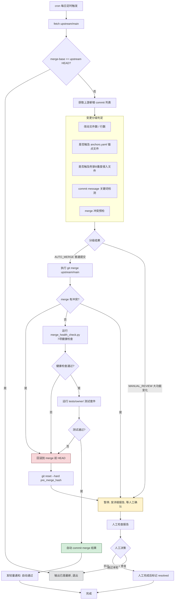

# PRD：hermes-agent 上游自动追赶机制

## 项目信息

| 项目 | 值 |
|------|-----|
| Language | 中文 |
| Programming Language | Python（脚本驱动）+ YAML（配置）+ Shell（cron 编排） |
| Project Name | `hermes_upstream_sync` |
| 仓库路径 | `~/.hermes/hermes-agent`（`/Users/yangtb/.hermes/hermes-agent`） |
| 上游仓库 | [NousResearch/hermes-agent](https://github.com/NousResearch/hermes-agent) |
| 当前分支 | `owner`（二次开发，229+ commit，侵入 ~70 个官方文件） |

### 原始需求复述

owner 分支是对 NousResearch/hermes-agent 的二次开发分支，已有 229+ commit 的定制内容，侵入约 70 个官方文件。上游 `main` 分支平均每天 60 commits 且经常大改架构（拆分模块、重命名、调整调用链），导致追赶官方更新极其困难。需要构建一套定时自动化合并流程，实现：每日自动追赶上游普通 commit，在大功能变化时停下来等人工确认，确保改动清单内的东西不丢失，且不会因官方已修复的 bug 而重复开发。

---

## 1. 产品目标

### 1.1 产品定位（已拍板：S′ → T）

| 阶段 | 名称 | 定位 | 主 KPI |
|------|------|------|--------|
| **v1（S′）** | 温和安全优先 | **上游风险分诊 + 受控自动合**。主怕「合坏 / owner 改动清单无声缺失」；自动合是减负，不是硬吞吐承诺。 | G2、G3、G5 |
| **v2（T）** | 吞吐增强 | 在验证网可信后，**无害 commit 不被重构段整批绑架**（序贯/小窗或路径安全合并）。 | 重定义后的 G1′ + 仍保留 G2/G5 |

**不可妥协原则（两阶段均成立）**：

> 吞吐永远不得以削弱 merge 后清单校验（D6/D7）为代价。  
> 保清单的是 **D6 健康检查 + D7 owner/contract 测试**，不是 D1 文件数代理。

**风险优先级（用户前提）**：

1. 最怕：合并后清单内容 **不知不觉缺失**（胶水被重构冲掉、行为静默降级）。  
2. 可接受：多数天需要人工处理真正的重构段。  
3. 多数上游 commit 本身无合并问题——v2 再专门解放被整批绑架的安全段。

### 1.2 可衡量目标

| 编号 | 阶段 | 目标 | 衡量指标 | 验收 |
|------|------|------|----------|------|
| **G1** | v1 **仅观测** | 记录自动吞并情况，**不设硬门槛** | JSONL：`decision`、commit 数、软/硬信号；周维度 auto 天数与 commit 占比 | v1 **不**以「介入率 &lt;20%」验收 |
| **G1′** | v2 | 无害 commit 稳定自动吞并 | 周维度：自动合入的上游 commit / 上游新增 commit ≥ 约定阈值（基线后再定，建议起评 ≥70%）；可选 `AUTO_PARTIAL` | 仅在 §1.3 升级门闩满足后启用 |
| **G2** | v1 主 KPI | 自动 merge 路径上清单不丢 | 每次 AUTO 完成前 D6 退出码 0；禁止带 FAIL 保留 merge | **硬验收** |
| **G3** | v1 主 KPI | 重构/高危热点预拦 + 丢胶水后验 | 硬红线（见 §5）触发必 MANUAL；D6/D7 失败必回滚+MANUAL | **硬验收** |
| **G4** | 阶段化 | 重复修复可提示人工 | **冷启动**：改动清单高风险提前修复指纹覆盖率 100%（条数可少，约 5–8+）；**库规模达标且跑满 ≥1 月后**：抽检应报未报 ≤20% | 冷启动与 80% 检出率 **不得同一里程碑** |
| **G5** | v1 主 KPI | 全流程可回滚 | 失败后 abort 或 `reset --hard` 回到 pre-merge HEAD，工作区干净，目标 &lt;30s | **硬验收** |

### 1.3 v1 → v2（S′ → T）升级门闩

同时满足后再启动 T 架构（序贯/小窗/partial），否则保持整批 S′：

1. 连续 **≥2 周** dry-run 或实跑 JSONL 显示：安全段常被整批硬红线绑架，或大量天数仅因软信号/历史误配而停。  
2. D6 + contract / anchors / inventory 已覆盖「丢了会肉疼」的清单项（至少附录 B.1 + 归因链 + 关键飞书胶水）。  
3. S′ 期间 **错误 AUTO ≈ 0**（无「自动合完才发现清单缺一块」）。  
4. 有带宽实现 partial 状态机与报告（已合 range / 未合 range）。

**进入 T 后仍必须**：每一小批跑 D6/D7；不得为冲 G1′ 关闭后验。

---

## 2. 用户故事

| 编号 | 角色 | 故事 |
|------|------|------|
| US-01 | owner 维护者 | 作为 owner 维护者，我希望系统**每天自动完成分诊**；在硬红线全过且 D6/D7 通过时自动 merge，以便无害增量不必手搓。 |
| US-02 | owner 维护者 | 作为 owner 维护者，我希望系统在上游重构/重度侵入路径/冲突/健康检查失败时**硬停并给出可执行报告**，以便集中处理真·大改，避免清单无声缺失。 |
| US-03 | owner 维护者 | 作为 owner 维护者，我希望系统能提示上游是否疑似修复了我已提前修的 bug（指纹），以便删本地/融合/保留——**提示默认不单独阻断**整批自动合（高置信度可配置为硬拦）。 |
| US-04 | owner 维护者 | 作为 owner 维护者，我希望每次拟自动合入的树都跑 `merge_health_check.py` 与 owner 测试，以便确信锚点与 inventory 仍在。 |
| US-05 | owner 维护者 | 作为 owner 维护者，我希望自动 merge 任一后验失败都能回滚到 merge 前 HEAD，以免半残树阻塞工作。 |

---

## 3. 需求池

### P0：必须拥有（阻塞交付）

| 编号 | 需求 | 对应场景 | 验收标准 |
|------|------|----------|----------|
| P0-01 | 定时触发：cron 每日定时执行上游同步检查 | D | cron 每日触发，无人工干预即开始 fetch upstream |
| P0-02 | 上游变更检测：fetch upstream/main 后对比 merge-base，判断是否有新 commit | D | 无新 commit 时输出"已是最新"并退出；有新 commit 时进入分级判定 |
| P0-03 | 变更分级判定：对上游新增 commit 进行自动/人工分级 | A/B/C/D | 输出 `AUTO_MERGE` / `MANUAL_REVIEW` 判定结果，并附分级理由 |
| P0-04 | 自动 merge：判定为 AUTO_MERGE 时执行 `git merge upstream/main` | D | merge 成功且无冲突 → 进入健康检查；merge 有冲突 → 回滚 + 转人工 |
| P0-05 | 健康检查：merge 后自动运行 `merge_health_check.py` | A/B/D | 退出码 0 → 自动推进到测试；退出码 1 → 回滚 + 发告警通知 |
| P0-06 | 锚点验证：merge 后自动验证 `anchors.yaml` 中 30+ 锚点 | A/B | 所有锚点的 contains 字符串均在对应文件中存在 |
| P0-07 | inventory 验证：merge 后自动运行 `inventory.yaml` 60+ 项静态检查 | A/B | 所有 module_symbol / file_exists / file_contains 检查通过 |
| P0-08 | 自动回滚：merge / 健康检查 / 测试任一步失败时，回滚到 merge 前 HEAD | A/B/D | `git reset --hard <pre_merge_hash>` 恢复，工作区干净 |
| P0-09 | 人工确认 gate：判定为 MANUAL_REVIEW 时暂停流程并发通知 | A/B/C | 流程暂停，等待人工确认后才继续；通知包含详细报告 |
| P0-10 | 通知机制（人工确认）：MANUAL_REVIEW 时发送详细报告 | A/B/C | 报告含：触发原因、受影响文件、丢失锚点、冲突内容、疑似重复 bug |

### P1：应该拥有

| 编号 | 需求 | 对应场景 | 验收标准 |
|------|------|----------|----------|
| P1-01 | Bug 重复修复检测：维护 owner 本地修复指纹库，merge 时检测上游是否修复了相同问题 | C | 输出"疑似重复修复"报告，含 owner commit hash + 上游 commit hash + 相似度评分 |
| P1-02 | 通知机制（自动通过）：AUTO_MERGE 成功时发轻量通知 | D | 通知含：合并 commit 数、健康检查结果摘要、时间戳 |
| P1-03 | 测试执行：merge + 健康检查通过后运行 `tests/owner/` 测试套件 | D | 全部通过 → 自动 commit merge 结果；有失败 → 回滚 + 发告警 |
| P1-04 | Dry-run 模式：支持 `--dry-run` 只做分级判定不实际 merge | A/B/C/D | dry-run 输出分级报告但 HEAD 不变 |
| P1-05 | merge 日志持久化：每次运行记录分级报告 / merge 结果 / 健康检查输出 | 全部 | 日志写入 `owner/logs/upstream-sync/` 下，按日期命名 |
| P1-06 | [owner] 标记删除检测：利用健康检查 Check 5（merge diff 死标记检测）结果 | A/B | Check 5 报告被删除的 [owner] 标记且无存活胶水时，转入人工确认 |

### P2：可以拥有（不阻塞交付）

| 编号 | 需求 | 对应场景 | 验收标准 |
|------|------|----------|----------|
| P2-01 | 多 remote 同步顺序：支持配置 upstream → origin → gitlab 的推送顺序 | D | 自动 merge 成功后按配置顺序 push 到各 remote |
| P2-02 | 飞书 webhook 通知：人工确认报告通过飞书机器人推送 | A/B/C | 飞书群收到结构化卡片消息 |
| P2-03 | 周报统计：每周汇总自动通过率 / 人工介入率 / 回滚次数 | 全部 | 生成 markdown 周报写入 logs 目录 |
| P2-04 | 锚点自动修复建议：anchor 丢失时，根据 owner 模块索引给出修复建议 | A/B | 报告中附"建议检查 owner/xxx 模块与官方 yyy 文件的胶水" |

---

## 4. 流程图



**流程节点说明**：

| 节点 | 类型 | 说明 |
|------|------|------|
| cron 触发 → fetch → 变更检测 | 自动 | 无人工干预 |
| 变更分级判定 | 自动 | 基于第 5 节的分级标准 |
| AUTO_MERGE → merge → 健康检查 → 测试 | 自动通过 | 全链路无人工 |
| MANUAL_REVIEW | 停下来等人工确认 | 发通知，等人工处理 |
| merge 冲突 / 健康检查失败 / 测试失败 | 自动回滚 | `git reset --hard` 恢复 |
| 自动通过完成 | 自动 | 发轻量通知，记录日志 |

---

## 5. 变更分级标准

### 5.1 软红线 / 硬红线（S′ 核心）

| 类型 | 含义 | 默认归属 |
|------|------|----------|
| **硬红线（hard）** | 触发 → `MANUAL_REVIEW`，不自动 complete merge | D0 熔断、D2、D3、D4、D6、D7；指纹 **high**（可配置） |
| **软信号（soft）** | 写入报告 / JSONL / 人工报告附录，**默认不阻断** AUTO | D1、D5；指纹 **medium** |

配置键（`owner/config/upstream_sync.yaml`）：

- `classification.d1_mode` / `d2_mode` / `d3_mode` / `d5_mode`：`soft` \| `hard`（D4/D6/D7 固定 hard，不配置）
- `fingerprint.high_blocks_auto`：默认 `true`
- `fingerprint.medium_blocks_auto`：默认 `false`（S′）

**原则**：

- **后验极严**：D6/D7 永远 hard；这是防「清单无声缺失」的主安全带。  
- **预拦对准重构热点**：D2/D3/D4 hard，减少「合完才发现要大改适配」。  
- **粗代理不硬挡**：D1 规模、D5 宽关键词仅 soft，避免日常 commit 误杀整批。

### 5.2 分级逻辑表

上游新增 commit **整批**（v1）经以下维度评估。  
**仅硬红线** 决定 `MANUAL_REVIEW`；全部硬红线通过 → 进入 D6/D7 → 通过则 `AUTO_MERGE`。

| 维度 | 指标 | 默认模式 | 通过条件 | 触发时行为 |
|------|------|----------|----------|------------|
| D0. commit 数量 | 积累 commit 数 | hard | ≤ `max_commits_threshold`（100） | 超限 → MANUAL，跳过 D1–D5 |
| D1. 改动规模 | 总改动文件数 | **soft** | 信息项；阈值默认 20 仅用于告警 | 超阈值 → 报告软信号，**不单独阻断** |
| D2. 锚点文件触及 | 是否改 `anchors.yaml` 中的 file | **hard** | 未触及 | 触及 → MANUAL |
| D3. 重度侵入文件 | 是否改附录 B.1 列表 | **hard** | 未触及 | 触及 → MANUAL |
| D4. 试合并冲突 | `git merge --no-commit --no-ff` | **hard** | 无冲突 | 冲突 → abort + MANUAL |
| D5. commit 关键词 | message 危险词 | **soft** | 信息项 | 命中 → 报告软信号，**不单独阻断** |
| D6. 健康检查 | `merge_health_check.py` | **hard** | 退出码 0 | FAIL → 回滚 + MANUAL |
| D7. 测试 | `pytest tests/owner/` | **hard** | 全部通过 | 失败 → 回滚 + MANUAL |

**注意**：D1–D5 为 merge 前预判（D4 会暂存 merge）；D6–D7 为 merge 后（暂存树上）验证。D6/D7 失败必回滚。

### 5.3 分级执行顺序

```
Step 0: D0（commit 数量熔断）→ hard？ → MANUAL_REVIEW
Step 1: D1（文件数，soft）→ 仅记录软信号
Step 2: D2（锚点，hard）→ 红线？ → 记入 reasons（仍可继续跑完维度以便报告完整）
Step 3: D3（重度侵入，hard）→ 同上
Step 4: D5（关键词，soft）→ 仅记录软信号
Step 5: D4（试合并，hard）→ 冲突则 abort 并记 hard 失败
        （若已有 hard 失败，实现上仍可跑 D4 以收集冲突信息，或跳过 D4；以报告完整性优先）
Step 6: 存在任一 hard 失败或（high 指纹且 high_blocks_auto）→ rollback 暂存 + MANUAL_REVIEW
Step 7: 否则保留 D4 暂存 → D6 → 失败？ → 回滚 + MANUAL
Step 8: D7 → 失败？ → 回滚 + MANUAL
Step 9: complete merge → AUTO_MERGE
        软信号写入成功/人工报告附录，不改变 decision
```

### 5.3 锚点文件列表（来自 anchors.yaml）

以下文件的变更将直接触发 MANUAL_REVIEW：

```
owner/owner-extensions/__init__.py
model_tools.py
agent/transports/chat_completions.py
agent/chat_completion_helpers.py
agent/agent_init.py
run_agent.py
hermes_state.py
hermes_cli/runtime_provider.py
agent/credential_pool.py
tools/approval.py
tools/skills_tool.py
agent/tool_executor.py
agent/agent_runtime_helpers.py
tools/clarify_tool.py
gateway/run.py
gateway/display_config.py
plugins/platforms/feishu/adapter.py
tools/cronjob_tools.py
cron/scheduler.py
agent/model_metadata.py
tui_gateway/server.py
```

### 5.4 重度侵入文件列表（来自附录 B.1）

以下文件的上游变更将直接触发 MANUAL_REVIEW：

```
gateway/run.py
plugins/platforms/feishu/adapter.py
agent/conversation_loop.py
tools/approval.py
gateway/platforms/base.py
tools/cronjob_tools.py
cron/jobs.py
cron/scheduler.py
```

---

## 6. Bug 重复修复检测策略

### 6.1 问题定义

owner 分支已提前修复了一些上游 bug（记录在改动清单的 "已修复" 小节中，如 §2.2.1-§2.2.4）。当上游后续也修复了同一 bug 时，owner 的本地修复变为冗余，需要人工决策：删本地取官方 / 融合 / 保留本地。

### 6.2 方案：owner 本地修复指纹库

**不要求全自动**，只要求检出后提示人工决策。

#### 6.2.1 指纹库结构

新建文件 `owner/validation/fix_fingerprints.yaml`：

```yaml
fixes:
  - id: credential-pool-env-seed-asymmetry
    title: "credential pool env seeding 不校验 key 格式"
    owner_commit: "2.2.1"          # 改动清单章节号
    owner_commit_hash: ""          # owner 分支 commit hash（可选，便于追溯）
    fixed_files:                   # 本地修复涉及的文件
      - hermes_cli/auth.py
      - agent/credential_pool.py
      - hermes_cli/model_switch.py
    fix_keywords:                  # 修复意图关键词
      - api_key_prefixes
      - _seed_from_env
      - copilot
      - ghp_
    fix_category: bugfix          # bugfix / security / enhancement
    status: active                  # active / superseded / merged_upstream

  - id: anthropic-unconditional-probe
    title: "anthropic 无条件探测拖慢 /providers"
    owner_commit: "2.2.2"
    fixed_files:
      - hermes_cli/model_switch.py
      - hermes_cli/providers.py
    fix_keywords:
      - _cred_signal_slugs
      - anthropic
      - should_probe
      - has_explicit_models
    fix_category: bugfix
    status: active
```

#### 6.2.2 检测流程

在变更分级判定阶段（merge 前），增加 Bug 重复修复检测步骤：

```
1. 读取 fix_fingerprints.yaml 中 status=active 的条目
2. 对每个上游新增 commit：
   a. 获取该 commit 修改的文件列表
   b. 获取该 commit 的 message
   c. 计算与每个 active fingerprint 的相似度：
      - 文件交集率 = |上游commit文件 ∩ fingerprint.fixed_files| / |fingerprint.fixed_files|
      - 关键词命中率 = |上游commit message 含 fingerprint.fix_keywords| / |fingerprint.fix_keywords|
      - 综合相似度 = 文件交集率 * 0.6 + 关键词命中率 * 0.4
   d. 相似度 > 0.5 → 标记为"疑似重复修复"
3. 输出疑似重复修复报告
```

#### 6.2.3 报告格式

```markdown
## 疑似重复修复报告

### 疑似命中 1：credential-pool-env-seed-asymmetry
- owner 本地修复：§2.2.1 credential pool env seeding 不校验 key 格式
- 上游 commit：`abc1234` — "fix: validate api key format in credential pool"
- 综合相似度：0.85（文件交集率 1.0，关键词命中率 0.60）
- 建议操作：检查上游是否已覆盖 owner 修复，若覆盖则删本地取官方
```

#### 6.2.4 决策规则（S′）

| 相似度 | 置信度 | 默认处理 |
|--------|--------|----------|
| > 0.8 | high | 报告「高置信度疑似重复」；**默认硬拦**（`high_blocks_auto: true`）→ MANUAL_REVIEW |
| 0.5 – 0.8 | medium | 报告「中置信度疑似重复」；**默认软信号**（`medium_blocks_auto: false`）→ **不阻断** AUTO |
| &lt; 0.5 | — | 仅日志 |

人工决策仍为：删本地取官方 / 融合 / 保留本地。系统**从不**自动删除 owner 修复。

---

## 7. 通知机制

### 7.1 自动通过通知（轻量）

当 AUTO_MERGE 成功时，发送轻量通知：

```markdown
## ✅ hermes-agent 上游同步完成

- 时间：2026-07-16 03:00:12
- 合并 commit 数：8 个
- 上游最新 commit：`abc1234` — "fix: minor typo in docs"
- 健康检查：7/7 通过 ✅
- 测试：全部通过 ✅
- 日志：owner/logs/upstream-sync/2026-07-16.log
```

**通知渠道**（按优先级）：
1. 写入 `owner/logs/upstream-sync/<date>.log`
2. 飞书 webhook（如已配置）

### 7.2 人工确认通知（详细报告）

当判定为 MANUAL_REVIEW 时，发送详细报告：

```markdown
## ⚠️ hermes-agent 上游同步需要人工确认

- 时间：2026-07-16 03:00:15
- 上游新增 commit 数：45 个
- 暂停原因：触及锚点文件 gateway/run.py（3 个锚点）

### 触发的分级红线

| 维度 | 结果 | 详情 |
|------|------|------|
| D2. 锚点文件触及 | 🔴 触发 | gateway/run.py（锚点：inbound-context-gateway-glue、hygiene-compression-notice-gateway-glue、auto-card-agent-end-glue）|
| D3. 重度侵入文件触及 | 🔴 触发 | gateway/run.py、agent/conversation_loop.py |
| D5. commit message 关键词 | 🔴 触发 | commit `def5678` — "refactor: restructure gateway message pipeline" |

### 上游 commit 列表（最近 10 个）

1. `abc1234` — fix: minor typo
2. `def5678` — refactor: restructure gateway message pipeline
...

### 疑似重复修复

#### 高置信度：credential-pool-env-seed-asymmetry
- owner 本地修复：§2.2.1
- 上游 commit：`ghi9012` — "fix: validate api key format"
- 综合相似度：0.85

### 建议操作

1. 检查 gateway/run.py 中 owner 胶水是否需要适配上游重构
2. 检查 agent/conversation_loop.py 中归因链是否受影响
3. 评估是否删除 owner 本地 credential pool 修复（取上游版本）

### 人工处理后

```bash
# 确认完成后标记 resolved
python owner/scripts/upstream_sync.py --resolve
```
```

**通知渠道**（按优先级）：
1. 写入 `owner/logs/upstream-sync/<date>-manual-review.md`
2. 飞书 webhook（P2，如已配置）

---

## 8. 已拍板决策与遗留项

### 8.1 已拍板（2026-07-16）

| 编号 | 议题 | 决定 |
|------|------|------|
| Q1 | Dry-run | P1；上线前建议连续 dry-run 收集 JSONL 基线 |
| Q2 | 测试范围 | 仅 `tests/owner/` + contract；不上游全量 |
| Q3 | push | **仅本地 merge**，push 保持手动 |
| Q4 | 回滚 | `merge --abort` 优先，兜底 `reset --hard` pre-merge HEAD |
| Q5 | 指纹冷启动 | 先高风险 5–8+ 条；G4 的 80% 检出率延后到库规模达标后 |
| Q6 | cron | 每日一次；>100 commits → D0 hard MANUAL |
| Q7 | 分支 | 仅 `owner`；执行前应校验当前分支为 `owner_branch` |
| Q8 | 工作区 | 不干净则 SKIP |
| Q9 | 飞书 | P2；初期 LogNotifier |
| Q10 | 阈值 | D1=20 作 **soft 告警阈值**；硬拦靠 D2/D3/D4/D6/D7；用 JSONL 校准 |
| **Q11** | **产品路线** | **S′ → T**；v1 主 KPI=G2/G3/G5；G1 仅观测；怕合坏/清单无声缺失优先于吞吐 |
| **Q12** | **软/硬红线** | D1/D5/medium 指纹 soft；D2/D3/D4/D6/D7/high 指纹 hard（见 §5） |
| **Q13** | **整批 vs 分割** | v1 整批；v2 在 §1.3 门闩满足后做序贯/partial |

### 8.2 仍可后续微调

| 编号 | 问题 | 说明 |
|------|------|------|
| R1 | D2 是否改为「仅与 B.1 交集 hard」 | 若 auto 过低且 D6 覆盖充分，可评估分层 D2 |
| R2 | high 指纹是否改为 soft | 默认 hard；若误报多可改 `high_blocks_auto: false` |
| R3 | 飞书 webhook URL | 运维配置项 |
